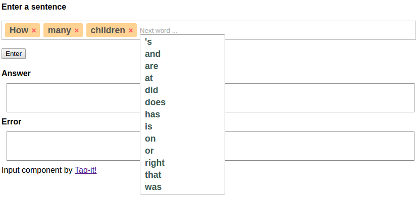

# NLI-GO

nli-go is a library, written in Go, that provides a natural language interface to databases. It is in fact just my hobby-project, but I am trying hard to make this the best nli system ever created!

For years to come, this system is not easy to use, not present for production, and not very robust either. Still, if you really need an nli, it may be worth your trouble to learn it. I think it's pretty cool.

## Purpose

This library helps a developer to create a system that allow end-users to use plain English / French / German to interface with a database. That means that an end user can type a question like

>  How many children had Lord Byron?

and the library looks up the answer in a relational database, and formats the result, also in natural language:

> He had 2 children.

Every part of the system is configurable.

## Install the program

Build this application's executable:  

```
cd ~/go/src/nli-go/app/cli
go build nli.go
```

If you like, you can move it to a place where it can be found from any location. In a Linux environment you might use:

```
sudo mv nli /usr/local/bin 
```

## Command-line use

You can use the executable as you would use any command-line application. It has two sub-commands: 
 
Use nli to answer a question, based on a configuration stored in a JSON config file. It returns a JSON string with the answer and / or an error.
 
```
./nli answer fox/config.json "Did the quick brown jump over the lazy dog?"
``` 

Or use it to suggest the next words the user can type.

```
./nli suggest fox/config.json "Did the quick"
``` 

## Example web page

An example web page in PHP is included to show how you may use this library. It's in app/web:



## Processing

For details about the processing of a request see [Processing](doc/manual/processing.md)
