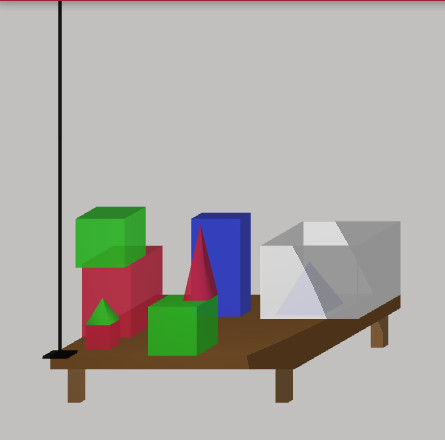

# NLI-GO

This is a research project with the following practical purpose:

> To create a software system that allows a regular programmer, untrained in linguistics and logic, to program a computer to interact with users in natural language. The system should be easy to use and the range of language constructs should be very wide.

and an underlying theoretical purpose:

> To distill the data structures and algorithms that allow a system to understand human language and to act on it.

As this is a hard problem, and we're a long way from solving it. However, knowledge has been accumulating since the beginning and can mainly be found in the docs/topics section. It can be interesting to you if you're building a linguistics system.

The system is a semantic parser and execution engine (an executable program, written in Go) that provides a Natural Language Interface to a database, a service or another application. It allows the user to interact with a computer system using natural language like English or French.

It is a rule based system that requires the developer to write rules by hand. Thus, the developer has full control over the behaviour of the system. Its semantics are not functional, but procedural.

The application is not production ready, but you can use it to experiment. The system is not at all robust and will break easily. Backward-incompatible changes will be made from time to time.

## Web demo

A old demo of this program can be found [here](https://patrickvanbergen.com/dbpedia/app/). It allows you to use a few sentences to query DBPedia.

A recent demo mimicks Terry Winograd's SHRDLU (1970). It can be found [here](https://patrickvanbergen.com/blocks-world/)

## Features

* An Earley parser to create a syntax tree from an input sentence, with semantic attachments
* Morphological analysis that performs segmentation and parsing of morphemes
* Mentalese, a based internal language, based on Predicate Logic, to process the user input
* A language with a Prolog-like syntax for rule based reasoning
* Support for access to Sparql and MySQL databases as well as in-memory data stores
* Combining data from multiple databases in reaction to a single request
* Modify internal and MySQL databases with Assert (insert) and Retract (delete)
* A dialog context to remember information from earlier in the conversation
* Anaphora resolution: the use of pronouns and other references to earlier entities
* Generalized quantifiers
* The distinction between classic negation (`not`) and strong negation (`-`)
* A generator to produce human readable responses
* Modules and namespaces, for modular development
* Uses websockets to communicate from client to server

## Build the nli client and server

(outdated! needs update)

NLI-GO is a command-line application called "nli". It's written in Go and you must compile it into an executable for your OS.

You can download and install GO from [here](https://golang.org/dl/)

From the root of NLI-GO build the client with

    go build -o bin/nli bin/nli.go

On Windows, you may want to use `go build -o bin/nli.exe bin/nli.go`.

Build the server with

    go build -o bin/server bin/server.go

## Start the server

Start the server and make it listen at port 3333

    bin/server 3333

## Run NLI-GO in interactive mode

NLI-GO comes with some sample applications, located in the directory "resources". The application `resources/blocks`, for example, is an attempt to recreate the results of [SHRDLU](https://en.wikipedia.org/wiki/SHRDLU). Start an interactive session with it like this:

    bin/nli inter -a resources/blocks

NLI-GO will then show

    NLI-GO session with resources/blocks. Type 'exit' to stop.

    >

and you can type, for instance:

    > Pick up a big red block

and NLI-GO, like SHRDLU in the old days, will reply with

    OK

The sentences that this applications can currently handle can be found in `tests/integration/BlocksWorld_test.go`, but you can try other sentences to see if they work.

When done, just type

    exit

## Run NLI-GO in single-request mode

NLI-GO can also be used just to give a single response. This allows you to use it as part of a larger system. This variant is used by the web demo, for instance. In this example you tell "Hello World" to the hello world application:

    bin/nli answer -a resources/helloworld "Hello World"

and it responds with

    Welcome!

This is the response of the application, or the error, if something went wrong. If you need more control over the output of the system, you can add `-r json`; like this

    bin/nli answer -a resources/helloworld -r json "Hello World"

and NLI-GO responds with a JSON string like this:

    {
        "Success": true,
        "ErrorLines": [],
        "Productions": [
            "Anaphora queue: [] ",
            "TokenExpression: [Hello World] ",
            "Parse trees found: : 1 ",
            "Parser: [s [hello Hello] [world World]] ",
            "Relationizer: go_intent(start_conversation) dom_hello() ",
     ...
            "Answer Words: [Welcome!] ",
            "Answer: Welcome! "
        ],
        "Answer": "Welcome!",
        "OptionKeys": [],
        "OptionValues": []
    }

If the system responds with a clarification question, it does this with a number of options the user can choose from

* OptionKeys: the keys of these options
* OptionValues: the values of these options

And if you want to specify a session identifier to allow NLI-GO to resolve back-references to earlier parts of the dialog, use `-s` with an identifier of your choice.

    bin/nli answer -a resources/helloworld -s 64152 "Hello World"

To reset the session, use

    bin/nli reset -s 64152

## Trying it out

If you want to experiment with NLI-GO, copy one of the application directories in `resources` and make changes to it.

## Docs

Much information on how to build an NLI-GO application can be found in [How to build an NLI application](doc/manual/knowledge-engineer/index.md).

If you want to follow my thoughts as I develop NLI-GO, you can read it here: [My personal log](doc/remarks.md)

And this is an overview of [How NLI-GO processes a request](doc/manual/system-developer/processing.md).
