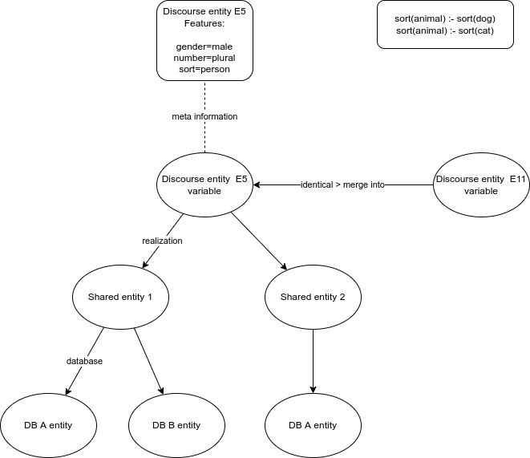

# Anaphora resolution (AR)

NLI-GO handles pronouns like "he", "she", "it", "they", but also expressions like "the block" and "the red one". These
expressions are called commonly called anaphora. Some refer to recent user input and some to a recent system response.

Patrick: if you're asking why we need all this: The reason we do all of this is to allow referring to unbound referents. This was not possible before.

## The anaphora queue

To resolve an unbound variable of a sentence, it is matched to all variables in the anaphora queue, until a match is found.

The anaphora queue is built on demand, whenever it is needed. It is built from the entities stored in the clauses of the dialog context.

Each clause has a list of entities ordered as they appear in the sentence.

The anaphora queue is built from the last clause encountered to the first, and the entities within a clause in order. In general an entity that appears earlier in a sentence is more likely to be the referent. 

It is also possible to tag entities as subject and object, and there functions will be used to determine the order of appearance. The subject is more important than the object, and this in turn is more important than other entities.

The anaphora queue is extended at the same of anaphora resolution itself. This is necessary because of intrasentential anaphora: a reference to an entity within the same sentence.

The anaphora queue is also extended when the system creates an answer sentence. At that time it creates a new clause, and its entities.

Each entity is added to the anaphora queue only once.

## Features

When the sentence is parsed, the system does not only build the representation of the intention, it also produces "features" for each of the entities.

These features are used to constrain the options in anaphora resolution. They are:

- sort: `person`, `car`, `event`, ...
- gender: `male`, `female`, `neuter`
- number: `singular`, `plural`
- reflexivity: `true` ("himself"), `false` ("him")
- determinacy: `determinate` ("the") `indeterminate` ("a")
- resolved: `true`, `false` (a forward reference is unresolved for some time)

These Features should be stored in the dialog context, but only when it is certain that this interpretation of the sentence is selected.

## Replacing variables

The implementation of anaphora resolution we take here involves replacing the variable of the reference with the variable of the referent.

This implementation effectively adds the constraint that the reference variable equals the referent variable [B = A] in Discourse Representation Theory. Only working with equalities is very hard, and reducing the number of variables is logically equivalent.

## Anaphora resolution step

There needs to be a separate AR step. The algorithm is like this:

- go through the relational structure of the sentence, quant by quant, from bottom to top
- handle `reference`-tagged relations as special cases
- handle `sort_reference`-tagged relations as special cases
- note: an entity may be both `reference` and `sort_reference` ("the blue one"): the sort needs to be resolved before the reference
- handle all quants E1 (like "the box")
    - go through all entities E2 in the queue
    - check if the features of E1 match those of E2
    - check if E2 matches the scope of E1
    - if E2 is a group, check its members individually
    - check for unresolved references
    - when in doubt, use parallellism (a reference in subject position is more likely to refer to entity that is also in subject position; idem for object position)
    - a local reference (same clause) is more likely than a remote reference

## Splitting up an entity list

In this interaction:

    What does the box contain?
    The blue pyramid and the blue block

the two objects are bound to the same variable.

But when only one of them is referenced

    What is the pyramid supported by?

the variable in the new sentence should not be replaced by the one holding the 2 objects.

This is an interesting issue. The two objects should be referencable together ("move them out of the box"). But in our case it seems as if a new referent is created out of the existing referent set:

    E18: [blue-block1, blue-pyramid]
    =>
    E23: blue-pyramid

Solution: if a reference refers to a single entity from a referent group, keep the reference variable unchanged, but bind it single referent's value.

