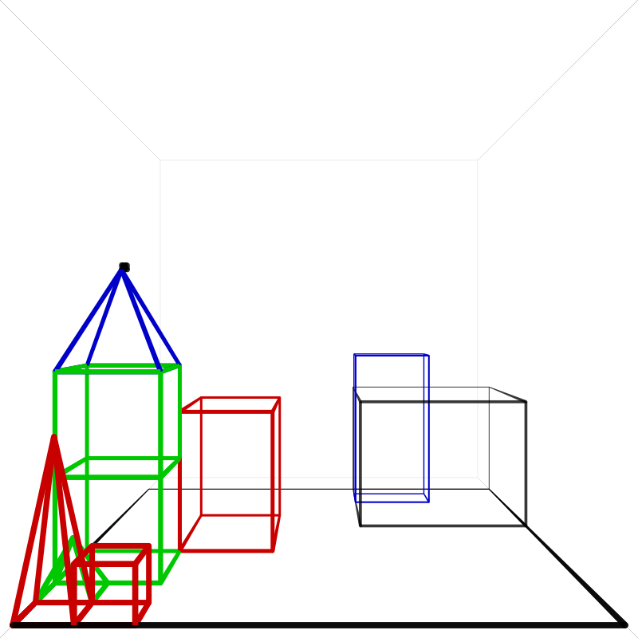
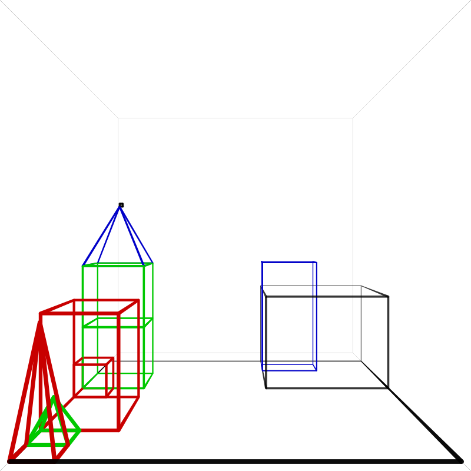

## 2023-06-12

I'm working on the block's demo @ https://github.com/garfix/blocks-world

Funny mistake:

    Pick up the table

The system starts moving all objects from the table to a different location on the table, then picks up the table top. The legs of the table are just for show, so they stay behind ...

Today I'm adding speech to text, which is built-in into the browser, but only Chrome.

## 2023-05-12

I realize that my system is thoroughly unsuited to process multiple interactions concurrently. Accomplishing this would mean a massive adaptation. Maybe later.

For now I best make sure that only one interaction can take place at one time.

I do want to allow the user to say "stop" and "continue".

Maybe have 2 processes: a conversation process and an action process. Only one of each can be active at a time.

If a new action process is started, the previous one halts. "stop" would then suspend the action process.

I think it's time for websockets.

## 2023-05-11

The client-server interaction is too complicated. It tries to minimize client-server interaction, but it does this by sending messages and listening to messages all in the same call, and this is error-prone and hard to follow. I should separate sending messages and listening to responses.

If a timeout occurs, the interaction should be aborted. Currently it fails, and still gives a response.

A dialog consists of processes. One process is

- request
- [clarification]*
- response

A system can start a process of its own

- [action]*

## 2023-05-09

I'm preparing the demo for publication. I want to improve the user interface, but the main thing is that the interaction with the server must be fixed. The server gets stuck in a state sometimes and this leads to confusing interaction with the user. Sometimes it's not even possible to reset the server.

At the moment multiple processes can run on the same system. Each sentence the user types starts a new process. But when a user starts a process while the previous one is waiting for input, this previous process will not complete. However, it may time out after 30 seconds.

The ideal behind multiple processes is that you can ask the system to start a long-running background task, and while it's doing that, start smaller tasks, concurrently. This is quite a bad idea for a blocks world scenario, because you can start building a steeple, while building a stack, and this will fail miserably.

Maybe it could be possible to do that, but I think it could be better modelled as having multiple conversations with the same system.

## 2023-05-05

I'm working on the last "todo" in the conversation:

    H: Can the table pick up blocks?
    C: No

Computer says no because it senses a conflict between `table` and `person` as the subject sort for "pick up". It would be best if it were to say something like

    C: No, only a person can pick up blocks

Now it produces:

    Breaking due to conflicting sorts: E$52: table & person

It would be good if the system could give more detailed feedback on the type of error that it detected. Also, currently the system itself determines the error message, while the application should (be able to) do it.

---

In the case of a sort conflict it would be reasonable to respond like this, which is my current state:

    H: Can the table pick up blocks?
    C: It doesn't make sense

The answer is correct, but not specific. However, it is more informative than the original "No".

---

Let's do the last one:

#44

    H: Thank you
    C: You're welcome

Winograd: "Idioms can be defined without modifying the grammar"

It's definetely necessary to modify the grammar in NLI-GO, and add a special intent. But it's a simple thing to do.

---

It's now 9:01, on Friday, the 5th of May 2023: dutch Liberation Day. I finished the 44 sentences of the famous SHRDLU interaction.

Now it's time to fix the demo and put it online, _improve_ the implementation, read all the literature, examine all other systems, and write a book about it!

## 2023-05-02

It is almost impossible to get the answer to #43 right. For one, my system takes the blue pyramid for the top of the steeple, whereas SHRDLU takes one of the other two, for some reason. The other thing is the position where it puts the blocks in the free area. I now use a formula that puts the object neer to where it picked it from. And then I fiddled around a bit with the promimity score to get something like the result we want:

    GOT:
        Yes, four of them: the red cube, a large red block, the block named superblock and the box
    WANT:
        Yes, four things: the box, the red cube, the blue pyramid and the block named superblock

This is good enough. Now have it say "four things" in stead of "four of them"

## 2023-04-30

I implemented an ambiguity detection system, but it still doesn't flag the word "it" in "Find a block ..." as ambiguous. Since "a block" is the first entity in the sentence it gets extra referent points, and thus wins. "the one you are holding" gets just one point less, and one could argue that this is still within the ambiguity range, but I don't know...

---

In 5 sentences the second best referent is scored just 1 less. I need only one. "It" in the last sentence: "Why did you drop it" has a score that is 19 points lower! It is not ambiguous at all!

Also Winograd did not provide a scoring algorithm. I can't even find "SMIT" in the code.

---

Interaction 43:

    H: Is there anything to the right of the red pyramid?
    C: Yes, four things: the box, the red cube, the blue pyramid and the block named superblock

Winograd: "Once an object has a name, the name is used to help identify it in responses"

The first answer the system gives is

    Yes, two things: the blue block and the box

And that's because the scene now looks like this:

The answer to this question depends on where the system has but the blocks, when it just needed some space. I put them on the first suitable place, searching from left to right. But I'd rather see that the object was placed in the largest empty spot.

Let's see if I can do that.

## 2023-04-29

Are Jacqueline de Boer married to a man?
    got
        Name not found: a man
    want
        Agreement mismatch: plural / singular

Simply taking the first or the last failed parse for the response doesn't work, because the order of the parses is not defined well.

I could improve the predictability of the parses, but it shouldn't really matter. It's better to prefer the sentence that "got farthest". In this case "name not found" got stuck in the parse phase, while "agreement mismatch" got farther, and should be chosen.

So I introduced a score for all sentences that are processed. If a sentence fails, then the response will only be used as output, if it has the highest score so far.

## 2023-04-28

I thought "steeple" was an invented word, but it really exists:

    "an ornamental construction, usually ending in a spire, erected on a roof or tower of a church, public building, etc."

    -- https://www.dictionary.com/browse/steeple

## 2023-04-27

The ambiguity can be resolved by distinguishing between the blocks that were explictly told to be picked up, and the ones that were just picked up as a part of the process.

Let's tag the event `tell` to every imperative sentence.

---

I'm running into a problem: the events in the imperative sentence don't have ID's, I can't assert them to the KB.
This may be a fundamental issue: imperative sentences indeed create events, whereas questions don't.

## 2023-04-25

By making ambiguity explicit, several issues surface that previously didn't occur when I just pickked the first acceptable referent.

    Is at least one of them narrower than the one which I told you to pick up?

This sentence is ambiguous, because 3 blocks were picked up

## 2023-04-24

When exactly is anaphora resolution ambiguous? Can we quantify that? When two equally likely referents are in the same sentence? Yes I suppose. And their score is the same.

--

I built an ambiguity detector, based on the scores of the referents. It detects 7(!) instances of ambiguity in the text.

The score is primarily based on the distance of the clause (extra clause -100), and further on syntactic function: subject +5 object +3. Almost none of these have been tagged, hence the ambiguity. It seems that giving the first NP the priority by default is a good heuristic.

--

Now I can say: "By \"it\", I assume you mean X", but this is not the only output. And that means that there can be an intermediary output and a final output. An intermediary output that is just informative, not clarifying.

## 2023-04-16

To establish the presence of ambiguity in anaphora resolution, it is not sufficient to pick the earliest referent that meets the restrictions, as I'm doing now.

So I will give all possible referents a score, and if the highest scores are close together, this indicates ambiguity, and it should be notified to the user.

## 2023-04-14

Page 158 says:

"If SMIT finds two different interpretations, and one is chosen because of a higher plausibility, the system types out a message to inform us of the assumption made in choosing one interpretation... we get:

BY "IT" I ASSUME YOU MEAN THE BLOCK WHICH IS TALLER THAN THE ONE I AM HOLDING
"

This refers to interaction #3:

    H: Find a block which is taller than the one you are holding and put it into the box.
    C: By "it" I assume you mean the block which is taller than the one I am holding
    C: OK

which I marked as "todo" in the beginning of the project.

This is a remark of the anaphora resolver. "the block which is taller than the one I am holding" is problematic because it is a description of part of the question. Note that it's not identical, because "you" is changed to "I"

## 2023-04-13

Interaction #42

    H: Why did you drop it?
    C: By "it", I assume you mean the superblock. I can't explain a nonexistent event.

Winograd: "There is no record in memory of any block being dropped."

In fact, the verb "drop" doesn't event exist yet. "It" can only refer to superblock, so the first sentence seems superfluous. But it is used as an extra means of coordination with the user. It's tough.

"Why x" implies the existence of x, and this assumption is violated here. Hence the somewhat annoyed sounding second sentence. This one seems easier.

Let's get started.

## 2023-04-12

Interaction #40

    H: Call the biggest block "superblock"
    C: OK

Winograd: "We can also give objects names."

"biggest" is a new word. It's like "littlest".

Interaction #41

    H: Have you picked up superblock since we began?
    C: Yes

I get the error:

    Info: The name 'superblock' could not be looked up because no sort could be derived from the relations.

This is because the system can't derive the sort of "superblock" from the sentence. I have to specify the sorts of 'picked up'.

## 2023-04-11

I almost succedeed with the interaction.

    Are there any steeples now?
        GOT:
          Yes, a large green cube
        WANT:
          Yes

This is because the steeple / stack is now identified by its lowest block.

Whereas all "Is there" sentences have been answered with "Yes, ..." this one apparently needs only a yes/no. But why?
What's the difference between

    Are there any steeples now?

and

    Is there a large block behind a pyramid?
    Is there anything which is bigger than every pyramid but is not as wide as the thing that supports it?

Well, obviously, our new sentence is in the plural.

Wouldn't it be better if we answered like this:

    Yes, the one that starts with a large green cube

---

Wait, I forgot that I added this sentence myself. So it doesn't matter what the response is.

This is something that can be improved, but I prefer just to finish the conversation for now.

By the way, the reason for just "Yes" could be that it's a repetitive follow up question. Are we there yet? Are we there yet?

## 2023-04-07

A definition is meant as a way to recognize things. By itself, it does not describe how to do something. A system could still be able to reach the state described in the definition, but this involves the forming of a plan, and problem solving. SHRDLU and NLI-GO do not have this ability yet.

But a definition can also be used to recognize an action, if such action has already been specified. In this case a stack already exists, so a steeple can be described as a stack, and the system should be able to build a stack from it.

So, a definition should contain:

- the description of an entity
- a prescription of an entity

We already have the description, so let's talk about the prescription. How do we turn "a stack that contains" into something that can be built?

Note, that we can also say

    a steeple is a stack _of_

and that a steeple can also consist of two green blocks, a red block, and a pyramid. It can contain extra blocks apart from the definition.

We also want to be able to say "How many stacks are there?" without having stacks explicitly defined in the database.

If a concept 'steeple' is added later, we don't want to have to change the database with steeple objects, nor do we want to chech each time a block is moved, if all steeples need to be updated. Same thing holds for stacks. And it makes one wonder why "supports" is available in the database in the first place. It can be derived from the position of the objects. And this is in fact what happens for past events.

If we think of "a stack which contains" and "a stack of", would it be useful to have these relations

    stack(S) contains(S, E)
    stack(S) of (S, E)

I think this is impossible to work with. First, we need to detect a `stack(S)` without binding its elements. This is possible if we have a `stack` in the database, but we don't want that. It's also possible to do it without storing the elements, but then `of` should do the same thing again.

It's better to create a relation `stack_contains(S, E)`. This should bind `S` to a new identifier.
How to define this identifier? Hard.
How to populate `E`?

## 2023-04-06

Also combinations that have not been explicitly turned into steeples should be recognizable as such. So yesterday's construction is insufficient.

It makes you wonder why containment relations (for the box) are stored in the database at all...

Note that "contain" for blocks in a stack is different from "contain" of an object in a box.

Idea:

    contain(b: box, a: object)
    contain(s: stack, a: object)

Let's analyze the sense of the definition:

    go_define('steeple', E$1,
        go_isa(E$1, stack),
        go_check(
            go_and(
                go_quant(
                    go_quantifier(_$2, Range$1,
                        go_$assign(N$1, 2)
                        go_$equals(_$2, N$1)), E$2,
                    dom_green(E$2)
                    go_has_sort(E$2, block)
                    dom_cubed(E$2)),
                go_quant(
                    go_quantifier(_$3, Range$2,
                        go_$greater_than(_$3, 0)), E$3,
                    go_has_sort(E$3, pyramid))),
            dom_contain(P$1, E$1, E$2)))

`go_isa(E$1, stack)` is the "genus" or sort that is the basic of this new concept.
`dom_contain(P$1, E$1, E$2)` serves for the recognition, but not for the build action
together `stack` and `go_and(...)` define the build action

## 2023-04-05

I expanded the stack building procedure by creating a few assertions:

    go:uuid(Stack, stack)
    go:assert(go:has_sort(Stack, stack))
    go:list_foreach(SortedList, B,
        go:assert(contain(EventId, Stack, B))
    )

So that the stack now is an actual entity in the database and this is needed to check if there are any steeples.

But can I remove the 'genus' out of the sense, and put it in a tag?

## 2023-04-04

I found Winograd's definition of "build":

    (DEFS #BUILD
        EXPR (LAMBDA NIL
        (RELATION
            (RESTRICTIONS: (((#ANIMATE)) ((#STACK)))
    MARKERS: (#EVENT)
            PROCEDURE: ((#EVAL (LIST '#STACKUP
                        (#BLUEPRINT SMOB1)
                        '*TIME)))))))

As you can see, it is not at all very generic. It only works with stacks, and uses `#STACKUP` to process.
Quite a relief! :)

---

Definition: https://en.wikipedia.org/wiki/Definition

and then especially this concept with the beautiful name: Genus-differentia definition

https://en.wikipedia.org/wiki/Genus%E2%80%93differentia_definition

    A genus-differentia definition is a type of intensional definition, and it is composed of two parts:

    1. a genus (or family): An existing definition that serves as a portion of the new definition; all definitions with the same genus are considered members of that genus.
    2. the differentia: The portion of the definition that is not provided by the genus.

## 2023-04-03

On p.142 of UNL we read "It currently recognizes this (new words) by the quote marks, but it could just as easily declared all unfamiliar words as possible new words. We have not done this as it would eliminate the feature that the system immediately recognizes typing erros without waiting to begin parsing the sentence."

(see interaction #36)

Following "A 'marb' is a red block which is behind a box", on p.143 we read: "Remember that all definitions are programs, so this one fits in with no problem. When it is called on to build part of the description, it simply inserts the description used to define it. If we talk about 'two big marbs', the system will build a description exactly like the one for 'two big red blocks which are behind a box'"

I coded "stack up" very rigidly, before. It needs to be much more flexible. But how does SHRDLU know how to turn a description into an action plan?

---

My plan now is to slice up a definition even further:

    A <x> is a <y> <rel-clause>

This way I don't need to extract the type <y> from the definition, and I can make the `isa` relation between x and y explicit.

When storing the definition, I will

- store `go:has_sort(X, Y)`
- store the definition as <y> <rel-clause>
- store the specification as <rel-clause>

Then I need to make `one` refer to ...

And I need to rewrite `stack up` as `build a stack`. Must I?

## 2023-04-02

Somehow I need to combine

    Will you please stack up both of the red blocks and either a green cube or a pyramid?

with

    Build one (Build a stack which contains two green cubes and a pyramid)

I can force the second one into the first one, or I can change the first one to make it handle the second one.

## 2023-03-31

Omg, the system parses the sentence as

    A "steeple" is
        a stack which contains two green cubes
        and
        a pyramid.

When the parser still stopped when the first parse tree was complete, the order still dependend on the order of the syntactic rules. Now they are all extracted, the order depends on the extracter. And I don't know how it works, anymore.

I noticed that the interpretation "A steeple is NP and NP" is grammatically wrong. It would require the word "both": "A steeple is both NP and NP". So I changed

    rule: assertion(P1) -> an(_) '"' dictionary_entry(W1) '"' copula(_) np(E1),

into

    rule: assertion(P1) -> an(_) '"' dictionary_entry(W1) '"' copula(_) an(_) nbar(E1),

## 2023-03-30

Interaction #39

    H: Build one
    C: OK

Winograd: "The description given in the definition is enough to deduce a plan for building new objects as well as recognizing them. The word "one" means "a steeple", and the plan is carried out. ..."

I don't think this is true. 'A "steeple" is a stack which contains two green cubes and a pyramid.' is the given. It mentions a "stack" but a stack does not have a description yet. There is the command "stack up", but it's not the same. In general, recognizing and creating are two very different things. It's easy to recognize someone that rides a bike, but that doesn't mean you can ride one.

In this case we do already have a recipe for building a stack, so we can use this. But we still need the connection of "stack" with "stack up".

## 2023-03-29

A word that's available from the lexicon should not be morphologically analyzed. This is just faster, it also allows the lexicon to override the sense that's derived from a morphological analysis.

---

As new words should also be available in the rules of the morphological analyzer, how to solve this?

- every time the morphological analyzer runs, add the rules from the general grammar
- new lexicon rule => add to general grammar and add to morphological grammar

or

- just turn both grammar rule sets into a single set

One effect of this is that morphological rules now also apply to normal parsing:

    How many cube s are on the table?

Will be parsed correctly.

## 2023-03-28

Currently, for the morphological analyzer to function, all morphemes have to be predefined in the morphological grammar rules. The analyzer should also check the normal grammar for entries. "steeples" is not recognized yet.

---

If no rule can be found any more, but at least one rule has applied, the word is added as a segment.

O, now it found "contain" + "s" as a plural when looking for a noun...

---

No rule found, and at least one rule applied, check the regular grammar (lexicon) for a word in this category.

That works, and as a "bonus" it also found "cubes" = "cube" + "s".

## 2023-03-27

I created a function go:define() to add a word to the current grammar. Now see if it works.

Interaction #38

    H: Are there any steeples now?
    C: No

Winograd: "The new defintion is used as a description to recognize steeples."

Only the word "steeple" was added. The plural must be recognized by the morphological analyzer.

## 2023-03-26

I started the I18n class for better translations of canned responses.

---

Interaction #37

    H: A "steeple" is a stack which contains two green cubes and a pyramid.
    C: I understand

Winograd: "The quote marks indicate that we are defining a new word."

## 2023-03-25

To give the right answer to #35 I think I need to distinguish between the expected sort and the actual sort.
Or I must keep track of the sort in the question before I start answering it.

The sort is not available at that time. Why not? Because it's stored in the dialog context (sorts), but not in the dialog DB.
Is it possible to store this info in the DB?

By the way, I can solve the problem by distinguishing the sort at the time of the question and the sort in the answer.

The intent thus looks like this:

    condition: go:intent(select_categoric, B) go:isa(B, ExpectedSort),

Because the condition is executed before the answering phase, only the expected sort is known (object). And this sort can be used in the answer.

So it's possible to answer this question without ressorting to new techniques. I also allowed `isa` to the sort determiners supported by the system. Used to be only `has_sort`.

---

Interaction #36:

    H: Does a steeple
    C: Sorry, I don't know the word "steeple"

Winograd: "The system interrupts immediately when it sees a word it can't figure out."

My parser only produced an error when it couldn't parse a word. I will now not consider this an error any more, but treat it as a regular output.

SHRDLU interrupts the user _while he is typing_, I could build that with NLI-GO, but I don't because I don't see the added value of interrupting a user when still typing. A user that makes spelling mistakes and later corrects them will only get irritated by the feedback. Also some words only have meaning when typed in groupes. People's names for instance. For example, we don't want to see this:

    H: When was Michael
    C: I don't know the word "Michael"

So while I could build the system to react like SHRDLU in this way (by re-parsing the sentence after every word the user types), I choose not to do this.

I'm still able to produce the same output as SHRDLU, though.

## 2023-03-21

    H: Is there anything which is bigger than every pyramid but is not as wide as the thing that supports it?
    C: Yes, the blue block

The system responds with "Yes, the blue one". Why? Because it responds as if it selects one block out of many. This would be correct has the sentence been

    H: Is there a block which is bigger ...
    C: Yes, the blue one

But that's not how the sentence goes. "anything" doesn't represent a clear type.

## 2023-03-19

I noticed that the in-memory database was the cause of much slowness. Especially the retrieval of data. So I added an index on predicate. This sped up all tests from 20 seconds to 9 seconds. :)

---

Interaction #35

    H: Is there anything which is bigger than every pyramid but is not as wide as the thing that supports it?
    C: Yes, the blue block

The reference "it" may be a problem. There's new syntax. Define "bigger".

Decomposing the sentence:

    Is there anything [X]
        which is
            bigger than
                every pyramid
        but is
            not
                as wide as
                    the thing
                        that supports it [X]

Complete syntax tree looks like this:

    s
        +- interrogative
           +- interrogative_clause
           |  +- copula
           |  |  +- is 'Is'
           |  +- there 'there'
           |  +- np
           |     +- nbar
           |        +- noun
           |        |  +- anything 'anything'
           |        +- relative_clause
           |           +- relative_clause
           |           |  +- which 'which'
           |           |  +- copula
           |           |  |  +- is 'is'
           |           |  +- adjp
           |           |     +- bigger 'bigger'
           |           |     +- than 'than'
           |           |     +- np
           |           |        +- qp
           |           |        |  +- quantifier
           |           |        |     +- every 'every'
           |           |        +- nbar
           |           |           +- noun
           |           |              +- pyramid 'pyramid'
           |           +- but 'but'
           |           +- copula
           |           |  +- is 'is'
           |           +- adjp
           |              +- not 'not'
           |              +- adjp
           |                 +- as 'as'
           |                 +- wide 'wide'
           |                 +- as 'as'
           |                 +- np
           |                    +- the 'the'
           |                    +- nbar
           |                       +- noun
           |                       |  +- thing 'thing'
           |                       +- relative_clause
           |                          +- that 'that'
           |                          +- tv
           |                          |  +- supports 'supports'
           |                          +- np
           |                             +- pronoun
           |                                +- it 'it'
           +- ? '?'

Current answer:

    Yes, the blue one

Should be:

    Yes, the blue block

This is the sense produced:

    go_check(
       go_check(
            go_quant(none, E$343,
                go_isa(E$343, object)
                go_check(
                    go_quant(
                        go_quantifier(_$21, Range$10,
                            go_$equals(_$21, Range$10)), E$344,
                        go_has_sort(E$344, pyramid)),
                    dom_bigger(E$343, E$344))
                go_not(
                    go_check(
                        go_quant(none, E$345,
                            go_isa(E$345, object)
                            go_check(
                                go_quant(some, E$271, none),
                                dom_support(P$28, E$345, E$271))),
                        dom_as_wide_as(E$343, E$345)))), none)

Where `E$271` is `block:small-red` so "it" refers to the small red block. This is incorrect. It should refer to `E$343`.

The explanation of the anaphora resolver says: "ref: E$343 has no sort". So let's give "anything" a sort.

go_check(
    go_quant(none, E$861,
        go_isa(E$861, object)
        go_check(
            go_quant(
                go_quantifier(_$91, Range$27,
                    go_$equals(_$91, Range$27)), E$862,
                go_has_sort(E$862, pyramid)),
            dom_bigger(E$861, E$862))
        go_not(
            go_check(
                go_quant(none, E$863,
                    go_isa(E$863, object)
                    go_check(
                        go_quant(some, E$864, none),
                        dom_support(P$37, E$863, E$864))),
                dom_as_wide_as(E$861, E$863)))), none)

    The thing that supports it
    dom_support(P$37, E$863, E$864)
    E$863 = "the thing", accept `block:blue`
    E$864 = "it", accept E$86 ()

This is correct.

## 2023-03-18

I added `state` and `action` as subsorts of `event`, which itself I made a subsort of `entity`.

I tagged most verbs with either a `state` or `action` sort, and added a sortal filter to `while` and `before`. The filter filters on the type of events that need to be considered. This saves 3 seconds on 23 seconds, so this is relevant.

---

Interaction #34

    H: Put the blue pyramid on the block in the box.
    C: OK

The sentence succeeds immediately. But the catch is that the system doesn't regard the sentence as ambiguous, yet.

I have to add "on" as a preposition next to "on top of".

This works, but now I get

    [0] Directly on the surface [1] Anywhere on top of

I respond with

    0

System says:

    I don't understand what you are referring to

It means that it can't figure out what "the block" refers to. And this is indeed unclear, in this interpretation.

Winograd: "This is syntactically ambiguous, but is understood without ambiguity since the parsing corresponding to 'put the blue pyramid which is on the block in the box' does not make sense in the current scene, while 'put the blue pyramid  on the block which is in the box' does"

This is the next challenge.

I'll distinguish between the semantics of `on` and `on-top-of`.

I told the sentence processor to continue looking after it found a sentence for which a referent could not be found. This solves the problem.

## 2023-03-17

I want to speed up the "before" and "while" sentences. They take a few seconds, each, because they bind while a great number of events.

The number of events could be reduced by distinguishing between events and states. I never made this distinction before because I didn't understand the need for it.

"CLE" says: "Adjectives in predicative positions give rise to state variables in their translation. States are like events, but unlike events they cannot be instantaneous." - p.23

To me, this never was enough to make the distinction. But it could be useful now, for efficiency. It could separate the events based on location (denoted by the verb: to be), and ones based on actions (all other verbs).

## 2023-03-13

Tagged relations are now stored in the dialog context database. Nice! I'm not doing anything with them , but it's good to know you can. You need to specify in which database the relations are stored (by adding them to a `write.map` file), but the built-in relations are:

    go:reference(E1, Reference)
    go:labeled_reference(E1, Label, Reference)
    go:sort(E1, Sort)
    go:category(E1, Category, Value)

If you want to know about variable E2, you need to convert it to an atom:

    go:atom(E2, A2)

Then you can use it to obtain data from the dialog db. Here's how to collect the gender of an entity.

    go:category(A2, gender, Value)

So, this gender is specified in the sentence, but the variable needs not have been bound yet.

A shorthand would be

    go:category(go:atom(E1), gender, Value)

## 2023-03-12

This proves to be a hard problem, because it seems that the system needs to make statements about unbound event variables, which is impossible.

In the meanwhile I introduced `go:bound(X)` and `go:free(X)` to check if a variable is bound or not. This works for the temporal `support` relation.

The `before` and `while` relations are quite slow now, but still, calculating the event before processing the relations that are relative to it, seems to be the way forward.

---

It's not actually impossible, because of an implementation detail that I used: by replacing format variables by calling variables, the call to `support` can actually see the name of the variable:

    support(P1, A, B) :-
        go:log(P1)
        ...
    ;

shows:

    Sentence$30: <not bound>

or

Sentence$47: `event:E67BE2644F3951C8`

But, dare I use this? I could "atomize" the variable name into an atom, with something like

    go:atomize(P1, A1)

and then request for metadata, thus

    go:category(A1, Category, Value)

## 2023-03-11

How can I distinguish between past events and current events?

* Bind the event variable to `now` but this can only be added to the present, and past and future events are treated alike
* Add `go:tense(Event, past)`, `go:tense(Event, present)` but this is wrong because this is a check, not a statement
* Add a tag `tag: go:tense(Event, past)`, `tag: go:tense(Event, present)` but these are not accessible in the execution phase

The first solution would work for now, but it looks like a hack.
I like the last solution, and I think I will implement this by creating a database for the current dialog. This is something I wanted to have for a long time! But it's not possible because the event is not bound, and only bound values can be stored into a database.

## 2023-03-08

I had a small breakthrough yesterday, by changing `location` from the location-change-event (momentary) to the location-at-event (with duration).

---

Relations operating on past events can be quite slow. It's good to evoke them only when necessary. For this reason it's good to separate to keep separate present tense sentences form past sentences. For example by introducing the event constant `now`, that is always set for present tense sentences.

---

When doing a sentence with a time modifier I now always perform the modifier first. It's essentials with "then" and is ok for the other terms (while, before). It makes sense to do so.

## 2023-03-07

I am implementing left_from, and it's very inefficient at the moment. The question can easily take half a minute to complete. Why is that? Because it takes an event parameter, but this is currently unbound. Therefore, the relation tries to match all events in the history.

This should be done differently. But this affects other time modifier sentences as well.

    {
        rule: interrogative_clause(P1) -> interrogative_clause(P1) time_modifier(P1, P2),
        sense:
            $interrogative_clause $time_modifier
            go:context_set(time, P1, P2, $time_modifier)
    }

    { rule: time_modifier(P1, P2) -> 'before' vp(P2),                              sense: $vp dom:before(P1, P2) }
    { rule: time_modifier(P1, P2) -> 'while' vp(P2),                               sense: $vp dom:while(P1, P2) }
    { rule: time_modifier(P1, P2) -> 'then',                                       sense: go:context_get(time_event, P2) dom:while(P1, P2) }

As you can see, `$time_modifier` is executed after `$interrogative_clause`. An option would be to reverse these, but this has shown to be very inefficient for `before`, which then produces all events before the given event.

---

Location events should not have a start/end time of the time they change, that should only specify the start; the end should be `100000`, or something, and it should change if the object changes location.

## 2023-03-04

    There were five blocks to the left of the box then.

"then" does not refer to "before you started to clean it off"; it refers to "you started to clean it off"

---

thought: "Before" does not simply mean "before that event", because this is an infinite time span. It just means: "just before that event".
But how much before is still "just"? Did not implement.

## 2023-02-27

    There were five blocks to the left of the box then.

Interaction #32 introduced a predication `dom:support(P1, A, B)` to tackle the problem. #33 has no need for an extra predication, but it also has no predication variable.

    go_$assign(N$3, 5)
    go_check(
        go_quant(some, E$507,
            go_has_sort(E$507, block)),
        go_check(
            go_quant(none, E$508,
                go_has_sort(E$508, box)),
            dom_left_from(E$507, E$508)))
    go_context_call(time, Sentence$48)

with context

    go_check(
        go_quant(some, E$503,
            dom_you(E$503)),
        go_check(
            go_quant(some, E$502, none),
            dom_clear_off(P$32, E$503, E$502)))
    dom_before(Sentence$48, P$32)

The constraint `dom_before(Sentence$48, P$32)` doesn't do anything because `Sentence$48` is not used by the sentence.

Should I add an event variable to all relations?
And should this variable be bound to the default value `now`, in absence of a time constraint?
Winograd uses separate relations for historic and current events. Should I do that as well?

---

It occurred to me that sentences accessing episodic memory are semantically distinct from present tense sentences. A bit similar to how command sentences are different. Commands produce side effects. Episodic sentences require the reconstruction of the past.

It would not be enough to add a predication variable to relations, because the relations were not stored like that in the past. A `left_from` relation is only defined for the present. The past is only defined in terms of `location` relations. The `left_from` relation in the sentence needs to be reconstructed from `location` relations.

Winograd says this about time-based relations: "

    we can ask "Is :B1 on :B2?" with the goal
    (THGOAL (#ON :B1 :B2)(THUSE TC-ON))

    To ask "Was :B1 on :B2 before ...?" we bind the variable TIME to the representation of the time we are interested in, and ask
    (THGOAL (#ON :B1 :B2 $?TIME)(THUSE TCT-ON))

    The theorem TCT-ON is the same as TC-ON except that it deals with the specified time instead of the present. Similar TCT-THEOREMS exist for all of the spatial relations, and for properties which change in time, such as #CLEARTOP and #AT.

"

A big difference between #32 and #33 is that the time-based relation `support` is a verb (which commonly has a predication variable) and `left_from` is a preposition (which don't usually have predication variables).

## 2023-02-18

"two large green cubes" is actually not how you would describe them, because there are no other green cubes. "the green cubes" would be more likely.

## 2023-01-27

Winograd about grouping entities in the response:

"We might up with an answer like 'yes, four of them: a large blue blue, a small red cube, a small red cube and a small red cube.' To avoid this redundancy, the object-namer looks for identical descriptions and combines them with the appropriate number to get 'a large blue block and three red cubes'" (p. 168)

I need to group the entities, based on the descriptions.

    dom:describe(E1, '', N) go:make_list(List, E1)

    dom:describe(E1, '', N) go:make_list(List, E1)

## 2023-01-23

If the check fails, the main entiy variable is empty. Thus the response can't show how many blocks there are, because the response is empty.

## 2023-01-18

Start of interaction #33:

    H: There were five blocks to the left of the box then.
    C: No, only four of them: the red cube, two large green cubes and a large red block.

Winograd: "It checks any statements about location or other such properties to see whether it agrees or disagrees."

This is a so called "there be" sentence, which has a copula as the basic verb: "were". It has a time modifier / time indicator: "then".

Winograd: "Earlier in the dialog, new information about 'owning' was accepted at face value."

That earlier sentence ("The blue pyramid is mine") is clearly an assertion. The current sentence is more like a question. Clearly (?) the user doesn't need to teach the system what the position of the objects was like, in the past: does the user expect the system to learn this new information? I don't think so. We can even add the tag question "right?".

But even if we can tell the system to interpret the sentence as a question, it is a new type of question. Basically it is a question about the number of objects. "Were there five blocks to the left of the box then?" "No, only four"

Goals:

- interpret the seemingly declarative sentense as a question
- turn "then" into a time modifier (based on the current deixis of time)
- recognize the sentence as a yes/no question about quantity
- combine 2 distinct objects into a group, in response generation: "two large green cubes"

Winograd: "The system knows that it has complete information about the basic properties of objects."

We can incorporate this knowledge into an intent. The sentence can be a declaration, but since it is about blocks, it is interpreted as a question.
