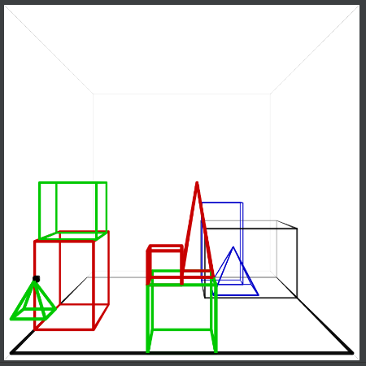
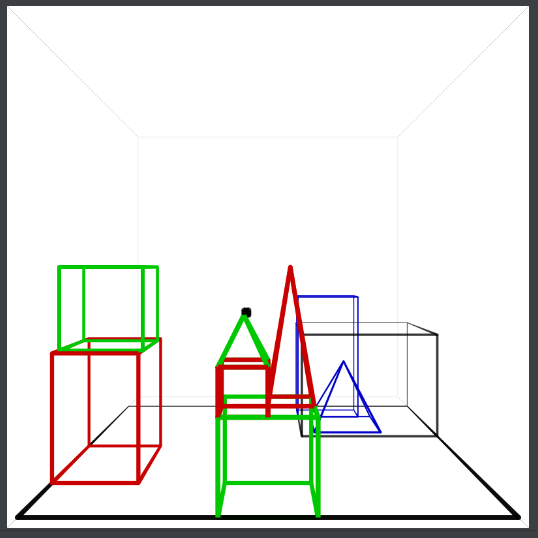
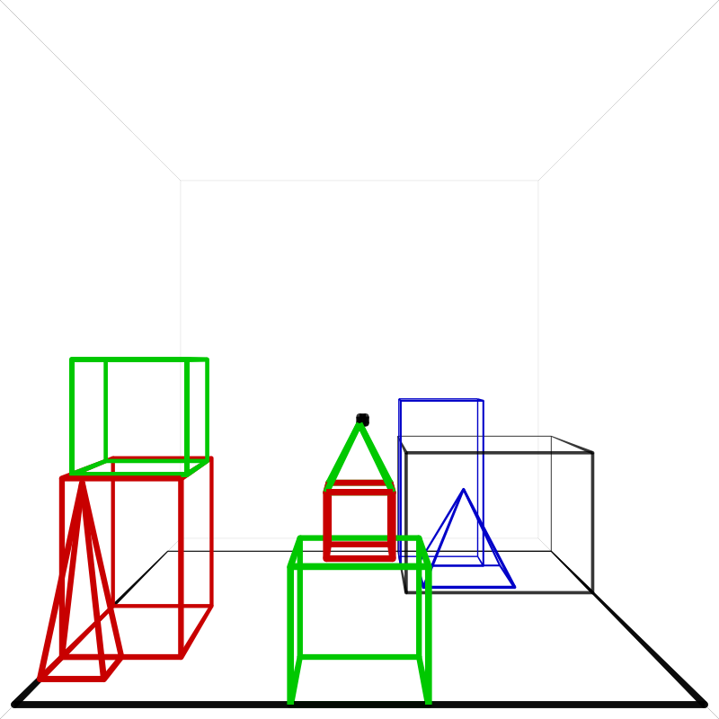
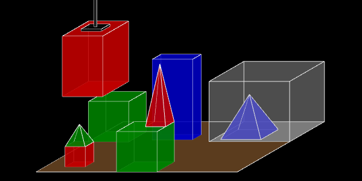

## 2021-12-29

This sentence still caused me trouble:

    Find a block which is taller than the one you are holding and put it into the box.

If I do a centering analysis on the sentence, I will find two clauses, each with its own center. The `back_reference` relations that will then be performed need to know on which clause they are acting.

It is netter to split the sentence up into two sentences:

    Find a block which is taller than the one you are holding
    put it into the box.

A sentence with "and" at the topmost level only occurs with declarative and imperative sentences. I can split up the sentence into root-clauses. 

An additional advantage is that I can then use the existing grammar to parse __multiple sentences__ at once! A long awaited feature.

* Parse the text
* Find the root clauses
* Process all root clauses in sequence

The grammar will "tag" the root clauses of a sentence.
I wanted to have a special category for root clauses, but this is not possible.

## 2021-12-28

An example of the syntax I will use for feature structures and unification:

    { rule: vp(P1, E1) -> np(E1) aux_be(_) tv_gerund(P1, E1, E2) np(E2),            agree: number(P1, E1) }
    { rule: noun(E1) -> 'blocks',                                                   tag: number(E1,  plural) }

The features are an open ended set, that can be extended at will, but the most common ones are:

    number (singular, plural)
    person (1, 2, 3)
    function (subject, direct-object, indirect-object)

Keys and values are not abbreviated.

I realize that this is an unusual way of handling features. "Speech and language processing" has an extensive chapter on feature structures. Nli-go has used this technique and it proved to be too hard to use, so I dropped it. The form I now use is a simplification.

- I don't use nested features, because they are not necessary, I think
- I don't use DAG's because they are hard to reason about
- I use agreement implicity where the book uses it explicitly; in my technique every feature needs to agree
- I am applying agreement on entities, not phrases, because that's how my grammar works, I think it will work

I will implement agreement later, as a separate phase.

===

Since this morning I am back at this problem:

    GOT:
        To get rid of the green pyramid
    WANT:
        To get rid of it.

I want to solve it by noticing that the green pyramid is - using the language of centering theory - the most highly ranked forward looking center of the previous utterance ("Why did you pick it up"); it is most highly ranked because of the _center continuation_ criterium: because it was the center, it is most likely to be the new center.   

## 2021-12-27

I will solve the problem by implementing the ideas of centering theory. It requires that the system knows about subjects and objects because a subject has a higher chance of becoming the center. I have not needed syntactice functions before, but have planned them for a long time, because many theories need them. 

I need to add functions to the grammar. I will treat them as a sort of tags, so that I can extend them later.

Compound sentences will need to be split up, so that the clauses can be treated separately. This issue expresses itself most in the sentence "Find a block which is taller than the one you are holding and put it into the box.". When split into two clauses, the pronoun "it" refers to the previous clause, and there's no need for building the anaphora queue as the sentence is processed. 

Implementing centering theory basically means that I will merge the anaphora queue and the discourse entities of the dialog context into a new structure that groups the discourse entities per clause (not sentence), and annotates (tags) the entities with meta information. Meta information will consist then first of the syntactic functions: subject and object, but later may contain the words that have been used to refer to an entity in the context. This structure is based on variables, not ids (like discourse entities).

todo:
- extend the read gramma with syntactic functions / syntactic tags 
- merge anaphora queue and discourse entities in a new structure that groups by clause
- add an extra processing step to `respond.rule` that adds a new node (or multiple nodes) to this structure (centering)
- make sure this new structure is used in all places that first used the old structures
- ??? does the 2-clause sentence now work? "it" -> find forward looking center (the active clause must be clear)
- replace `dialog_anaphora_queue_last` (in `describe.rule`) by `dialog_anaphora_queue_find_forward_looking_center(constraint_relation)`

## 2021-12-26

The problem I was working on:

    H: Is there a large block behind a pyramid? 
    C: Yes, three of them: a large red one, a large green cube and it

This should not say "it" but "the blue one". 

The problem is either:
- "It" (in a response) cannot just refer to the last object on the anaphora queue.
- Too many objects enter the anaphora queue

I would like to use "it" in a response in very specific cases only. But at the moment I don't even have a means to check if an object was called "it" in the question. Maybe I should annotate discourse entities.

Looking for information on what a pronoun may refer to I found

    https://en.wikipedia.org/wiki/Anaphora_(linguistics)#Anaphora_resolution_%E2%80%93_centering_theory

Which refers to 

    PROVIDING A UNIFIED ACCOUNT OF DEFINITE NOUN PHRASES IN DISCOURSE - Grosz, Joshi, Weinstein (1983)
    https://aclanthology.org/P83-1007.pdf

A later paper (1995) by the authors:

    Centering: A Framework for Modeling the Local Coherence of Discourse - Grosz, Joshi, Weinstein (1995)
    https://aclanthology.org/J95-2003.pdf

## 2021-12-25

I started a new job, at eLEAF. It has taken up all of my time for the last months. I see now that I left this project in a broken state and without even committing the comments. 

## 2021-10-03

Some observations

- any quant can be a reference
- a pronoun is just a special reference (him == "that male")
- you could use paths for pronouns, but not for definite references

Perhaps make an extra collection of paths that are used for references.

===

What about this: create a separate phase for pronoun resolution. It checks all quants in the sentence, tries to resolve them, and changes the variables to the variables of their referents. This works for definite and indefinite reference. If a variable was bound to id's earlier, this binding will also be applied for the new sentence. Quants that are not resolved automatically serve as nonanaphoric references. All quant entities will be added to the anaphora queue.

Anaphora resolution then has these parts:

- name binding phase: named entities are added to the queue
- resolution phase: 
  - unify variables with ones from the queue (U)
  - add all quant entities to the queue 
- *solving phase: no entities are added to the queue any more   
- result phase: entities in the result are added to the queue

The anaphora queue is also used in the generation phase.

Phase U (unify variables; the actual reference resolution) is obviously most complicated.
I need to go into it much more:

- go through all quants of the sentence
    - go through all the entities (variables) of the anaphora queue
        - check if the range matches - no
        - check if the sort matches - no
    
This seems impossible. I can't match anything. I would only be able to match the sort if the sort was present on the variable - not the id. But this is not enough.

## 2021-10-02

The idea of adding variables and then changing the variable of the reference to that of its referent sounds nice but I don't think it's possible to do reference resolution in a separate step. 

Consider this very sought example: 

    Drop the block. Pick up a new object and put the little red block on top of it.

If "a new object" is a pyramid, the little red block cannot be put on top of it and thus it must be put on top of "the block" mentioned earlier.
This is nonsense. Language doesn't work like that.

===

Currently I am copying ids when I do anaphora resolution. Merging variables would be much better. This way the entities are explicitly identified. That is, they are the same sense, not just the same reference.

Is it possible to use the path construction for anaphora? It might mean the anaphora queue could go. It may also mean that I could turn anaphora resolution into a separate step. (It is a separate step in CLE) It would also mean that the rules for anaphora could not be hard-coded, but programmable (this is good). 

What about 

    Grasp the pyramid
    I don't understand which one you mean

"the pyramid" is a definite reference, but it might be anaphoric (refer to a previous discouse entity) or nonanaphoric (refer to an object in the scene).

===

An alternative is to make the anaphora queue at least an explicit variable in `respond.rule`. Or several variables for several versions of the queue. This way we can use different versions of the queue explicitly in the handling relations.

It is probably a good idea anyway to make the anaphora queue an explicit entity in the processing of a sentence.

## 2021-10-01

Number 25 is now solved, but I am not done because an earlier interaction is broken:

    H: Is there a large block behind a pyramid? 
    C: Yes, three of them: a large red one, a large green cube and it

"it" here refers to the blue cube. This blue cube had not been mentioned recently, so it is odd that it is referred to. First I thought that it was because the response is generated after the results are added to the anaphora queue (and the response relations refer to the response entities). But when I fixed that the problem is still there. 

The problem is deeper. Whenever a quant is processed it adds entities to the queue. Way too many entities are added. The reason I add entities to the queue while solving the question is that I need to be able to backreference entities in the same sentence. Entities that are not known beforehand.

What I should do, is that I should not add id's to the anaphora queue, I should add variables. That is, I should make the distinction between discourse entities (variables) and the knowledge base ids.

## 2021-09-30

I tried to add the full power of the solver to the generation conditions. It failed, because eventually it came down to the point that I had to add the result relations as a temporary separate knowledge base. This felt wrong. And it is wrong, because we don't want to solve problems in the generation fase. There we just want to generate the sentence. If we gave this full power, the conditions could become extemely complex, slow, and complicated. It would give the programmer the power to make generation complex, slow, and complicated. So I undid this. All complicated work must be done in the preperatory phase. The generation process must make quick decisions, not do (extensive / any) calculations.

## 2021-09-29

I solved this problem by introducing predicates like `d_color`. Not pretty, but I just want to get #25 done at the moment. Technically `d_color` is a custom predicate specially used for the generation phase. This is a normal thing to do, except that this one feels (and is) a bit odd. 

The conditions now look for `d_color` and not `color`, and will find only the ones from the result; not the ones from the database. Yes, it exchanges one problem for another, but this problem is fixable, while the other wasn't, otherwise.

## 2021-09-28

I am working out this possibility. But I find that generation can only use simple functions, because it uses the matcher and this only allows simple functions. Now that I need to nested function I have to change that. Generation then allows all functions available, because it uses the solver.

This has the consequence that more relations are matched, like the ones in the knowledge bases. For example: there is a condition 

    dom:color(E1)

It now matches for the box, because it has a color in the knowledge base (white). While before, in the description that was composed, no color was given to the box, because the box needs no further identifier.

## 2021-09-25

What about this:

    { rule: noun(E1) -> 'it',   condition: go:dialog_anaphora_queue_last(L1, go:object(L1)) go:equals(E1, L1) }

This means: use "it" if the entity is in the anaphora queue, and it's the last `object` (i.e. block or pyramid) added to the queue.

## 2021-09-22

"Building natural language generation systems" p. 151 contains a conservative algorithm for generation pronouns.

Also: "The important role of world knowledge in the interpretation of anaphoric references and the difficulties inherent in modelling world knowledge means that we do not currently know how to build an algorithm which produces pronominal references in all and only those cases where pronouns could be used and understood by people."

## 2021-09-19

I found this term in Halliday's book:

    referential chain

p 606. It is a chain that starts with a referent ("green pyramid") and is followed by a series of pronouns ("it" - "it" - "it").

The book also refers to J.R. Martin's "English Text: system and structure" (1992) for more in-depth information on reference.
And indeed it has 60 pages on the subject.

https://books.google.nl/books?id=11mdy0PgSaMC&pg=PR1&lpg=PR1&dq=english+text+system+and+structure&source=bl&ots=arzDTfjjWB&sig=ACfU3U1nwMU3_fsPdLb3NGWgUAu3lQf5Mg&hl=nl&sa=X&ved=2ahUKEwi8_sSdno7zAhUFsKQKHQ7oD9Y4FBDoAXoECBEQAw#v=onepage&q=english%20text%20system%20and%20structure&f=false

But does it answer the question: at what time should one stop referring to an entity as "it". When has the other entity come into focus?

https://books.google.nl/books?id=AzqB8oLEIUsC&printsec=frontcover&hl=nl#v=onepage&q&f=false

Same book, different pages. Page 156-157:

    Finally the major limitation on the account of partificipant identification in this chapter needs to be acknowledged - that is, it's (sic) lack of attention to the 'process' of identifying participans. ... The account thus falls short of the specificity required for computer implementation and text generation.

Thanks, this saves me the cost of buying the book :)

I am beginning to think that systemic functional grammar is not very interesting for computational linguistics. And this is funny because it's Winograds grammar of choice.

I need to dive into "Natural Language Understanding" by James Allen again. It has very good material on this subject.

## 2021-09-18

Answer: no, absolutely not.

Now reading: Halliday's Introduction to Functional Grammar - 4th edition

Interaction #25 is simply the first time a reference "it" is used in a response (rather than a request). SHRDLU can use "it" when the entity was recently used. However, it does not need to be a topic (or theme).

Winograd has information about this as on page 169:

    The system has heuristics which lead it to use "it" to refer to an object in an event it is describing whenever:
    (1) the same object was called "it" in the question;
    (2) the object was called "it" in the question preceding the current one, and "it" was not used in the current one;
    (3) the object has already been named in the current answer, and was the first object in the answer; or
    (4) no objects have been named in the current answer, and the object was the only one named in the previous answer.

The first case applies here. But this type of heuristic is not acceptable for NLI-GO. It would complicate the generation process badly.

As for a solution: how about checking if the entity is on top of the anaphora queue?

    { rule: noun(E1) -> 'one',                                                  condition: dom:root(E1) }
    { rule: noun(E1) -> 'one',                                                  condition: dom:shape(E1, S) dom:default_shape(E1, S) }
    { rule: noun(E1) -> 'pyramid',                                              condition: dom:shape(E1, pyramid) }
    { rule: noun(E1) -> 'it',                                                   condition: go:dialog_anaphora_last(L1) go:equals(L1, E1) }

## 2021-09-14

Is the anaphora queue actually a topic queue? Just asking.

## 2021-09-12

How should NLI-GO know when to use the pronoun "it" in stead of the full description?

I may have found an answer here:

    When a sentence continues discussing a previously established topic, it is likely to use pronouns to refer to the topic. Such topics tend to be subjects.

See https://en.wikipedia.org/wiki/Topic_and_comment

If I can keep track of the topic in a discourse, I can use it to choose for a pronoun.

Information structure is about this as well. Very important for a good dialog. https://en.wikipedia.org/wiki/Information_structure

## 2021-09-09

Almost there.

    GOT:
        To get rid of the green pyramid
    WANT:
        To get rid of it.

## 2021-09-05

No, this #25 is not really forthcoming. Main point now is saving the entities of the response in the dialog and later loading them for the next sentence.

What if there are multiple entities for a single variable? How do I load them in the next sentence? They should go in a single binding. And so there's only one way to do this. I will need to create a relation set for this entity that consists of an or: go:or(go:eq(E21, 18), go:eq(E21, 56))

But for now I will just work out the case where the entity has only a single ID.

todo:
- create go:dialog_read_bindings and go:dialog_write_bindings
- update go:relationize by changing RequestBinding into in/out   
- have `back-reference` check if the variable is already bound

## 2021-07-26

No, anaphora cannot be treated like ellipsis. In many cases it is not syntactic in nature. This is exophora, it refers to expressions outside of the dialog. And I think, in natural language these are quite common. References to entities that are implied by the text but not explicitly mentioned. 

These entities are conjured up by the active _script_. I have not used this concept in this project before, but at some point it will need to make an entry.

todo:

- start using dialog-wide variables for entities
- have `back-reference` check if the variable is already bound

## 2021-07-24

I am still struggling with pronouns: they can be treated in syntactic ways (with category paths), but sometimes it needs to be done semantically (referring to an entity that is only implicit).

Can I make two variants? A syntactic and a semantic one? 

==

https://en.wikipedia.org/wiki/Anaphora_(linguistics)

Note: anaphora is per definition a back-reference; whereas cataphora is a forward reference. The generic term is endophora. (Why haven't I heard of this? Doesn't anyone use this term?)

https://en.wikipedia.org/wiki/Endophora

Referring to something outside of context is an exophoric expression.

https://en.wikipedia.org/wiki/Cataphora

Ok, here it says that anaphora is also used as the more generic term.

Cataphora across sentences exists! O no!

    "He's the biggest slob I know. He's really stupid. He's so cruel. He's my boyfriend Nick."

===

Shouldn't I make a distinction between ordinary NP's and NP's that are the focus (or the topic) of the sentence? With respect to anaphora and what is stored in the queue?

What is focus? 

    a grammatical category that conveys which part of the sentence contributes new, non-derivable, or contrastive information
    https://en.wikipedia.org/wiki/Focus_(linguistics)

What is the topic of a sentence?

    the topic, or theme, of a sentence is what is being talked about
    https://en.wikipedia.org/wiki/Topic_and_comment

What is a discourse topic?

    the central participant or idea of a stretch of connected discourse or dialogue
    https://en.wikipedia.org/wiki/Discourse_topic

## 2021-07-11

Still struggling with anaphora within elliptic constructs.

It's still about

    C: Yes: the green one
    H: When did you pick it up?
    C: ...
    H: Why?

When the ellipsis in "Why?" is filled with "did you pick it up", the "it" in the new sentence should copy the referent in the original sentence. How?
    
And now this is maybe how it can be solved:

- When did you pick it up?
- Parse
- Ellipsis resolution: When did you pick the green one up?
- Why?
- Ellipsis resolution: Why did you pick the green one up?

This will work, but still we see that the last sentence still contains the word "one", that should have been replaced by block.
It only works because we do anaphora in the ellipsis phase. It would not work if we handled "back_reference()" in the solution phase.

The problem with "one" is that the system knows that it's "block" (it even knows its exact identity) so we shouldn't need to figure that out.

And I'm also thinking about the fact that anaphora may refer to an entity that was not explicitly named in the text before. Like "I am going to marry tomorrow." "O, I didn't even know he proposed to you". "He" must be inferred from the context. And this is not possible while parsing. But this is far fetched, and one can wonder if this is important in an NLI system.

## 2021-07-07

I am reading "Grokking Simplicity" by Eric Normand. Great book on functional programming in a pragmatic way. I will implement its ideas in this project at some time.

## 2021-07-04

What about treating anaphora as ellipsis? That is: if we take

  Jones owns a Porsche. It fascinates him.

Can we replace "it" by "a Porsche"?

  Jones owns a Porsche. A Porsche fascinates him.

No, not really; it doesn't show that the second "a Porsche" is the same one as the first. But what if we copy the anaphoric reference as well?

I would need to introduce an entity id for the indefinite description. This id would live in the discourse

  Dialog context:
    - deictic center
    - sentences
    - process list
    - discourse entities

Now some entities can reside in the database and some only in the dialog context. Do the entities that are already in the database need to reside in the dialog context as well? What is the link of the dialog entitie with the database entities? Their id may be the same. But what if we introduce a discourse entity that later turns out to have a database reference?

  John owns a Porsch. There it is: the red one with the license plate LOOK-MA.

Currently the only reason to introduce discourse entities is to handle indefinite description. But once we've introduced discourse entities, any entity should be a discourse entity. And they may or may not have a reference to the database. (They may reside in multiple databases; but in this system we use shared ids for that).

The interesting consequence of this is that we can provide discourse entity ids to all entities as soon as they come up. We don't need to wait to assign the id until we have found the entity in the database.

  Dialog context:
    - entity id generator [1, ...]
    - discourse entities

  "Jones owns a Porsche" => owns(`discourse:1`, `discourse:2`) porsche(`discourse:2`) 

  Discourse entities:
    - `discourse:1` { db: `mycorp:1288` }
    - `discourse:2` { db: null }

  But I can't use id's when I am querying the database. I can't query "a red block `discourse:11`". Because the discourse id is not in the database. I would still need a variable. 

Can I not use dialog-wide discourse variables?

Dialog context:
- entity variable id generator [1, ...]
- discourse entities
    - D1: `mycorp:1288`
    - DB2: null

The dialog-wide variable then represents the discourse entity. And this immediately solves the problem in "John owns a Porsch. There it is: the red one with the license plate LOOK-MA.": once the id is known it is assigned to the dialog variable; and from that moment, the discourse entity is linked to the database entity. It also solves the problem of the anaphoric reference. Once the variable is bound, it does not need to be looked up again.

The problem with "Why (did you pick [it] up)?" is then resolved if we have `back_reference` check if the variable in its first argument is already bound (in which case we need not search).

But I want to also take the step of using "ellipsis" for anaphora. It is useful for forward references and for indefinite decriptions. Because "it" can be simply replaced by an id; but "a red block" cannot. "I own a red block. Pick one up." But the problem is still the sense-restriction. 

===

The sense restriction does not need to be resolved in the parse step; it can be resolved in the ellipsis step.

If I want to treat anaphora as ellipsis, I will need to invent category paths for all placed where referents can be found:

- proper nouns in the same sentence
- np's in the same sentence
- np's in previous sentences
- np's in the previous answer

The last one is the most difficult, I guess.

A big advantage of replacing the anaphora queue with category paths is that the method is even more explicit and declarative. It is even possible to specify the order in which to search for referents. 

todo:

- start using dialog-wide variables for entities
- have `back-reference` check if the variable is already bound
- implement anaphora resolution as ellipsis
- add the answer (sentence) of the system to the sentences list in the dialog context  
- Replace the keyword `ellipsis` by `import`

## 2021-07-03

Is it possible to use the syntactic path method for anaphora too? This way I could do forward references. 

  go:back_reference(E1, gender(E1, male))

would be

  rule: np(E1) :- "he", 
  ellipsis: ..np(E1)/noun(E1),
  sense: gender(E1, male)

I need to find a solution for the relation set; it can't be resolved in the syntax phase. Unless, of course, I change the relation set into a feature.

In any case, I can store the anaphoric reference in the dialog, along with the sentences.

Take into account: indefinite descriptions ("Jones owns a Porsche. It fascinates him.")

## 2021-06-16

I managed to fill in the ellipsis of "Why?" with "did you pick it up". This is awesome, but a new problem just presented itself:

The system now interprets the "it" as SHRDLU. This is what happens:

  H: Had you touched [any pyramid] before you put the green one on the little cube?
  S: Yes, [the green one]
  H: When did you pick [it] up?
  S: While [I] was stacking up a large red block, a large green cube and the red cube
  H: Why (did you pick [it] up)?
  S: -- does not find an instance of SHRDLU picking up SHRDLU --

"It" must now refer to the same object it referred to before. The system should not try to interpret it again; it should remember its previous binding.

While this seems to call for replacing the ellipsis with its _semantic_ antecedent, this is undesirable in some cases.

James Allen (Natural Language Understanding, p.450) mentions the "sloppy identity problem":

  Jack kissed his wife
  Sam did too

Here: "Sam did too" should be replaced with "Sam kissed his wife", and then be reinterpreted to mean that Sam kissed his own wife (not Jack's wife). If the meaning of the previous sentence was taken, the second sentence would mean that Sam kissed Jack's wife.

## 2021-06-13

If you ask the question

> Why?

and the system cannot find an antecedent, it might reply

> Why what?

but currently it doesn't.

XPath can serve as a guideline for the path syntax I use: https://www.w3schools.com/xml/xpath_syntax.asp

## 2021-05-31

The path syntax could also borrow from CSS specifiers: inbetween nodes need not be named explicitly.

  path: a / b / c / d
  ellipsis: a / d       // note: b and c are skipped

## 2021-05-30

The syntax I used up to now didn't really work. Now is the time to fix it. I need to

- connect the entities
- make sure the deeper senses are connected as well
- choose the right place in the processing pipeline

Example sentences:

    { rule: vp(P1) -> np(E1) 'can' too' [vbar(P1)], sense: ../vp/vbar(P1) np(P1) }
    { rule: interrogative_clause(P1) -> 'why', sense: [root]/[prev]/comp(P1) }

I thin I found it: the order of processing is still

- parsing
- ellipsis
- relationizing

In the parse phrase the ellipsis structs are skipped. In the ellipsis phase, this happens:

- go through the tree
- if you find an ellipsis struct:
    - find the antecedent node
    - copy the subtree of this node (both phrases and senses)
    - update the variables
    - append it to the tree

Example sentences:

    { rule: vp(P1) -> np(E1) 'can' too', ellipsis: ../vp/vbar(P1), sense: $vbar $np }
    { rule: interrogative_clause(P1) -> 'why', ellipsis: [root]/[prev]/comp(P1), sense: $comp }

In this form, ellipsis is clearly separated. This is clearer I think. And processing is easier.

Note that this technique can possibly play a role in gapping / long distance relations too. I may come back to this later. 

## 2021-05-29

I am not going to implement all of this right now, but since I am at it, I may as well create a mini path-language:

`/` divides the steps in the path

Any step "down" will not come back to a node that has just been left behind. So if A has two vp sub-nodes: B and C, and the path is defined in C, then ../vp means: go up, then go to B; but when the path is defined in B, then it means: go up, then go to C.

* `..` moves up one node
* `cat` moves down to the (first) `cat` sub-node (that has not been visited)
* `cat[2]` moves down to the second `cat` sub-node (that has not been visited)
* `[next]` moves to next sibling node
* `[prev]` moves to previous  sibling node
* `[sibling]` moves to either next or previous sibling node
* `[root]` moves to the root node of current sentence

In this tree

    + and
    +--+ vp
       +-- np
       +-- verb A
    +-- verb
       +-- np
       +-- verb B

Suppose we're in B, then `[prev]` points to A.
When we're in A, then `[next]` points to B.
Suppose we're in either A or B, then `[sibling]` points to resp. B or A.

If we're in any node, then `[root]/[prev]` points to the root of previous sentence. 

I like the sibling approach, but how it works out, only actual experience with complex ellipsis will learn.

## 2021-05-27

Using a path to specify the missing piece, looks like a good way to go. It is better than to specify contrived grammar rules for ellipsis. I will now check if this method will handle all cases named in the Wikipedia article.

This is just a brainstorm session; these examples may or may not work in practise. 

    Fred took a picture of you, and Susan (took a picture) of me.
    { rule: vp(P1) -> np(P1) ['' -> ../vp/vbar] }

Took this path notation from file systems.

    She persuaded him to do the homework, and he (persuaded) her (to do the homework).
    { rule: vp(P1) -> np(P1) ['' -> ../vp/vbar] np(P1) ['' -> ../vp/pp] }

    Sam has attempted problem 1 twice, and (he has attempted) problem 2 also.
    { rule: vp(P1) -> ['' -> ../vp/np,vbar] np(P1) }

Notice ^ the expression `np,vbar` for the sequence of `np` and `vbar`.

    Sally is working on Monday, (she is) not (working) (on) Tuesday.
    { rule: vp(P1) -> ['' -> ../vp/np,aux_be] `not` [../vp/vbar/verb] [../vp/vbar/pp/preposition] time(P1) }

This ^ is looking contrived; and it probably is; I am going for "possible", here, not "simple". The reason is that the missing text is not a single phrase. It is a known problem with constituent grammars (see Wikipedia article).

    John can play the guitar; Mary can (play the guitar), too.    
    { rule: vp(P1) -> ['too' -> ../vp/np,vbar] np(P1) }

First case with a placeholder ("too").

===

Alternative syntax:

    { rule: vp(P1) -> np(E1) 'can' too', sense: ../vp/vbar(P1) np(P1) }

===

    { rule: interrogative_clause(P1) -> 'why', sense: [root]/[prev]/comp(P1) }

`//` means main constituent of the sentense; `/` means S-clause. `[prev]` means one sentence back, and start at the top-level constituent.

## 2021-05-26

Or this:

    { rule: interrogative_clause(P1) -> 'why',    sense: go:intent(why, P1) go:ellipsis(wh_phrase) }

but that would mean that the semantics only gets available when the sentence is being executed. That's not good.

What about

    { rule: interrogative_clause(P1) -> 'why' ?wh_phrase(P1),    sense: go:intent(why, P1) }

where `?wh_phrase` refers to a wh_phrase near in the parse forest. But the `?` can also be interpreted as _optional_.

    { rule: interrogative_clause(P1) -> 'why' ^wh_phrase(P1),    sense: go:intent(why, P1) }
    { rule: interrogative_clause(P1) -> 'why' ellipsis:wh_phrase(P1),    sense: go:intent(why, P1) }

In some cases ellipsis uses placeholder words, like "too", and "hers".

    John can play the guitar; Mary can play the guitar, too.
    If Doris tries my chili, I will try hers.

Examples from https://en.wikipedia.org/wiki/Ellipsis_(linguistics)

And there are constraints on the location where to find the antecendents of the ellipsis. So it would be nice if we could locate these:

    { rule: possessive(P1) -> ellipsis('hers', 'her' [^ ^ np possessive]) }
    { rule: interrogative_clause(P1) -> 'why' ellipsis('', [^^ interrogative_clause comp]) }

LFG has such paths. Not only do they make it easier to look up the referents; the constraints may be necessary as well.

As for processing ellipsical phrases: I think this phase goes _after_ parsing and _before_ relationizing:

* parse
* ellipsis resolution: replace the ellipsis placeholder by the words in the referent 
* relationizing

Note that ellipsis resolution retrieves words, not semantics. It's a purely syntactic operation.

## 2021-05-25

I think I will implement ellipsis by specifying it in the grammar, explicitly. So something like this:

    { rule: interrogative_clause(P1) -> 'why' wh_phrase(P1),    sense: go:intent(why, P1), ellipsis: wh_phrase }

## 2021-05-24

I think I will need to use ellipsis anyway, because the event of the previous question is only the second-last event mentioned in the discourse. The last event would be the one in the response. So a back reference would result in the event from the answer.

## 2021-05-23

Ellipsis is actually quite important for a user-friendly NLI system. But it seems such a complicated thing to do.

I found that "Natural Language Understanding" (James Allen) actually has a good section on ellipsis (14.6). He writes that it is a matter of treating the elliptic text syntactically; by matching its syntactic tree to the syntax tree of the previous sentence.

Ellipsis is a branch of linguistics in itself, with many variations :D

https://en.wikipedia.org/wiki/Ellipsis_(linguistics)

The form of ellisis found in #25 is called "sluicing": https://en.wikipedia.org/wiki/Sluicing

===

While ellipsis can be treated as the omission of some words, or even the whole sentence, its implementation may not be straightforward. There are various forms, there are exceptions, and Wikipedia even questions if constituent grammars are the right way to handle ellipsis.

Perhaps different forms of ellipsis can best be treated in different ways. The sentence "Why?" can be treated with a backreference to an event. As in

    { rule: interrogative_clause(P1) -> 'why',                             sense: go:intent(why, P1) go:back_reference(P1) }

For this to work, events must be added to the anaphora queue, and the back reference must refer to an event, not an (non-event) entity.

## 2021-05-22

I made an error. Reference time should not be stored as a process slot, but as a dialog context slot. Processes are finished when the sentence finishes. And this information should be transferred to the next sentence; just like the anaphora queue.

In fact, reference time is, just like reference location, often called:

    deixis

See https://en.wikipedia.org/wiki/Deixis

---

I introduced the deictic center in the dialog context, to conclude interaction #24. It uses specialized functions to modify the deictic center (of time) explicitly.

Proceeding with #25:

    H: Why?
    C: To get rid of it.

Winograd: "The system remembers immediately previous sentences to understand questions like this and the following ones." "By keeping track of selected parts of the original subgoal tree, the system has some understanding of its own motives."

The question "Why?" shows ellipsis (leaving out part of the sentence, to avoid repetition); the full sentence is "Why did you pick it up?". 

Do I need the extend "Why?" with part of the previous sentence, to find the sentence to be answered? Or is it enough to push the event "Pick up X" to the anaphora queue, and use it to answer "Why?"

## 2021-05-19

I could make the construct more generic with

    go:slot_extend(time, P1, $time_modifier)
    go:slot_get(time, P1, TimeModifier) {{ TimeModifier }}
    go:slot_clear(time)

but I am not happy with the parameter `P1`. It doesn't fit. But what about this? This structure can be applied to other cases than time:

    go:context_set(time, P1, $time_modifier)
    go:context_extend(time, P1, $time_modifier)
    go:context_clear(time)
    go:context_call(time, P1)

## 2021-05-17

Back to 

    When did you pick it up?

Somehow this sentence must be processed with the additional constraint of "before you put the green one on the little cube".

I can make this constraint either explicit or implicit. 

You might also say that the sentence is to be processed in the context of "before you put the green one on the little cube". But while "context" sounds cool, it doesn't say anything about its implementation. Nevertheless, the earlier sentence can set, or extend, the time-context, by specifying

    { rule: interrogative_clause(P1) -> aux_have(_) np(E1) past_participle(P1, E1, E2) np(E2) time_modifier(P1, P2),
                                                                            sense: go:intent(select, E2)
                                                                                   go:quant_check($np1,
                                                                                        go:quant_check($np2, $past_participle $time_modifier))
                                                                                   go:set_time_context(P1, $time_modifier) }

The newer sentence can then pick up this context as follows:

    { rule: mem_vp(P1) -> np(E1) mem_vp(P1),                               sense: go:quant_check($np, $mem_vp) 
                                                                                  go:time_get_context(P1, Context) {{ Context }} }

or

    { rule: mem_vp(P1) -> np(E1) mem_vp(P1),                               sense: go:quant_check($np, $mem_vp) go:time_apply_context(P1) }

The new time functions would store the time context in a process slot.

And I will need

    go:clear_time_context()

## 2021-05-15

Some things I am picking up from "From Discourse to Logic":

- A sentence represents either a state or an event
- If a state does not specify time, it (usually) takes place _during_ the current reference time (set by the previous event)
- If an event does not specify time, it (usually) takes place _after_ the current reference time (set by the previous event)
- There are exceptions, and they may be resolved by "discourse relations" but this theory is not computational enough (p.528, my wording)
- Whenever a new time interval is specified, this time (t), or this event (e) becomes the new reference point: `Rpt := e` (p. 523) 
- There is also a refrenence time needed for the past perfect: the temporal perspective perspective point `TPpt` (p. 595)
- There is no clear semantics for the progressive.
- "for an hour" describes a period of time, without specifying the beginning or the end

## 2021-05-08

Anaphora may also be reference forward.

    A stockbroker who knows him likes Bill.

(From "From Discourse to Logic", p. 88)

Also: the referent of an anaphoric expression sometimes can be found only by using world knowledge.

DRT _stores_ the semantic representations of all sentences. I have not done that so far. But I will need to store the semantic representations of all entities. 

## 2021-05-05

Reading. "From Discourse to Logic" (Kamp, Reyle) 

It contains the sentenses:

    Jones owns Ulysses. It fascinates him.

To find the right antecedents for "it" and "him", we need to know that "him" refers to +male entities and that "Jones" is male. This would normally be handled by using features (here: Gender). But it can be deal with by adding extra relational constraints (like `male(E1)`). The problem with features is that they form a second source of knowledge, syntactic in nature, and thus not accessible by knowledge rules, and containing in some cases knowledge that is also available relationally (so: double).

## 2021-05-01

I fixed the mutable variables: they are no longer stored in the process, but in the nearest cursor with a (lexical) scope type.

## 2021-04-29

The current problem, when tackled in a more comprehending way, leads to DRT, Discourse Representation Theory, that deals, among others with inter-sentential anaphora.

I have been pushing this advanced topic away for a long time. But now I ordered "From Discourse to Logic" by Hans Kamp and Uwe Reyle. Kamp is the creator of DRT.

If I want to do this project right, I will have to incorporate DRT.

## 2021-04-27

The system now correctly answers the question 24, but it is by chance that it describes the right event since both events (pick up green pyramid) are found.

How can we have the system decide that "you pick it up" in  

    When did you pick it up?

Refers to the case where the pyramid was picked up in order to build a stack, and not the second case where the pyramid was picked up because the system was simply told to?

It must be the case that

    before you put the green one on the little cube

constrains the deictic center to the period [0, t], where `t` is the start time of "put the green one on the little cube". 

Or is it that "touched any pyramid" adds an event to the anaphora queue? If so, "you pick it up" must refer to that event; but this is not even a propnoun (like "it"). Perhaps its a 

---

As always, it is best to see what Winograd has to say about it. And he doesn't disappoint us. In 8.1.8 (p. 147) says something very specific about this:

    There are discourse phenomena which involve time reference. First, there are specific back-references with words like "then" and phrases like "at that time". The system keeps track of the major time reference of the previous sentence, and substitutes it in the current sentence whenever such phrases are used. This time is also carried forward implicitly. Consider "Did you pick up a red block while you were building the tower?" "No." "Did you pick up a green one?" In this sequence, the second question involves a specific time interval although it is not mentioned again. 

    Whenever there are two successive PAST sentences and the second does not have any explicit time reference, the previous TSS is used. Long dialogs can appear in which the same time interval is used throughout, but is mentioned only in the first sentence. 
 
---

Whereas anaphora referring to objects can be solved by built-in mechanisms that build an anaphora queue, this does not seem to be possible for the current time frame (or TSS). Time, in the blocks world, is discrete, and words like "before" are part of the grammar.

But it is possible to create the time frame explicitly in the grammar.

The time frame in "Had you touched any pyramid before you put the green one on the little cube?" is specified by

    { rule: time_modifier(P1, P2) -> 'before' mem_vp(P2),                              sense: $mem_vp dom:before(P1, P2) }

To fix the time frame specifier we can change the rule like this

    { rule: time_modifier(P1, P2) -> 'before' mem_vp(P2),                              sense: go:mark_timeframe(P1, $mem_vp dom:before(P1, P2) ) }

If the following rule has no timeframe, the relations from this frame can be added. Where? At `apply_timeframe`:

    { rule: interrogative_clause(P1) -> 'what' vp(P1, E1),                             sense: go:intent(what, E1) go:apply_timeframe(P1) }

---

Can we simplify this? The variable passed to the category `s` always refers to the main clause. So `apply_timeframe` may be implicit. But is the timeframe always added to the main clause? Probably not.

    Do you know when that happened?

## 2021-04-26

Phased out `make_and()`. Now using lists to generate `and` sequences.

## 2021-04-24

I added memory events in a number of strategic places. I displaced and renamed many of the blocks world files, to emphasize the role of the events.

## 2021-04-22

Not all relations cause memory events. Only the ones that are relevant for later recollection. These events are added explicitly.

This probably does not correspond to the way long term memory works in humans.

Myself, I would not have created a special event for "let go", but I will do it for the demo.

## 2021-04-20

Another thing about

    When did you pick it up?

"When", in this case, refers to the time frame "before you put the green one on the little cube". If you just look for the occurrences where the green pyramid was picked up, there are two. The question just referes to the first of these occurrences.

So I need to introduce a time frame for the dialog context, or "did you pick it up" itself must refer to the event "Had you touched" in the previous sentence. 

## 2021-04-19

Looking ahead to the coming interactions, it's a good idea to visualize the should goal structure that allows the system to answer the coming questions 25 - 30:

    G1: stack_up([`block:big-red`, `block:green-back`, `block:small-red`])
        Event1: put_on(`block:big-red`, `table:table`)
        Event2: let_go(`block:big-red`)
        Event3: put_on(`block:green-back`, `block:big-red`)
        Event4: let_go(`block:green-back`)
        Event5: put_on(`block:small-red`, `block:green-back`)
            Event6: clean_off(`block:small-red`)
                Event7: get_rid_of(`pyramid:green`)
                    Event8:  pick_up(`pyramid:green`)
        Event6: let_go(`block:small-red`)

To answer the questions:

    25: why? -> Event7
    26: why did you do that? -> Event6
    27: why did you clear of that block? -> Event5
    28: why did you do that? -> G1
    29: why did you do that? -> null ("Becaause you asked me to")
    30: how did you do it? -> Event1, Event2, Event3, Event4, Event5, Event6

I must now create a relation between goal-event and event-event.

## 2021-04-18

Some remarks about this interaction:

    Is there a large block behind a pyramid?
    Yes, three of them: a large red one, a large green cube and the blue one

More specifically: "a large red one". 

There are 5 blocks, 3 of which are cubes. The `type` of all blocks is `block`, but the `shape` of a cube is `cube`, and not (also) `block`.

Now, to determine if we need to add "large" to distinguish two blocks, we should look at the _type_ of the object, not the _shape_. There is only one red object whose _shape_ is block (and not cube). But there are two objects whose _type_ is block.

On the other hand, in

    Is at least one of them narrower than the one which I told you to pick up?
    Yes, the red cube

it is not necessary to say "small red cube", since there is only one red cube.

The point is that there's a difference between the presentation shape "cube" and all allowable shapes (a cube is also a block). 

To determine the accurate description of an object, you must first determine the presentation shape of the object (the `characteristic_shape` I called it) and then check how many objects have this shape, by not checking the characteristic shape of these objects, but by checking the regular shape.

If the characteristic shape of an object is `block`, you need to check how many blocks there are; and these should include cubes as well (even though, if you would ask to describe them, they would be called `cube`, not `block`).

So there's

- type: the database shape
- shape: any of the shapes and subshapes that an object may be said to have (an object can be both a cube and a block)
- characteristic shape: the most characteristic shape of the object (`cube` for a cubed block)

---

Interaction 24:

    H: When did you pick it up?
    C: While I was stacking up the red cube, a large red block and a large green cube.

Winograd's comment: "A time is described by naming the main goal which was being worked on."

Winograd also writes on naming events in 8.3.3: "Naming events is relatively straightforward". This is a comfort, but it also comes at a surprise: "straightforward"?

Let's do an initial analysis:

- The question asks for an event. The event is described by the clause "you pick it up"; where "it" refers to the green pyramid from the last answer.
- The answer describes the event by creating a clause from the predicate and the arguments

So what's straightforward about it? Winograd:

    With each event type (such as #PUTON or #STACKUP) we associate a small program which generates an English name for the event and combines it properly with the names of the objects involved.

Ok, this makes sense. In stead of creating English names we will create a relational representation, that will be turned into English by the generator.

This is enough to get started.

---

The "pick up" mentioned here is not an explicit command, like "pick up a big red block". This "pick up" event takes place every time an object is grasped.

## 2021-04-15

The answer to #23 should still be

    Yes, the green one

Not: "Yes, the green pyramid". This is because the question already includes the type of the block: "Had you touched any pyramid".

I also need this for the previous interaction "Is there a large block behind a pyramid??"

---

It looks like the active sentence is a knowledge source itself. "Is E1 a block?" This fact can only be found in the input sentence itself.

---

Another take at this, is to simply view the `sort` of a variable; if I need to know if `E5` is a block, I can check its sort. It's stored with the variable.

I can introduce a new function, like this:

    go:get_sort(E5, Sort)

Or, allowing inheritance:

    go:isa(E5, block)

This works because the sort of an entity is deduced from the relations used in the quants of the input sentence.

---

Unfortunately, the type of the entity is not only determined in the relationization process. The identifiers of the entities also contain their type. This leads to an overfitting of the word "one".

The meaning of the question "Had you touched any pyramid" should more explicitly contain the requested sort:

"Describe the entity, of which it is given that it is a pyramid (no need to repeat that)", such that ...

    describe(E1, Sort, Description)

## 2021-04-12

I added "slots" to the process entity. These are a sort of global variables needed to store some objects that need to be accessed from various places: like `locale` and the `sense` of a sentence. These slots can both be accessed from the outside (the Rule code) and the inside (the Go code).

I managed to complete #23 this way.

More about James Allen's "Natural Language Understanding": on page 367 he has a very interesting description of the difference between reflexive and irreflexive pronouns.

## 2021-04-11

I now have a case where I want to access information about the sentence I am currently processing. And I find that I don't have access to it any more.

By turning sentence processing in a more general relation processing, I lost the sentence as a first class citizen.

So I need to bring this back. I can't store sentence information in the nli database, because it is shared by other sentences (in the future nli-go will work on several sentences at once). Same thing for the dialog context.

What I can do is store sentence information in the `process` object.

---

Some more thought: a process can have multiple relational representations of the same sentence. So storing the sense with the process is not possible.

But what I can do is store the sense in a mutable variable, just like I did with the locale. This way, it won't be necessary to add another field to the process either.

Or, like I thought I did. Because I was storing the locale in a the nli-go memory base. I should change that as well. 

"Mutable variables" are then really turning into global (process scoped) variables. And I can use these variables "from the inside" as well. This is very convenient.

## 2021-04-10

This anaphora queue makes you wonder: what _is_ the best way to represent anaphoric relations? 

According to Winograd, SHRDLU looks inspects the current and previous sentences. This is probably very time-consuming. There is no separate structure to hold anaphoric information.

I just looked at James Allen's "Natural Language Understanding". He has a complete chapter on this. I should get into this a lot deeper. Later.

## 2021-04-09

If I just store the current variable with the entity in the queue, I can use this to determine if two entities share a relation in the current sentence. When the sentence is finished, I will remove the variables from the queue. This way I can determine from the presence of variables that an entity is mentioned in the present sentence or not.

## 2021-04-08

An error in the anphora queue generation was one of the problems causing int. 23 to fail. When I corrected it, int. 21 suddenly failed:

    Put the littlest pyramid on top of it

The system's interpretation now is: "Put the littlest pyramid on top of <the littlest pyramid>". This is because "it" refers to the last entry added to the anaphora queue, and this is now (as it should be) "the littlest pyramid".

Here is a picture showing the system has put the little pyramid on top of itself (it's no longer there, of course):

The reason why this interpretation is wrong, is not so simple. The interpretation corresponds to the word "itself", but why is that?

LFG would say that the antecedent of a reflexive pronouns like "itself" can only occur in the Minimal Complete Nucleus containing the pronoun.
(Syntax and Semantics, Dalrymple, p. 280)

This means, I think, that when the antecedent and the pronoun are part of the same relation, the pronoun is reflexive.

Or that a non-reflexive pronoun must not refer to the subject of the same relation.

Currently I am not storing this type of information in the anaphora queue, so that must change.

## 2021-04-05

SHRDLU uses a Time Semantic Structure to describe the interval that applies to a certain clause.

    TSS
        - tense (present, past)
        - progressive (yes, no)
        - start time (0, 1, ...; nil)
        - end time (0, 1, ...; nil)

So this structure is attached to each clause. I prefer to work with individual relations in stead of "object structures".

    dom:tense(P1, past)
    dom:progressive(P1)
    dom:start_time(P1, 23)

Current approach:

- Evaluate "you put the green one on the little cube" into a start- and end time
- Use the start time to create `dom:end_time(P1, End)`
- Create a normal representation for "Had you touched any pyramid" into the main event, and extend it with `dom:tense(P1, past)`
- Evaluate the main event with the function `dom:eval_in_time($event_description)`

---

I can store an past action in memory like this

    do_pick_up(E1) :-
        time(T1)
        // implementation
        time(T2)
        go:uuid(Id)
        go:assert(pick_up(Id, `:shrdlu`, E1))
        go:assert(start_time(Id, T1))
        go:assert(end_time(Id, T2));

`before` can be implemented as

    before(P1, P2) :-
        end_time(P1, End)
        start_time(P2, Start)
        go:less_than(End, Start);

New approach:

- Look up "you put the green one on the little cube" (as `put_on(P1, E1, E2)`) in the system's event assertions, this gives event ID values for `P1`
- Look up "Had you touched any pyramid" (as `touch(P1, E1, E2)`) in the assertions (gives no match) and use deduction to come from `touch` to `pick_up`
- Given the values of P1 and P2, use `before(P1, P2)`

## 2021-04-03

Interaction 23, shall we?

    H: Had you touched any pyramid before you put the green one on the little cube?
    C: Yes, the green one

"The system deduces from its memory what event is being referred to, and can relate other events to it in time. The analysis includes complex tenses of verb groups, and there are special facilities for keeping track of the various forms of irregular verbs like "have""

Interaction 23 to 33 form a new level of complexity. Daunting, but utterly fascinating. Only at the highest level have I an idea of how to deal with these. It will require a lot of thinking, trying, failing, and refactoring. But I have made all the preparations I could. So let's just get going.

First remarks on the interaction:

- The sentence is in past tense. It is about an action that was performed in some past period of time.
- It can be paraphrases as "Did x happen, before time T (described by y)"
- "you put the green one on the little cube" describes an action, so past actions must be stored in a form so that they can be recalled like this
- "Had you touched any pyramid" also describes an action in the past
- Another paraphrase: x(T1) y(T2) T1 < T2
- "The green one" refers to "any pyramid" earlier in the same sentence.

Earlier on I created the document "shrdlu-history.md" that collects information about SHRDLU's history.

Coming questions about moving things in the past:

    How many objects did you touch while you were doing it?
    What did the red cube support before you started to clean it off?
    Have you picked up superblock since we began?

## 2021-04-02

I added the function `go:translate(Source, Locale, Translation)` to translated canned texts to a chosen locale.

`go:locale(Locale)` can be used to find the current locale.

The translations can be stored in a simple CSV file in the grammar.

## 2021-04-01

The rule bases weren't stored in the session. They are now.

I placed the learnable 'own' rules in a separate rules base (blocks world), to avoid storing all rules in the session. Only a few rules can be learned, so only these will need to be stored in the session.

## 2021-03-31

Haha, I made it!

## 2021-03-30

Next interaction (22):

    H: How many things are not on top of green cubes?
    C: I'm not sure what you mean by "on top of" in the phrase "on top of green cubes",
       do you mean:
       1 - directly on the surface
       2 - anywhere on top of
    H: 2
    C: three of them

    "When there are several interpretations and none is clearly better, the system has to ask the user for more information. The paraphrases were included with the directory definition of "on", and the request for more information occurs automatically when the heuristics for resolving ambiguities aren't sufficient. A request like this can also occur when the meaning of a pronoun such as "it" or "they" is unclear."

The preposition "on" is ambiguous. Winograd has put this ambiguitity in the dictionary. I will add rules for it. The `wait_for` / `user_select` construction allows me to do this.

I will change the system's clarification to a simple "Did you mean?"

"Things" must mean "block" or "pyramid", but not "table" and "box". 

---

I got an answer, from the system. But the answer was "two of them", not "three of them". What happened? 

Apparently, in interaction 20 SHRDLU doesn't remove the long pyramid from the green block, but it _puts the small block next to it_, on the same block. The book doesn't have a picture of this situation, but it makes sense. This is why the long pyramid is placed in a corner of the block.

Also, I got myself into a left recursion with

    anywhere_on(A, B) :- anywhere_on(C, A) anywhere_on(C, B);

I fixed it.

## 2021-03-29

go:number_of() -> go:count()

Data in memory bases is now only persisted if a change has taken place. This saves 25% of the time to run the blocks world.

---

Agreement:
- number: the NP must agree in number with the VP (singular, plural)
- gender (male, female, neuter)
- tense (present, past, future)

It would be nice to have agreement. I haven't needed it yet, but it is necessary in some cases.
But is it? Yes, I agree that agreement is necessary for generation; but is it necessary for parsing?
It's a big deal in CLE; so let's see if they can come up with an example where agreement is necessary for a proper parse.

I haven't found one. And even if I could find a far-fetched example of a sentence that could only be parsed properly with agreement, is it worth it? Agreement requires a lot of extra work.

And what about generation? Yes, to generate a sentence one must remember that the number, the gender and the tense of the NP and the VP match. But is it necessary to have explicit mention of agreement in the rules? It is the semantics that leads the chosen rule, both for the NP and the VP. There's no need to have them match.

If I were to have agreement, its syntax would be an extra field next to 'rule' and 'sense': 'agree'. But I will wait until have a good case before I add it in.

    You might not need agreement.

## 2021-03-27

Relations are now used as messages, in the communication between the web client and the server. Relations can be converted to JSON effortlessly.

---

This sequence also goes wrong:

    Put a small red block into the box
    Will you please stack up both of the red blocks and either a green cube or a pyramid?

The system creates a stack of a green block with on it a single small red block. Now I think I know why: it somehow interprets "both of the red blocks" as "a small red block" from the anaphora queue.

## 2021-03-26

The rewrite I started on January 21 is done! Answering and execution are now separated. This is a major advancement and I will create a new release.

It is now possible to create a plan and execute that plan later, by creating a `goal` for it. This change shows itself most manifestly in the fact that the system answers "OK" directly after it has received the question, and before it starts executing the plan. This is an advancement even over SHRDLU, that says "OK" only after the execution is complete. To appreciate this difference it is only necessary to imagine that you want to tell the system to "Stop!" performing its current action. 

The working representation of the blocks after all interactions now looks like this:

And here's a first impression of the web demo I am working on.

    "Pick up a big red block."

It is still too brittle to release.

The system class now looks nothing like it did before. It used to contain all language processes. Now it just passes relational messages. 

## 2021-03-25

Up until now, `go:list_foreach` only fails if all children fail. I need it to fail under certain circumstances. So I'm thinking about a 

    go:cancel()

That breaks the loop and fails.

## 2021-03-23

The movements in the blocks world demo are now animated. The fact that the hand moved from A to B directly now became obvious, since it moved the blocks through other blocks. The hand now first moves up, before moving the block to another location.

I dropped the idea of using `go:action()` to communicate changes to the outside world. All interaction is now done via `wait_for()` relations.

The animation also reveals another problem: when the system builds a stack, it first decides on a location, then builds it. When building the first block, it may need to place the objects on top of it in some location. And it chooses the exact location where the stack should be. Later, the rest of the stack is still placed there. A solution could be to exclude this intended location from free space. 

## 2021-03-15

I must now create a more general communication protocol between the system (as a server) and the client (for example website).

Currently we have: asking something, getting a response text, getting response options, passing the option selection back to the server. Now we must add actions: the system tells the client what to do; the client notifies the system when its done.

Whereas before we could do most of the interaction in plain text; this is now becoming awkward. Its better to make the intention explicit.

    User: tell('How old is Lord Byron')
    System: select(uuid, 'Which one?', ['a', 'b', 'c'])
    User: pick(uuid, 'b')
    User: tell('Pick up a block')
    System: move_block(uuid, `block:red`, 100, 100, 0)
    User: done(uuid)

This would work, but it also requires to conversion from commands to actions on the side of the system. Can we do without? Can we make create relations that are directly executable?

    User: assert(goal(answer('How old is Lord Byron'))
    System: user_select(uuid, 'Which one?', ['a', 'b', 'c'], Selection)
    User: assert(user_select(uuid, 'Which one?', ['a', 'b', 'c'], 'b'))
    User: assert(goal(answer('Pick up a block'))
    System: user_move_block(uuid, `block:red`, 100, 100, 0)
    User: assert(user_move_block(uuid, `block:red`, 100, 100, 0))

(The relations the system sends are wrapped in `wait_for` relations).

This way, the system treats the user as just another knowledge source.

To create just two relation levels:

    User: go:tell('How old is Lord Byron')
    System: go:user_select(uuid, 'Which one?', ['a', 'b', 'c'], Selection)
    User: go:assert(go:user_select(uuid, 'Which one?', ['a', 'b', 'c'], 'b'))
    User: go:tell('Pick up a block')
    System: dom:move_object(uuid, `block:red`, 100, 100, 0)
    User: go:assert(dom:move_object(uuid, `block:red`, 100, 100, 0))

## 2021-03-06

The async rewrite is complete!

## 2021-03-05

All predicates that can be asserted / retracted are now indexed individually for facts and rules.

I created a write.yml file for rule bases. Now you can specify which rule base will receive the new rule, explicitly.

===

I will use `wait_for` instead of `ask` because it's a bit more general.

## 2021-03-01

Still working on making everything asynchronous. It's a lot of work, but its doable.

I am tackling some other issues in the process. Such as binding. I was never happy with the fact that the responsibility of binding was distributed over the code base. I am able to centralize it (in the Process and ProcessRunner classes). I just rewrote the binding code for rules as well, and it has become rediculously simple. As it should be.

Also, I am working on getting rid of scoped variable bindings.

Even though all relations are now executed asynchronously, this has not affected exection time. In fact, in the end it will be faster than before.

But today I want to talk about clarification questions. These will also change drastically. When the user asks "How old was Lord Byron" and the system needs to ask "Which one, A, B, or C?" the system would need to ask the user and restart the complete question from scratch. This changes. The system will halt until the user has answered the question, but when he/she does, the system will be able to continue where it left off.

I have thought of several approaches, but this is the one I'm currently excited about:

When the system needs to ask the user a question, it will just run

    go:ask(
        go:which_one(['George', 'Jack', 'Bob'], SelectionIndex)
    )

The `go:ask()` executes its child. When it succeeds, halt is successful. If it fails, it will not fail, but it will pause the process. Pausing the process can happen by sending a "processing instruction", which I already use for `go:break()`.

Next time the process is started, it will just run the `ask()` relation again, until the answer is made by the user.

The UI will ask the system for open `go:which_one()` relations (the last one on the process stack) and create facts for them:

    go:assert(go:which_one(['George', 'Jack', 'Bob'], 2))

Next time the process asks `go:which_one(...)` it will match this fact. This way, the answer will remain available to the system, and other knowledge sources could be able to answer the question as well.

## 2021-01-23

Save all goals and give them a status (i.e. "complete"), or remove them when they are finished?

## 2021-01-21

Starting one of the biggest rewrites of this program. Making everything asynchronous.

First problem: not all relations must be executed asynchonously. If I want to fetch all active goals at the start of a Run(), this can't wait. I need them now.

Relations that are executed in the scope of a goal are asynchronous; relations that are executed otherwise are immediate, synchronous.

## 2021-01-17

In order to save the state of a plan in execution, I want to create a custom call stack. Basically such a stack looks like this:

goal
|
goal
|
goal

The reason there is a call stack (or: sub goal stack) is that _some_ functions, like `list_foreach` perform a series of functions as part of their execution.

The advantage of creating a custom call-stack is that you can serialize and store is, and pick it up at some later time. And this is of course what I want. I want the system to be aware of its own state, and I want to be able to pause a process at any time, and I want to run the application for a limited amount of time, and be able to continue where it left off. If I can create this, I can use it for other processes too. Processes with steps that require user interaction.

This is one of those times where you'd wish that you had taken this decision earlier, because now you need to rewrite large parts of the code, and you had the idea in the back of your mind all the time. (Then again, there are _many_ ideas in the back of my head ;)

But things are not that simple. For one, the bindings need to be preserved.

    goal A / bindings 1
    |
    goal B / bindings 2
    |
    goal C / bindings 3

And then there's the thing that a goal consists of a relation set. Only one relation of this set can be executed at once, so we need to keep track of this

    relation * relation / bindings1
    |
    * relation relation / bindings2
    |
    relation relation * relation / bindings 3

The `*` denotes the current relation that is being executed. The bindings are now bound to the relation that is currently being executed.

So far, nothing special. But what exactly should happen when a function like `list_foreach` is executed? This function binds a variable to all values in a list, and calls a `scope` relation set, with this binding. How would that work? It can't call each `scope` immediately, like before. Now it must place `scope` on the call stack and leave its execution to the system (to its "fetch-decode-execution" cycle). But, hey!, that means that once `scope` is finished, `list_foreach` should be called again, to tell it that `scope` has finished, and that it should continue where it left off.

Yes, this is pretty complicated, but I see no other way. The relation that is being executed must get a state, and this state will be stored in the call stack.

    relation * relation / bindings1 / state 1
    |
    * relation relation / bindings2 / state 2
    |
    relation relation * relation / bindings 3 / state 3

As an example, let's go through the `list_foreach` and see what this means. In this example the values of the list are all added up. (S is a local, rewrtitable, variable).

First call:

    * go:list_foreach(List, ElementVar, Scope) / [S: 0, { List: [15, 27, 31], ListVar: X, Scope: go:add(S, X, S)}] / {}

`list_foreach` places the scope on the stack:

    * go:list_foreach(List, ElementVar, Scope) / [S: 0, { List: [15, 27, 31], ListVar: X, Scope: go:add(S, X, S)}] / { Index: 0 }
    |
    * go:add(S, X, S) / [{S: 0, X: 15}] / {}

Note that `list_foreach` has changed its state. Now it says: `{ Index: 0 }`

`add` quickly returns and the system pops it off the stack. `S` has become 15. The system still sees `list_foreach` as the current relation, and calls it again, but this time with a state. The result binding of `scope` is passed to `list_foreach` as well. 

    * go:list_foreach(List, ElementVar, Scope) / [S: 0, { List: [15, 27, 31], ListVar: X, Scope: go:add(S, X, S)}] / { Index: 0 }; child = [{S: 15, ...}]

`list_foreach` places the next scope on the stack:

    * go:list_foreach(List, ElementVar, Scope) / [S: 15, { List: [15, 27, 31], ListVar: X, Scope: go:add(S, X, S)}] / { Index: 1 }
    |
    * go:add(S, X, S) / [{S: 15, X: 15}] / {}

and when `add` returns, `list_foreach` is called for the third time and places the next scope on the stack:

    * go:list_foreach(List, ElementVar, Scope) / [S: 15, { List: [15, 27, 31], ListVar: X, Scope: go:add(S, X, S)}] / { Index: 2 }
    |
    * go:add(S, X, S) / [{S: 52, X: 15}] / {}

when `list_foreach` is called for the fourth time, is is done spawning child relations, and returns with new binding. This binding is passed to the next relation on the same stack frame. The state is reset to `{}`. 

## 2021-01-09

I noticed that the original SHRDLU demo used animations when moving objects around in the scene. And since this is an important part of the demo, I need to duplicate this. 

I noticed that SHRDLU only says "OK" when it is done moving all objects. This means, probably, that it moves objects in the process of answering the question. I could have NLI-GO do that too, but this is not what I want. I don't want the system to be unresponsive while it is executing the task. As for a simple reason why: you would not even be able to tell the system to stop.

This means that I will separate the answerer from the goal execution engine. They will need to be activated separately. At the same time, both will be modules of the same system, and share some of the resources. This is how I image this to work:

The answerer may assert `goal` relations:

    go:assert(go:goal(GoalSet, incomplete, `id`, none))

This means: spawn a goal (specified by GoalSet, a relation set), which is as yet unfinished ("incomplete"), has an id (`id`) and no parent id (`none`).

I will create a system command: 

    run(maxTime)

that tries to advance the incomplete goals by executing their goal sets. The `maxTime` argument may tell the system how long it should run maximally. For now it is not important. But it can be used to run this process each minute in a cron job or something.

A goal set, or any subgoal it invokes, may create actions. An action is a signal to external modules that something needs to be done.

    go:assert(go:action(ActionSet, <actionType>, incomplete, `id`))

The goal executor will halt until the action is completed. The action type can be used by external modules to listen to specific actions.

Finally, I will add another system command to notify the system that an action has been performed, or has failed: 

    updateActionState(actionId, newState) 

The web application then serves as the not-so-physical representation of the robot, that performs actions by creating animations. When the user enters a line of text, the web app will call `answer`. When this is done, it will call `run` to advance the system, and then `query` to ask for the pending actions. It will perform these actions by creating animations, and then call `updateActionState`, followed by another `run`, as long as the action query gives more results.

Isn't this a awful lot of work just to add some animation? Yes, if it were just for the animations, this much work would be unwarranted. But this is also a preparation for the agent that is necessary to perform much more complex tasks, and to create the goal hierarchy that is needed to answer the following 15 questions of the SHRDLU demo interaction. 

## 2021-01-05

I created a stack trace! It is output when the answerer finds no results. It is an automation of what I have been doing all along to fix a program. 

An object called CallStack keeps track of the functions being called recursively. When a function gives no results, a copy of the stack at that time is frozen.

Here's an example stack trace that is created when I try to fit a block into the box that doesn't fit:

    Stack trace
    10. go_greater_than_equals(W$6, Width$25)
        {ColIndex$5:4, Index$6:4, Line$6:1000, VerLines$2:[600, 640, 800, 840, 1000], W$6:0, Width$25:200, X1$18:1000}&{A1$1:0, A1$2:-1, B1$1:200, B1$2:-1, StartY$1:200, StartY$2:600, Success$11:true, Success$12:true, Success$14:true, Success$15:true, Success$3:true, Success$4:true, Success$7:true, Success$8:true}
    
    9. go_list_foreach(VerLines$2, Index$6, Line$6, go_subtract(Line$6, X1$18, W$6) go_greater_than_equals(W$6, Width$25) go_subtract(Index$6, ColIndex$5, ColSpan$2) go_break())
       {ColIndex$5:4, VerLines$2:[600, 640, 800, 840, 1000], Width$25:200, X1$18:1000}&{A1$1:0, A1$2:-1, B1$1:200, B1$2:-1, StartY$1:200, StartY$2:600, Success$11:true, Success$12:true, Success$14:true, Success$15:true, Success$3:true, Success$4:true, Success$7:true, Success$8:true}
    
    8. dom_find_span(Width$25, VerLines$2, ColIndex$5, ColSpan$2)
       {ColIndex$5:4, HorLines$2:[600, 640, 840, 940, 1000], Length$25:300, VerLines$2:[600, 640, 800, 840, 1000], Width$25:200, X$21:1000}&{A1$1:0, A1$2:-1, B1$1:200, B1$2:-1, StartY$1:200, StartY$2:600, Success$11:true, Success$12:true, Success$14:true, Success$15:true, Success$3:true, Success$4:true, Success$7:true, Success$8:true}
    
    7. go_list_foreach(VerLines$2, ColIndex$5, X$21, go_list_get(HorLines$2, 0, StartY$2) dom_find_span(Width$25, VerLines$2, ColIndex$5, ColSpan$2) go_add(ColIndex$5, ColSpan$2, V1$6) go_subtract(V1$6, 1, ColEnd$2) go_list_foreach(HorLines$2, LineIndex$2, Y2$6, go_greater_than(LineIndex$2, 0) go_subtract(LineIndex$2, 1, RowIndex$2) go_if_then_else(dom_span_free(ColIndex$5, ColEnd$2, RowIndex$2, fixed), go_subtract(Y2$6, StartY$2, SpanLength$2) go_greater_than_equals(SpanLength$2, Length$25) go_let(A1$2, X$21) go_let(B1$2, StartY$2) go_break(), go_let(StartY$2, Y2$6))) go_not_equals(A1$2, -1) go_break())
       {E5:`block:big-red`, HorLines$2:[600, 640, 840, 940, 1000], Length$25:300, VerLines$2:[600, 640, 800, 840, 1000], Width$25:200}&{A1$1:0, A1$2:-1, B1$1:200, B1$2:-1, StartY$1:200, StartY$2:600, Success$11:true, Success$12:true, Success$14:true, Success$15:true, Success$3:true, Success$4:true, Success$7:true, Success$8:true}
    
    6. dom_do_find_free_position(E5, fixed, HorLines$2, VerLines$2, X$18, Y$17)
       {BoundX1$2:600, BoundX2$2:1000, BoundY1$2:600, BoundY2$2:1000, E5:`block:big-red`, E6:`box:box`, HorLines$2:[600, 640, 840, 940, 1000], Objects$2:[`pyramid:blue`, `block:blue`], VerLines$2:[600, 640, 800, 840, 1000]}&{A1$1:0, B1$1:200, StartY$1:200, Success$3:true}
    
    5. dom_do_find_free_space(E6, E5, X$18, Y$17)
       {E5:`block:big-red`, E6:`box:box`, Z$26:0}&{A1$1:0, B1$1:200, StartY$1:200, Success$3:true}
    
    4. dom_do_put_in(E5, E6)
       {E5:`block:big-red`, E6:`box:box`}&{A1$1:0, B1$1:200, StartY$1:200, Success$3:true}
    
    3. dom_do_put_in_smart(S, E5, E6)
       {E5:`block:big-red`, E6:`box:box`}
    
    2. go_quant_foreach(go_quant(some, E6, go_definite_reference(E6, dom_box(E6))), dom_do_put_in_smart(S, E5, E6))
       {E5:`block:big-red`}
    
    1. go_quant_foreach(go_quant(some, E5, go_definite_reference(E5, dom_red(E5) dom_block(E5))), go_quant_foreach(go_quant(some, E6, go_definite_reference(E6, dom_box(E6))), dom_do_put_in_smart(S, E5, E6)))
       {}

This is very useful! It makes debugging a lot easier, I expect. What you also see here is that some constructs are very heavy and this shows up in the call stack. So this is an indication that I should keep them simple. 

## 2021-01-02

Very happy with the fact that it was possible to create the typical oblique projection of SHRDLU with THREE.JS. The demo is coming along fine. I am now working on the hand, which a largely ignored up to now, but which has such an important role in the demo. It hit on me a few days ago that the hand actually moves smoothly in the SHRDLU demo. In the database it just switches to a new position, so this is an important difference that I will need to find a solution for.

The hand picks up a block in the center, and when the hand moves up, the block should follow. The block is not at the same position as the hand of course, it must be translated.

## 2021-01-03

Since I now have an interactive blocks world demo, I can interact with it immediately and try different sentences. They all break down in terrible ways! I have seen cubes floating in space, cubes taking up the same space, execution times of 5 seconds... Wow. This thing is not robust by any means.

However, I fixed the first problems I encountered. And I made an interesting innovation: I added an extra rules layer of "physics". This layer of rules is responsible for ensuring that all relations (contain, support, cleartop) stay intact, whatever you do. All objects that move now go trough a single function `phys_move_object`. This function has as input just the position of the object. It breaks up any existing relations the object might have, and then rebuilds them, just by looking at the position of the object. I was afraid that this would be very expensive, and it is not cheap, but the enormous advantage is that you can now move objects around without thinking about the relations _at all_. They have been fixed in a special layer once and for all.
