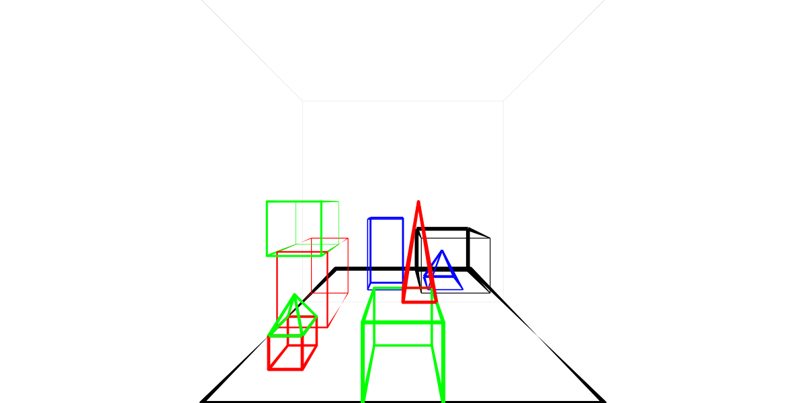
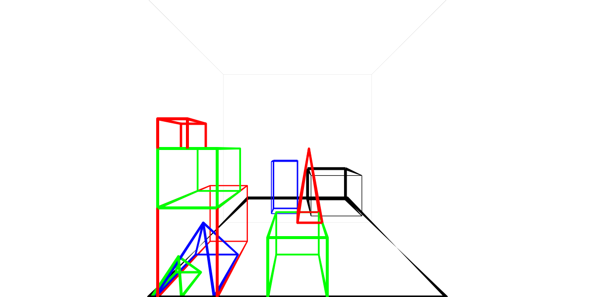

## 2020-12-17

Almost finished with the 21 interaction. The word "littlest" is analyzed successfully and its semantics are integrated with the rest. The interaction succeeds now except for the fact that the wrong pyramid is placed on top of the tower.

The reason: the word "the" in "the littlest pyramid" is implemented as a back reference and this again is implemented by looking at the anaphora queue first to see if it can find "the littlest pyramid". It finds the red pyramid (which is the largest) and condludes that it is the littlest one within the set of just itself. "the" is one of the hardest words around, semantically!

I changed the parser and the relationized. Thet can now handle cases where the root category is not `s`, with one variable. It can now be, for example `comparative(E1, E2)`. I need this for the morphological analyzer. It uses the Earley parser to parse the word segments.

## 2020-12-14

The rules I had so far allow for removing extra characters, but it doesn't allow adding missing characters.

And in the SHRDLU example, this is exactly what I need:

    littlest -> little est
    
It needs to add an extra e, but only when the adjective that is formed ends with "e".

    super: *est -> adj: *e, suffix: est
    
I can solve this by just adding the rule like this (not checking if the `adj` ends with "e", and checking if the final morpheme exists by explicitly naming it)

    adj: little
    
Up until now I stopped processing rules when there were no more rules to be applied. I could change this to : until all rules have resulted in terminals.  This is more powerful, and more robust. But it requires all the simple morphemes to be listed.           

## 2020-12-09

If I were to introduce long distance relationships, the problem of the relations from 7 Dec, the problem of duplicating morphological rules, could be handled like this

    { rule: relation(E1, E2&) -> noun(E1) }
    { rule: noun(E1) -> noun(E1), ortho: *s -> *, sense: number(E1, plural) }
    { terminal: noun(E1) -> 'daughter', sense: go:has_daughter(E1, E2*) }

`E2&` introduces an unbound dependency (gap), that will be filled in by `E2*`. Or, more verbose

    { rule: relation(E1, E2) -> noun(E1),                                   sense: gap(E2, rel) }
    { rule: noun(E1) -> noun(E1), ortho: *s -> *,                           sense: number(E1, plural) }
    { terminal: noun(E1) -> 'daughter', sense: go:has_daughter(E1, E2),     sense: filler(E2, rel) }
    
Here `rel` is the type of gap to be filled. The `gap` and `filler` relations need to be post-processed during the relationizer phase.

===

And what about this: I use these types of rules for segmentation

    { rule: relation -> noun }
    { rule: noun -> noun suffix,               ortho: *s -> * s }
    { rule: super -> adj suffix,               ortho: *{consonant1}{consonant1}est -> *{consonant1} est }
    { rule: comp -> adj suffix,                ortho: *{consonant1}{consonant1}er -> *{consonant1} er }

and these rules for morphological analysis

    { rule: plural_suffix(E1) -> 's',   sense: number(E1, plural) }
    { rule: super_suffix(E1) -> 'est'}
    { rule: comp_suffix(E1) -> 'er'}

    { rule: noun(E1) -> noun(E1) plural_suffix(_) }
    { rule: super(E1) -> adj(E1) super_suffix(_) }
    { rule: comparative(E1, E2) -> adj(E1, E2) comp_suffix(_) }

    { rule: relation(E1, E2) -> relation(E1, E2) plural_suffix(_) }
    { rule: relation(E1, E2) -> 'daughter',                     sense: daughter_of(E1, E2) }
    
    { rule: adj(E1) -> 'big',                                   sense: height(E1, H1) order(H1, desc) }
    { rule: adj(E1, E2) -> 'big',                               sense: height(E1, H1) height(E2, H2) greater_than(H1, H2) }

The start-category is not `s` as in a sentence, but rather the given category from the parse tree.

This way I can use the existing parser and the relationizer for semantic analysis of a word, and perhaps one day use gap-and-filler, if I want.  

===

Alternative for segmentation

    relation: * -> noun: *
    noun: *s -> noun: *, suffix: s
    super: *{consonant1}{consonant1}est -> adj: *{consonant1}, suffix: est
    comp: *{consonant1}{consonant1}er -> adj: *{consonant1}, suffix: er

or with strings

    relation: '*' -> noun: '*'
    noun: '*s' -> noun: '*', suffix: 's'
    super: '*{consonant1}{consonant1}est' -> adj: '*{consonant1}', suffix: 'est'
    comp: '*{consonant1}{consonant1}er' -> adj: '*{consonant1}', suffix: 'er'

Character classes can be written like this

    vowel: ['a', 'e', 'i']
    consonant: ['b', 'c', 'd']

## 2020-12-07

Regular expressions are not very well suited to the job. I will create a custom mini-language.

    // vowels
    { character-class: vowel, members: ['a', 'e', 'i', 'o', 'u', 'y'] }
    
    // superlatives (like 'biggest')
    { rule: super(E1) -> adj(E1), ortho: *{consonant1}{consonant1}est -> *{consonant1} }
    { rule: super(E1) -> adj(E1), ortho: *est -> * }
    
    // big
    { terminal: adj(E1) -> 'big', sense: go:order(E1, desc) }
    
The segmentation rules are like CLE's, but more general. 

Processing: in comes a word, all rules are tried, from top to bottom. The first that matches is executed. The result of the execution is then exposed to the rules again, until a terminal is reached.  

Semantics are included in the rules, not in a separate layer, because "Speech and Language" doesn't require a parsing step, and CLE does not give a good reason for one. So why not keep it simple until we know what we really need.

The character class allows short strings as well (i.e. `th`). I have no current need for them, but this seems like something you might need.

===

This works great for these examples, but what about for relations, like "daughters".

    { rule: relation(E1, E2) -> relation(E1, E1), ortho: *s -> *, sense: number(E2, plural) }
    { terminal: relation(E1, E2) -> 'daughter', sense: go:has_daughter(E1, E2) }
    
All orthographic rules would need to be doubled, because `relation` needs two variables.    

===

The problem here doesn't go away when the segmenation rules are separated from the semantic rules. 

## 2020-12-06

"Speech and Language Processing" also has a chapter on morphological analysis. Its approach is the use of Finite State Transducers. THese FST's need to be constructed from rules. And they need to be nested. Once this is done, it produces syntactic and semantic features.

The book has a lot of examples and is worth the read. But implementation of these ideas is not straightforward.

=== 

What about this: repeatedly try all segmentation rules, which look something like this:

    // parents
    { rule: noun(E1) -> noun(E1), ortho: /(.*)s$/ -> $1v, sense: number(E1, plural) }
    // cities
    { rule: noun(E1) -> noun(E1), ortho: /(.*)ies$/ -> $1y, sense: number(E1, plural) }
    // solves
    { rule: verb(E1) -> verb(E1), ortho: /(.*)es$/ -> $1ve, sense: tense(E1, present), number(E1, singular) }
    // solved
    { rule: verb(E1) -> verb(E1), ortho: /(.*)ved$/ -> $1ve, sense: tense(E1, past) }
    // breakable
    { rule: adj(E1) -> verb(E1), ortho: /(.*)able$/ -> $1, sense: able_to(E1) }
    // bigger
    { rule: comparable(E1) -> adj(E1), ortho: /(.*)([bcdfghklmn]{2})er$/ -> $1$2 } // fout $2 double consonant
    { rule: adj(E1) -> 'big', sense: big(E1) }
    // unhappiest
    { rule: adj(E1) -> adj(E1), ortho: /^un(.*)/ -> $1, sense: not($adj) }
    // schoolbus
    { rule: noun(E1) -> noun(E1), ortho: /^(.*)bus/ -> $1, sense: $noun drive_to(E1, E2) }

## 2020-12-04

CLE (p.120) has a special segmentation phase to analyse tokens into morphemes. The result of this phase is a `seg` relation such as

    seg(designed, [design, ed], regular)
    
Here, "designed" is the token, the array contains the morphemes, and the last argument is the rule by which these were extracted.

Rules can be `regular`, `irreg`, `suffix` and others.

The suffix rule is
    
    suffix(<added>, <removed>, <suffixes>)

Examples of suffix rules:

    suffix(ies, y, [s])
    suffix(ments, [], [ment, s])
    suffix(c1c1er, c1, [er])
    
In the last rule we recognize the comparative, in which `c1` is a consonant. Two `g`'s are reduced to one.

The segmentation phase is followed by the morphology phase. This phase is split into a word parsing phase and a sense derivation phase.

Word parsing is like sentence parsing in that it results in a parse tree. It yields syntactic information.

While the word parsing phrase is performed _before_ sentence parsing, sense derivation is done _after_ sentence parsing, a the same time when semantic analysis takes place.

===

So, a word is like a miniature sentence. It needs tokenization ("segmentation") and parsing. The parse rules can have semantic attachments. The tokenization phase is more complex; the parsing phase is simpler. 

## 2020-12-03

I thought long and hard about these two constructs:

    largest state of america by area
    america's largest state by area
    
They mean the same thing, but I need to treat them differently, because two parts of the sentence that are semantically dependent are syntactically separated:

    largest
    by area
    
This is where phrase structure grammar shows a weakness. I can't join separated parts of a sentence together. I don't know if other types of grammar can do it, but it would be interesting to find out.

I rewrote the DBPedia rules to make the relations and superlative rules more powerful and easy to extend. This is now possible because I separated sortal analysis from syntactic analysis. Semantics is no longer dependent of top-down sortal restrictions. They can also be bottom-up now.

===

Rules for plurals

https://www.grammarly.com/blog/plural-nouns/

Rules for double consonants        

https://www.grammarly.com/blog/spelling-words-with-double-consonants/

This information seems to imply that the units that matter are consonants and vowels. `biggest` must first be decomposed by this orthographic rule (segmentation)

`biggest` 
`(..\c\v\C)\Cest` -> `$1` `est` where `\v` means `vowel`, `\c` means consonant, and `\C` means the same consonant

After this segmentation, morphological decomposition is simple.

## 2020-11-30

Morphological analysis. Let's focus on the word "bigger" for a moment.

The word has 2 morphemes: "big" and "-er". An othographical rule ads an extra "-g-". 

The word big, I think means something different from the morpheme "big". "Big" means `larger than 128`, in the blocks world. The morpheme big does not mean that, because it can be used in the word "bigger". And one very small thing can still be bigger than another small thing. No, the morpheme "big" means something like `ordered by height, descendingly`. It orders the results. "Biggest" means "big", followed by `first()`, and "bigger" means "big", followed by `before(A, B)`. Paraphrased, "A is bigger than B" thus means: `take A's height hA and B's height hB, order these by height, ascendingly, then hA is positioned before hB`. 

Can't "-er" just mean `greater_than(A, B)`? It can if we just consider "bigger", but if we extend the use to "smaller", we're out of luck. Morphological analysis is not _necessary_, because we can extend the dictionary with all morphological variants of a word, along with their meanings. Morphology gives us the opportunity to have less rules, in the end. But more importantly, it allows the system to derive the meaning of words it has not heard before.

What does the rewrite rule like for words like bigger?

    { rule: adjp(E1) -> adj(E1, E2) 'than' np(E2),                            sense: go:quant_check($np, $adj) }

What are the inputs for the morhological analyser, for the word "bigger"?

- the form: bigger
- the category: adjective
- the variables, E1, and E2

What might a morphological rule look like?

    { rule: /big/(E1, E2) -> big,           sense: height(E1, H1) height(E2, H2) order(H1, asc) }
    { rule: /big/(E1) -> big,               sense: height(E1, H1) order(H1, asc) }
    
    { rule: /($1)er/(E1, E2) -> $1,         sense: $noun, before(E1, E2) }
    { rule: /($1)est/(E1) -> $1,            sense: $noun, first(E1) }
    
No this doesn't work. Ordering by the height of E1 doesn't help. What about this; it simply removes relations that are not `bigger`. 

    { rule: /(big(E1, E2))/ -> big,         sense: height(E1, H1) height(E2, H2) greater_than(H1, H2) }
    { rule: /(big(E1))/ -> big,             sense: height(E1, H1) order(H1, asc) }
    
    { rule: /(small(E1, E2))/ -> big,       sense: height(E1, H1) height(E2, H2) less_than(H1, H2) }
    { rule: /(small(E1))/ -> big,           sense: height(E1, H1) order(H1, desc) }

    { rule: /(noun(E1, E2))er/ -> %noun,    sense: $noun }
    { rule: /(noun(E1))est/ -> %noun,       sense: $noun, first(E1) }
    
Note that even for the morpheme `big` there are two variants: one has a single argument; the other has two.    

The ordering works for "biggest", but not for "bigger". "bigger" needs a `greater than` that cuts away the relations that do not fit.

Ok, and what about "the three biggest blocks"?

## 2020-11-29

I wrote about the recent breakthrough in looking up names in this blog 

http://patrick-van-bergen.blogspot.com/2020/11/the-right-way-of-looking-up-names-in.html

## 2020-11-28

I works! Tokenize -> Parse -> Relationize -> Find Sorts -> Find Names -> Answer -> Generate

I split the `find sorts` and `find names` off from the parse phase. This is more modular, and more powerful. Finding sorts and names is much easier now. And the only thing I was worried about, the explosion of the number of parse trees, turns out to be not a big problem at all. SYNTAX constraints the number of possible parse trees, even when your grammar tells you that 

> Any word can be a proper noun

I did not even order the parse trees by some heuristic. The first one that has sorts that do not conflict, and that lead to names being found in the database, is used to answer the question.

By changing this, the number of database lookups for names has reduced quite a bit. I don't need to do three word lookups when the name is just a single word, because I now _know_ that the name is just a single word.

## 2020-11-26

I removed the children from the state altogether, along with its id. This is more in line with the original Earley algorithm, and it is semantically more correct, because a `state` in earley should not be bound to concrete children; it's an abstracted entity. 

When the algorithm now completes a state, advanced states are now indexed in the chart (`advanced`). A completed state's child sequence is indexed in a separate field (`completed`). The extracter reads the child sequences from the `completed` field.

===

In "An Efficient Context-Free Parsing Algorithm", Jay Earley suggested that the completer add a pointer from the completed consequent (D, in E -> a D b) of the advanced state to the state that completed it (D -> c). When D is completed by multiple states, simply add multiple pointers to the completing states. 

Creating the parse trees from this representation is not straightforward, so this should have been worked out.

===

There are many earley implementations available from https://en.wikipedia.org/wiki/Earley_parser Some of these are probably very good. I doubt any of them are particulary instructive; they all require enourmous amounts of code.

I thought about writing an article about my solution, but there is not much point in this. I can't compare it with other solutions, since I don't understand them. It would take me very much time to work this out completely. And I doubt that someone is interested.

When I'm done simplifying the parser even more, I may point out its simple structure, and leave it at that.

=== 

Let's continue with the sort extractor. To repeat:

- Have `proper_noun` match any word
- This will create loads of parse trees
- Order these by the number of proper nouns (less is better?) and / or the length of the proper nouns (longer is better?)    
- For each tree:
    - Create relations
    - Determine the sorts of the variables; this is now easy because all relations are known (known sorts are better)
    - only if a sort is known, find the persons in the database, otherwise, skip the parse and mention that the person is not known
    - stop when found
    
So there are several aspects that help to determine the most likely parse tree:

- number of proper noun groups
- number of proper nouns per group
- number of known sorts

## 2020-11-24

I finished rewriting the parser (again!) to have it extract all parse trees. This was not a walk in the park! I had to stretch my brain for days and laying awake going though the algorithm in my mind again and again.

There were two problems: the first was to get the information of the trees out of the shared forest (preferably efficiently, but I would would settle for 'just so so'). The other was to build multiple trees while walking through a shared tree structure.

As I said a few days ago, "Speech and Language processing" described in brief how the parse trees should be extracted. However, this method turned out to yield only a single tree. Some literature was written on the subject by Tomita and Scott, but these algorithms are complex and I couldn't get my mind around them. So I went bacl trying to create my own solution.

What I finally came up with was an extension to the solution in "Speech and Language processing". In the `completion` stage I store links to completed "child" states in the completed "parent" state. I extended this with a an array field "children" in the chart. It maps a parent-state-string to zero or more child-state-sequences.

    type chart struct {
        states [][]chartState
        words  []string
        stateIdGenerator int
        children map[string][][]chartState
    }

A parent state has zero or more children. And there can be multiple instances of these. These are stored in `[][]chartState`. The `string` that forms the key of the map, is a textual representation of the parent state that holds just the rule and the start - and end word index. An example of such a key is

    np(E1) -> proper_noun_group(E1) {  } [2-3]
    
As you can see it represents a state, but it leaves out the child states in its representation. It is an abstraction of multiple concrete parent states, all of which have the same rule and word-span.

And then I had to find a way to traverse the forest and pop out trees. I had never done anything like this before. The algorithm I came up with is quite elegant I think. I just do a depth first traversal of the forest _like it had been a single tree_. But whenever it reaches a junction with multiple sets of child sets, it "forks" its process and continues with both trees "synchronously". Each new process clones the existing tree can continues to complete it. I quote "forks" because I do not actually fork the process, even though the language go would allow me to. I want this code to be portable. So what I did was in stead of using the system's stack to traverse the tree, I created a software-stack; one that I could clone along with the tree that was being built.

Before the clone; C is the active node.

    O
    |\ \        [*O] - [O*C] 
    O C D

After the clone; state has two groups of children: [X] and [Y Z S]; both continue in a separate fork. Each with a separate tree and a separate stack.  

    O
    |\ \        [*O] - [O C*D] - [X]  
    O C D
      |
      X

    O
    |\ \         [*O] - [O C*D] - [Y Z S*]
    O C D
     /|\   
    Y Z S
    
Note that after the children of C are done, the process backtracks through the software stack and continues to process the next nodes (here: D).

The `*` here is an index that keeps track of the child that is being processed.          

## 2020-11-18

I found out that the tree extraction routine I use doesn't work. It extracts only the first parse tree. This is all I needed up to now, but this is going to change. In "Speech and Language processing" it says:

"To turn this algorithm into a parser, we must be able to extract individual parses from the chart. To do this, the representation of each state must be augmented with an additional field to store information about the completed states that generated its constituents." "Retrieving a parse tree from the chart is then merely a recursive retrieval starting with the state (or states) representing a complete S in the final chart entry."

This is what I did, before. And I assumed that all completed `gamma => s` states would be available in the chart. But that's not what happens. Only the first one is stored; and that is exactly because Earley keeps track of the states it has processed. Hard to explain. Doesn't work the current way. 
 
The book is from 2000.

In 1986 Masaru Tomita wrote the book "Efficient Parsing for Natural Language: A Fast Algorithm for Practical Systems" that first describes Shared Packed Parse Forest (SPPF) using a competitive parsing algorithm. https://www.amazon.com/Efficient-Parsing-Natural-Language-International/dp/0898382025

In 2008 Elisabeth Scott wrote a paper called "SPPF-Style Parsing From Earley Recognisers" and describes how to extract parse trees from a Earley packed forest. An algorithm called BRNGLR. https://www.sciencedirect.com/science/article/pii/S1571066108001497

And apparently, the day before yesterday, Jeremy Dohmann published his thesis "Noise-skipping Earley parsing and in-order tree extraction from shared packed parse forests" with some interesting extensions. https://github.com/jcd2020/Thesis/blob/master/full_thesis.pdf

I am going to read these. 

## 2020-11-15

I have a problem. There are two types of relational phrases: "a of b", and "b's a". Each of these has many forms:

    state of X
    father of X
    son of X
    capital of X
    
    X's state 
    X's father
    X's son
    X's capital
    
Currently I have many rules like this

{ rule: nbar(E2) -> 'capital' 'of' np(E1),                            sense: go:quant_check($np, dom:has_capital(E1, E2)) }
{ rule: nbar(E2) -> 'capital' 'of' np(E1),                            sense: go:quant_check($np, dom:has_capital(E1, E2)) }
    
So I want to extract the relation in a separate rule

    { rule: relation(E1, E2) -> 'capital',                                  sense: dom:has_capital(E1, E2) }
    
And there are more cases where the current scheme of determining sort by top down induction from sense doesn't work. In many cases the sort can not be reduced top-down while parsing, so I want another technique.

I am now thinking of the following:

- Have `proper_noun` match any word
- This will create loads of parse trees
- Order these by the number of proper nouns (less is better?) and / or the length of the proper nouns (longer is better?)    
- For each tree:
    - Create relations
    - Determine the sorts of the variables; this is now easy because all relations are known (known sorts are better)
    - only if a sort is known, find the persons in the database, otherwise, skip the parse and mention that the person is not known
    - stop when found
    
So there are several aspects that help to determine the most likely parse tree:

- number of proper noun groups
- number of proper nouns per group
- number of known sorts

Can I just generate all relations for each parse tree? If so, then just take the one with all sorts complete.

Note! This solution also allows me to say "I don't know X" again, which was not possible before.

Suggested steps:

- parse, and for each tree
- relationize 
- extract sorts
- find entities by name     

## 2020-11-13

I did

    What is the second largest state of america by area?"
    
by adding the functions

    go:order(Var, Dir)
    go:get(Start, Count)
    
that work on result bindings. Here is the main grammar rule:

    { rule: nbar(E1) -> ordinal(N1) 'largest' nbar(E1) 'by' 'area',       sense: dom:land_area(E1, Area) go:order(Area, desc) go:subtract(N1, 1, I1) go:get(I1) }       

## 2020-11-11

Next sentence:

    What are the two largest states of America by area?
    
First up: `the two`. So far I have regarded a count noun as a quantifier, but I can't keep this up any longer. Although?

    { rule: quantifier(Result, Range) -> 'the' number(N1),                sense: go:equals(Result, N1) }

In SQL the query would be like this

    SELECT name OF state ... ORDER BY area DESC LIMIT 2

## 2020-11-10

I wrote to Terry Winograd about this project a couple of weeks ago. Today I got his reply:

> Dear Patrick,
>
> Thanks for letting me know about your project.  Sounds like you are working hard at developing a line of development which is out of favor in today's world of machine learning.  I wish you success.
>
> All the best,
>
> --Terry Winograd

This made me happy today :)

I am having a go at these SEMPRE queries in a DBPedia context:

    Here is the city with the largest area:    
    (argmax 1 1 (fb:type.object.type fb:location.citytown) fb:location.location.area)
    
    The second largest city by area:    
    (argmax 2 1 (fb:type.object.type fb:location.citytown) fb:location.location.area)
    
    The five largest cities by area:    
    (argmax 1 5 (fb:type.object.type fb:location.citytown) fb:location.location.area)
    
    The person who has the most number of children (who, in Freebase, turns out to be Chulalongkorn with a whopping 62):    
    (argmax 1 1 (fb:type.object.type fb:people.person) (reverse (lambda x (count (!fb:people.person.children (var x))))))

My first query:

What is the largest state of America by area.

Remarks:

- I am taking land area (as opposed to land + water area)
- "America" is not a name in DbPedia (it is, but not the name of the USA); so I am making this explicit in the mapping
- The connection `state-of-county` does not exist. There is a `hypernym` property that may have value `http://dbpedia.org/resource/State` but this also houses things like `http://dbpedia.org/resource/Greenberg–Hastings_cellular_automaton` so not really useful. Also Hawaii is not such a state. I am now using `http://dbpedia.org/class/yago/WikicatStatesOfTheUnitedStates` together with the hypernym. Unfortunately I am missing some states. DBPedia's relations lack strong semantics.

## 2020-11-08

I completed interaction 20, by introducing the sortal reference ("one" means "block") I described yesterday.

Renamed entities.yml to sorts.yml and "entity type" to "sort".

===

Interaction 21:

    H: Put the listtlest pyramid on top of it.
    C: OK
    
Winograd: Words like "little" are not in the dictionary but are either interpreted from the root forms likt "little".

The meaning of the wordt "littlest" is: the smallest height. The meaning of the word "little" is: height less then 128. How can we derive the meaning of littlest from that of little?  

SHRDL has a morphological analyser called Morpho. I think (!) it recognizes suffixes, like this:

    ((STA WORD '(G N I)) (SETQ RD (CDDDR WORD)))
    ((STA WORD '(D E)) (SETQ RD (CDDR WORD)))
    ((STA WORD '(N E)) (SETQ RD (CDDR WORD)))
    ((STA WORD '(R E)) (SETQ RD (CDDR WORD)))
    ((STA WORD '(T S E)) (SETQ RD (CDDDR WORD)))

Note the list `'(T S E)` that has the suffix `est` in reverse. How can SHRDLU know that littlest should take the smallest height; not the largest height? I think this is derived from the attribute `DIRECTION` from the definition of "little":

    (DEFS LITTLE 
        SEMANTICS ((MEASURE (MEASURE DIMENSION:
                     #SIZE
                     RESTRICTIONS:
                     (#PHYSOB)
                     DIRECTION:
                     NIL))
               (ADJ (OBJECT 
                (MARKERS: (#PHYSOB #LITTLE) 
                 PROCEDURE: ((#MORE #SIZE
                            (128. 128. 128.)
                            ***)))))) 
        FEATURES (ADJ))
    
`DIRECTION` is `NIL`, whereas "big" has a direction of `T`:

    (DEFS BIG 
        SEMANTICS ((MEASURE (MEASURE DIMENSION:
                     #SIZE
                     RESTRICTIONS:
                     (#PHYSOB)
                     DIRECTION:
                     T))
               (ADJ (OBJECT 
                (MARKERS: (#PHYSOB #BIG) 
                 PROCEDURE: ((#MORE #SIZE *** (128. 128.
                                    128.))))))
    )   FEATURES (ADJ))    
    
SHRDLU stores information about a word in its definition; an object oriented structure.

Can all _diminutives_ be characterized with a direction? How many diminiutives are there? Does it pay to create a morphological analyser for this reason alone? Is it hard to write a morphological analyser? (yes I think so!)    

# 2020-11-07

Interaction 20 is:

    H: Put a small one onto the green cube which supports a pyramid
    C: OK
    
Winograd notes: "A small one" must contrast with the earlier phrase "a large block", so this means "a small block"

I added the code for this interaction within 10 minutes. And the result is correct. The tall pyramid is removed from the front green block and placed elsewhere. The small red block is removed from the stack and placed on top of the green block.

However, the interaction succeeded by accident. If the small pyramid had been listed before the small block in the database, this object would have been placed on the green block. The reason? "A small one" does not match any of the previous entities in the queue, since NLI-GO only uses the anaphora queue on definite references ("the" in stead of "a"). So "a small one" is not interpreted as "a small block" but more generally as "a small object". And the red cube (its `size` relation, in fact) is the first one in the database. 

What needs to be done is this: the word "one" must be treated as a back reference, so that it can be resolved to the concept "block".

- A variant on the function `back_reference()` for sorts `sortal_back_reference()` 
- "one" will have sense `sortal_back_reference()`   
- `sortal_back_reference()` searches in the anaphora queue for the last sort (`block`)
- in the file `sorts.yml` it can find the predicate to use for sort `block`, namely: `block(E1)`
- this predicate is used to find the block

# 2020-11-06

Changed logging: debug lines are now only calculated when debug is on. This is important because log line calculation took up 25% of processing time.

# 2020-11-05

Uniformized the directory where all generated files are stored. It is now always the `var` directory, except when you specify another directory. The `session`, `log` and `sparql-cache` directories are located within `var`.

# 2020-11-02

Finished `go:break()`. It breaks `go:list_foreach()` and `go:range_foreach()` loops. Very nice to have. Quite simple to implement if you have the scope stack available.

# 2020-11-01

Extended generation with head conditions; see generation.md

Removed most of the syntactic brackets `[ ]` where they were not necessary: in code declrations. Brackets are now only used with bindings and lists. 

===

Proper functions. New syntax. Implemented as a rule with property "function" true. Adding the `return` keyword. It places the value in the current scope's `returnValue`. The solver must check if this value is set and then not continue. Function call is a term???

    square(X) {
        go:multiply(X, X, R)
        return R
    }

Implementation may be as follows: on solving a relation, the solver may start by inspecting the arguments. If an argument is a function call, it may be replaced by its return value.

=== 

Introduced `break()` to break a loop. It's not finished, but it works already very well on the free space algorithm. Brought down the blocks world tests from 3 seconds to 1 second.

# 2020-10-31

I started indexing predicate to knowledge base / knowledge base function, in the problem solver, for speed. It made the blocks world test 1/8th faster. More importantly, this allows the system to scale up to many more knowledge bases, because finding the handler for a predicate is now reduced from O(n) to O(1).

# 2020-10-28

I used the database to store the 2D grid of the space algorithm. This is not good practise, so I want a n-dimensional datatype and I want it to be sparse. Let's call it matrix. Let's specify a default value.

    go:make_matrix(M1, 0, 1000, 1000, 1000)
    go:matrix_get(M1, 513, 811, 12)
    go:matrix_set(M1, 513, 811, 12, Value)

# 2020-10-27

I turned bindings into a proper set: BindingSet. Checking for uniqueness is done in the `Add()` function. This check proved very heavy in the aggregation question of DBPedia. It now took 14 seconds, as compared to 1 second before.

It took me a while to come up with a good solution for this, but I found it in using a hashmap using the serialized representation `String()` of a binding as key. Checking for membership in the set is now O(1), which is great.

Since a binding may contain to pointer to a scope that changes, one might think that it's wrong to fix the serialization of a binding (which contains part of the scope's contents) at any time. However, fixing the scope at that point in time is a good thing, because, if scoped variables are relevant, than their value _at a given time_ is exactly what matters.

In a mathematical set, the order of the elements doesn't matter. In the case of the bindings, the order does matter, even if it is only for testing, to get the same responses each time (i.e. "Madonna and Penn" and not "Penn and Madonna"), so I kept the ordering in tact.

===

My app does not return the blue block in the answer to interaction 19. I found out that this is because the blue block isn't considered "large". My interpretation of "large" was the same as that of "big", that is: all dimensions must be greater than 128. Cf SHRDLU:

    (DEFS LARGE 
        SEMANTICS ((MEASURE (MEASURE DIMENSION:
                     #SIZE
                     RESTRICTIONS:
                     (#PHYSOB)
                     DIRECTION:
                     T))
               (ADJ (OBJECT 
                (MARKERS: (#PHYSOB #BIG) 
                 PROCEDURE: ((#MORE #SIZE *** (128. 128.
                                    128.))))))
    )   FEATURES (ADJ))

And the length of the blue block is only 100. I added a procudure for "large" that simply says: height > 128. This will do for now.

The app now replies:

    Yes, the red block, the large green cube which supports the red cube and the blue block 
    
which is correct. However the answer SHRDLU gave is

    Yes, three of them: a large red one, a large green cube and a blue one
    
So there is some work to be done.

I also so that SHRDLU doesn't actually build the stack on the location of the largest block. It is located in a bit of a different location.

===

Note: I remove the iterator variables from the result bindings in foreach loops, to reduce the number of unnecessary bindings.    

# 2020-10-25

Bindings should be a set. It must contain each binding only once. This should be enforced in code.

I just found out that a single procedure call may yield the same value many times, and this causes the following procedures to be excuted just as many times.

The `UniqueBindings` function seems to be very heavy, however.

# 2020-10-22

Starting to appreciate the "Let it crash" coding style

https://en.wikipedia.org/wiki/Erlang_(programming_language)#%22Let_it_Crash%22_coding_style

# 2020-10-20

I got local variables to work. Local variables might not be the right name. Perhaps "rewritable variables" is better. I solved the problem of using local variables as parameters to relations.

This is experimental, of course, as is the whole application in this state. I now have two types of variables that look exactly the same. One can receive a value only once; the other one may be rewritten. It would be good to make them syntactically different. For example

    go:let(%X, 0)
    go:let(&X, 0)
    
But I haven't done that yet. 

The question arises: why not make all variable rewritable? Other languages do it all the time. If you don't need rewriting, don't use it.

The reason of course is that the variable, once bound, serves as a constraint for the rest of the program. Once Name is "John", and you use it in the relation name(E, Name), Name should not be overwritten, it serves to find only entities whose name is "John".

Erlang does not support mutating variables. Elixir, which is based on Erlang, doesn't either. But it has "variable rebinding". 
http://blog.plataformatec.com.br/2016/01/comparing-elixir-and-erlang-variables/
https://medium.com/everydayhero-engineering/elixir-variable-rebinding-342c5d0fd961

===

An algoritm to find a place for a block. 

Collect all vertical (V) and horizontal (H) lines that form the edges of existing objects.
Create a VxH grid of 1 and 0 where 1 means: occupied by an objects.
Go through all V
    Take 1, 2 or 3 columns at once (a multicolumn, V1), as much as minimally needed for the block.
    H1 = 0
    Go through all H        
          If the block fits in H1, stop
          If the multicolumn is not empty, H1 = H + 1
            
  
# 2020-10-18

Adding local variables, because I am creating a function that determines the largest rectangle, and I don't want to do this via recursion.

The local variables are stored in a Scope object. Scope objects are stored in a stack. Whenever a rule fires, it pushes a scope onto the stack; when it is done, the scope is removed. A binding can have a reference to such a scope, so that I don't need to pass bindings and local variables separately all through the system.

# 2020-10-16

Writing the algorithm for finding space made me clearly see that I needed real operators. Specially the fact that I need to introduce extra variables just to add things up is tiresome:

    go:subtract(H, 1, HPrev) grid(WorkH, HPrev, V, WorkPrevH) go:add(WorkPrevH, 1, WorkH)
    
I want to write

    grid(WorkH, H - 1, V, WorkPrevH) WorkH = WorkPrevH + 1
    
I can do this with two things:

1) parse `A + B` as `add(A, B)`, and `A = B` as `unify(A, B)`
2) if `add(A, B)` is used on the place of a scalar argument, it should be expanded as `add(A, B, C)`, executed, and the value of `C` filled in into the argument        

I have no intention to allow the user to create operators. This makes code hard to read to outsiders.

Another idea is to actually create functions that can only be used where a term is wanted.

square(X) :- return(X * X)

These don't need to be special. They just need to contain one or more returns. I like this better then the extra argument at the end; and it still allows for a variable number of arguments.

In Erlang the last expression in a function is returned.
Mercury, another declarative language, does the same: https://en.wikipedia.org/wiki/Mercury_(programming_language)#Examples 

But how do you make the difference between passing a relation set, and passing the result of a function call? 

It can be solved by adding type information to the arguments of relations. How about this:

    surface(X int, Y int) int :-
        return(X * Y);   

# 2020-10-12

The image has revealed all kinds of problems!

- There was a bug in the do_put_in() routine (now fixed)
- "Stack up two pyramids" has moved the blue pyramid in order to attempt to create a stack. It is out of the box (now fixed)
- All objects that were but on the table are in the lower left corner of the table
- The blue block and the blue pyramid take up the same position

It's time for a better routine to find empty space.

# 2020-10-11

I used Pinhole https://github.com/tidwall/pinhole to create a visual representation of the blockworld's scene. I found myself drawing pictures with pencil using debug data, more than once, so I thought this could be easier.

This is image of the initial blocks world

and this is the situation after interaction 18:

Something clearly went a bit wrong :}

# 2020-10-10

I removed the node argument from `and()`, `or()` and `xor()`. I no longer use this node argument to link and's in the generation process. I just nest them, like I do in the parsing process. 

This makes and end to the dummy argument in the parsing process, but it makes generation somewhat more complicated, since it now allows for nested structures.

This situation is better than before, because it is unnatural to require a "node" argument in a logical and, but I am not happy with the generation of one or more entities. dbpedia now contains the most generic and-generation code, and it looks like this:

    { rule: entities(And) -> entities(E1),                                        condition: go:unify(And, go:and(E1, _))  }
    { rule: entities(E1) -> entity(E1),                                           condition: go:and(E1, E1) }
    { rule: entities(E1) -> entity(E1) ',' entities(E2),                          condition: go:and(E1, go:and(E2, _)) }
    { rule: entities(E1) -> entity(E1) 'and' entities(E2),                        condition: go:and(E1, E2) }
    { rule: entities(E1) -> entity(E1),                                           condition: go:and(_, E1) }
    { rule: entities(E1) -> entity(E1) }

This complexity is created by both `make_and()` which always creates `and()` relations, even when there is only one entity:

    and(`byron`, `byron`)
    
And that a relation may contain either entity-variables and `and`s:

    married_to(E, and(`presley`, `rowe`))      

So maybe it's time for an improvement to `make_and()`.

===

Interaction 19:

    Q: Is there a large block behind a pyramid?
    A: Yes, three of them: a large red one, a large green cube and the blue one

When I programmed this question, the first answer I got was: none.

Checking out what was wrong I found that the blue pyramid had moved to a different place; I don't know why yet. Also, I built the tower in the wrong place. It's in the front now, so no pyramid is in front of it any more. I should have built the tower on the big red block, without moving it. It would have been easier not moving the largest block, since it was already on the table. Let's see if I can change the code so that it will build the tower without moving the big red block.

I gave the objects some better readable id's (b1 -> small-red, etc).

# 2020-10-06

Before, I had introduced names for objects in the blocks world, like "the blue cube". So that I could use these names in the answers. However, SHRDLU generates these names based on these distinguishing characteristics. Since I can do that too, now, I thought it would be nice to remove the names from the blocks database. And it worked! 

For this to work I had to introduce the predicate `shape`, which is always the same as `type`, except when type is a block and its dimensions are the same; then it is a cube.

# 2020-10-05

I fininished interaction 18! Today I cleaned up the generation grammar, by using the technique that each rule could be used only once with a particular binding.

This way I could use left recursion for `nbar -> adj nbar`. 

I noticed that I could not do without categories like `color` and `volume`. It was not possible to make these `adj`. But I think this is not a problem. 

# 2020-10-04

I had a problem with generation of text from a structure that contains multiple relations for the same entity

    large(E1) green(E1) block(E1)
    
    { rule: adj(E1) -> 'large',                                                 condition: dom:volumne(E1, large) }
    { rule: adj(E1) -> 'green',                                                 condition: dom:color(E1, green) }
    
Since the generator takes the first rule it can find, it will use only the first one; and 'green' will not be used.

I tried to solve this by creating

    { rule: nbar(E1) -> volume(E1) color(E1) noun(E1),                          condition: dom:color(E1, C) dom:volume(E1, V) }
 
And this works for small grammars, but it is not extensible. 

What I am going to do is that I will go back to more standard rewrite rules and introduce the restriction that a rule, together with a variable-binding can be used only once in a generation. This technique is also used by Earley to avoid left-recursion.  

===

The include syntax `{{ DescSet }}` is implemented as a relation `$go$_include_relations`. I chose this name so that the relation cannot be used explicity by the developer.

The processing of `{{ DescSet }}` is now done by the variable binding functions. When a relation set is bound to variables `BindSimple()`, this process checks if the relation set contains a relation `$go$_include_relations` and if so, replaces this relation by its bound contents.

# 2020-10-01

    "The large green one which supports the red pyramid"
    
"The large green one"? The green blocks are both equally large (200x200x200)! So "large" provides no extra information and should have been left out.   

# 2020-09-28

`{{ DescSet }}` is like `call(DescSet)` with some subtle differences:

- relations are inlined before generation
- `call` does not export variables, while `{{ }}` does.

# 2020-09-26

I don't think its necessary to introduce a new entities.yml entry, nor a special command. The solution can call a domain rule to get a description.

On the other hand, it is not enough to create a string of text to serve as a description; it should be language-independent. This means that the solution must create, from a single entity id, a more complex relation structure, which can then be fed to the generator.

For example, if E1 is the large green one which supports the red pyramid, then the solution must create the relational structure

    green(E1) large(E1) support(E1, E2) pyramid(E2) red(E2)
    
The only relations the solution currently creates is done by `make_and()` which adds some `and` relations.

So this interaction is not only about finding a unique description, but about building relation structures as well.

    {
        condition: ...,
        responses: [
            {
                preparation: dom:create_description(E999, DescSet),
                answer: {{ DescSet }}
            }
        ]
    }     
    
    create_description(E1, DescSet) :-
        if_then_else(
            type(E1, T) type(Et, T) number_of(Et, 1), 
            unify(DescSet, type(E1, T)),
            if_then_else(
                size_type(E1, ST) size_type(Ex, ST) number_of(Ex, 1),
                unify(DescSet, size_type(E1, ST)),
                if_then_else(
                    color(E1, C) color(Ey, C) number_of(Ey, 1),
                    unify(DescSet, color(E1, C)),
                    if_then_else(
                        color(E1, C) size_type(E1, ST) color(Ea, C) size_type(Ea, ST) number_of(Ea, 1),
                        unify(DescSet, size_type(E1, ST) color(E1, ST)),
                        support(E1, E2) create_description(E2, E2Desc) unify(DescSet, size_type(E1, ST) color(E1, ST) support(E1, E2) {{ E2Desc }})
                    )                    
                )
            )
        )
        
This looks good. I will try this out.        

# 2020-09-25

From 09-20:

    - color(Id, Color) size_type(Id, SizeType)

Can be implemented as: 

- select color from E1: C
- select size from E1: S
- select all ids where color = C: Cc
- select all ids where size = S: Sc
- if Cs = 1, take color as unique property
- if Sc = 1, take size as unique property
- if the intersection of C ids and S ids = 1 id, take the combination of C and S as unique property

    block:
        describe: &describe_entity
        
    describe_entity(E1, Name) :- 
        switch(
            name(E1, Name),
            color(E1, Color) count( color(E1, Color), 1) color_name(Color, ColorName) ...
        )      

Make sure the description can be generated in any language.                 

# 2020-09-21

I am moving entities.yml from db to domain, because it contains only domain references, and I want to extend it with properties I can use for interaction 18.

# 2020-09-20

I added ASSERT and RETRACT for MySQL. You can now insert and delete information in a MySQL database.

    block:
        describe:
            - name(Id, Name)
            - color(Id, Color) size_type(Id, SizeType)
            - support(Id, X)
            - to_left(Id, Y)
            
Maybe I need generation rules to create the response. 
            
===

About interaction 18:

    Q: Which cube is sitting on the table?
    A: The large green one which supports the red pyramid
    
This is a `which` question, that asks for a selection. The programmer may choose to use a function that's called, let's say "go:describe(E)" to create a distinguishing text for the answer. But would would such a function do?

In 8.3.3 Naming Objects and Events, Winograd describes how SHRDLU forms a meaningful description of an object. 

"First we need to know how the object is basically classified." Each type of entity needs a human-defined set of useful properties: size, color (but not: x-location, height). They are properties that a human would find easy to distinguish, but for a computer it would not matter, so they need to be hand-picked.

1) "The naming program first checks for the unique object in the world." They either have a name, or they are one of a kind (i.e. "the box").

2) If the object is a block, ball or pyramid, the correct noun is used and a description is built of its color and size. If this uniquely describes the object, the description is preceded with "the" and its done.

3a) If the requirement is nonspecific, just use these properties, preceded by an article: "a green cube"

3b) If it needs to be specific: add still more information:
    - information about the objects it supports
    - name the objects to its left
    
It is clear that a computer cannot determine a proper description by itself; it needs our help.    

# 2020-09-16

Some remarks on SEMPRE: 

Names: in the tutorial it suggests creating a lexicon for the names of the entity in the database. Apparantly this lexicon is hand-written. This is a huge amount of work. And I would ask: why not use the names in the database directly?

Relations: in the tutorial the relations used to compose the logical form are taken directly from Freebase. This makes the grammar domain-specific. It is a semantic grammar that is bound to a single database. Tieing domain logic to database representation can be cumbersome, since database representation has a different responsibility than domain logic. In a database, efficient storage is important. For domain logic, human reasoning is important. It is better to separate these right away.

Interactive mode: I really like SEMPRE's interactive mode. It allows you to interact with the system without having to start it each time. This works very well in a terminal. I'd like to copy that.

Compilation to Java: SEMPRE compiles a sentence into a Java program. It brings in the expressive power of a complete programming language. This is a very powerful feature, and not one I can simply copy. 

And I found [these examples](https://github.com/percyliang/sempre/blob/master/DOCUMENTATION.md) interesting:

    Here is the city with the largest area:    
    (argmax 1 1 (fb:type.object.type fb:location.citytown) fb:location.location.area)
    
    The second largest city by area:    
    (argmax 2 1 (fb:type.object.type fb:location.citytown) fb:location.location.area)
    
    The five largest cities by area:    
    (argmax 1 5 (fb:type.object.type fb:location.citytown) fb:location.location.area)
    
    The person who has the most number of children (who, in Freebase, turns out to be Chulalongkorn with a whopping 62):    
    (argmax 1 1 (fb:type.object.type fb:people.person) (reverse (lambda x (count (!fb:people.person.children (var x))))))

I don't have anything like this yet.

# 2020-09-14

Started the application 'expressions', because I am reading about [SEMPRE](https://github.com/percyliang/sempre/blob/master/TUTORIAL.md) and I wanted to know what the expressions example looked like in NLI-GO. 

# 2020-09-13

Interaction 18: 

    Q: Which cube is sitting on the table?
    A: The large green one which supports the red pyramid

Winograd: "Ordinarily the system would be satisfied with calling this 'a big green cube', but since we asked 'which cube' it has to be more specific in naming it. The use of substitute nouns (such as 'one') and pronouns in answers makes the discourse more natural."

# 2020-09-12

Made the nli app more prominent, separated it from the web-app for clarity, and extended the documentation on the main README. 

# 2020-08-30

I need to handle rule-references like `by_easiness` in

    go:quant_ordered_list(QBlocks, by_easiness, List)
    
Left unchanged, it is an atom, and atoms don't have a hamespace. I treat them just like strings, they are constants that get their meaning through their use by predicates. I came up with the idea of introducing a rule reference `&`:

    go:quant_ordered_list(QBlocks, &by_easiness, List)
    
A rule reference can have a prefix.

# 2020-08-16

I will introduce modules to go with the namespaces. 

# 2020-08-13

About predication declaration: these define sorts

    "has_wife": {"entityTypes": ["person", "person"] },
    
But validation uses types

    go:add(int, int, int)
    
For custom predicates I also want to have these

    dom:parent(id:Person, id:Person)
    dom:name(id:Person, string)        

Where `id:Person` contains both the type (id) and the sort (Person).

# 2020-08-07

Thinking about namespaces. Namespaces are necessary when using third party knowledge bases, and they are useful to distinguish own predicates with system predicates. I want to make this easy to use. This is where I am now:

A namespace is rooted in a directory. Below this directory can be other directories.
Within a namespace, we distinguish between own predicates and external predicates. Own predicates have no prefix; external predicates do:

    my_predicate(X, Y)
    bb:their_predicate(W, Y)
    
I will be using the prefix `go` for system predicates:

    go:quant_foreach()    
    
Predicate files may be placed in subdirectories, and own predicates may refer to these; paths are relative to the namespace root.

    orders/my_order(X, Y)
    
You can only refer to external predicates in the root directory of a namespace; these are public. Nested directories of external namespaces are off limit, they are private. So this is not possible:

    * bb:subdir/their_predicate(W, Y)    

Each namespace has a file called `index.json` that contains information about it:

    {
        "name": "corpsoft/plants",
        "uses": {
            "ani": "othercorpsoft/animals",
            "min": "othercorpsoft/minerals"
        }
    } 

This file determines the full name of the package, and its dependencies. It also maps the full names of other packages to prefixes. These prefixes are used to denote the predicates as in

    ani:has_legs(X, Y)
    
The index file will later be extended with a major-minor-patch version; and the dependencies with version restrictions.

Fact bases will also get an `index.json` file. It will contain the information about the fact base, and the predicates it maps from   

    {
        "name": "corpsoft/database",
        "type": "sparql",
        "baseurl": "https://dbpedia.org/sparql",
        "defaultgraphuri": "http://dbpedia.org",
        "map": "db/ds2db.map",
        "names": "db/names.json",
        "entities": "entities.json",
        "doCache": true,
        "use": {
            "animal": "corpsoft/animals"
        }
    } 

A grammar uses predicates, so it must specify its dependencies in its index

    {
        "uses": {
            "me": "mysoft/blocks"
        }
    }

# 2020-08-02

I replaced the `sem(N)` semantics references with the `$` references. For instance

before:

    { rule: np(E1) -> 'either' np(E1) 'or' np(E1),                         sense: or(_, sem(2), sem(4)) }
    
after:    

    { rule: np(E1) -> 'either' np(E1) 'or' np(E1),                         sense: or(_, $np1, $np2) } 
    
An index of 1 is implied, so you can use `$np` if there is only one `np`.

Also, `quant_check` and `quant_foreach` not allow only a single quant.    

# 2020-08-01

I completed the complex interaction number 17.

I replaced `do()` with `quant_foreach()` and `find` with `quant_check()`, because these names express their meaning better.

# 2020-07-27

    "The command is carried out by the following steps: It puts a green cube on the large red block (note that it chooses the green cube with nothing on it), then removes the small pyramid from the little red cube, so that it can use that cube to complete the stack as specified."
    
I don't understand why SHRDLU doesn't just put the little pyramid on top. This is an object that has "nothing on it", which is appararently a reason to choose something over something else. Somehow a block with a pyramid on top is still more attractive than a pyramid for building a stack.

===

A lambda function takes just one argument. If a semantics needs three variables, it is necessary to nest three functions. It is necessary to call these in the correct order. In my syntax you can pass multiple variables at once, via the head. The order is determined by the position of the arguments.   

# 2020-07-23

I am reading "Semantics in Generative Grammar" by Heim and Kratzer. Very clearly presented book. But on the first page I stumbled over

    "To know the meaning of a sentence is to know its truth-conditions"
    
There is also a variation where "truth-conditions" reads "truth-value". My point is that in NLI-GO the meaning of a sentence is not about truth, but about command. The semantics of a sentence is correct if the command succeeds in making the computer do what you want it to do. Even a declarative sentence, which is the type of sentence treated in books on language semantics, has a commanding reading; it says: assert this statement to your knowledge base. Furthermore, the final episthemological level of NLI-GO is not _truth_, but rather _belief_. The facts in the knowledge base are the atoms of work. Whether this information is true or false is outside the responsibilities of the system.

Frege / Montague use functions to calculate the truth value of a sentence. Since this is not our aim, the use of functions is not necessary, and we can use a much  more free use of semantic composition.      

# 2020-07-17

What is the quantifier for the unquantified noun?

* Does every woman have _children_? => some
* What _bike_ did you take? => "what" is an "interrogative determiner"
* How many _cookies_ did you take? => count them all
* Can _birds_ fly? => yes, most can, but not this penguin here
* Pick up _blocks_ => not possible

I am going to treat the unquantified noun as a noun that lacks a quantifier. It will try to match as much as it can, and will make no checks. But I will treat it as quantifier, because it is much easier for me to treat all NP's as being quantified. The quantifier will get the special atom `none`.

===

I changed variables to completely camelcased. 

    Ordered_blocks => OrderedBlocks
    
Because I don't know what I was thinking when I created this (actually I do) :).     

# 2020-07-14

Since I need to do something with the order of entities, the thought keeps reocurring that _order_ can be part of the quant:

    quant(quantification, range, order)
    
As yet I need order because "stack up both of the red blocks and either a green cube or a pyramid" implies "stack up easiest first".

Are there sentences where the order of entities is part of the NP?

    * Play songs by Moby sorted by age    
    * Play songs by Moby oldest first
    * Play songs by Moby shuffled
    * Stack up some blocks, starting with the easy ones
    
I also like to have order part of the quant because the quant itself becomes a sort of SQL query, with FROM = range, LIMIT = quantification (WHERE would go in the scope of the `find` relation). It is an object specification that can be passed around, modified, and executed at any desired time.

What I don't like is that `quant` then has sometimes two, sometimes three arguments.      

===

I added a list of terms as a term type. This means that you can now use [1, 2, 3, 4] as an argument to a relation. Any type of term is allowed as element.

To make this possible I needed to remove the optional brackets `[]` in the relation set, which I intended to to for a long time.

Use the atom `none` if you want to enter an empty relation set.   

# 2020-07-12

Trying to solve the stacking problem, you can split it in a planning phase and an execution phase

1) planning: find 4 easy objects that match the requirements, order them by size (pyramid on top)
2) execution: place the objects on top of each other

But, while this is not an issue in the blocks world, it can be in other situations, there may be problems in the execution phase. A certain block may be taken by someone else while you are building the tower, for example.

Therefore a more robust solution would be to integrate the planning and the execution phases. All objects would remain possible to use while executing. But this requires a much more complex working data structure with two types of ordering (by size, by easiness). 

This would be _more robust_, but it would not be completely robust. Because someone might kick over the stack. This problem would not be solved by the extra robustness.

People, I think, use the two phases: select some blocks, build the stack. If something goes wrong, _replan_.

But I am not now going to build a replanning agent.

===

    "Will you please stack up both of the red blocks and either a green cube or a pyramid?"
    
If a computer has an option between A XOR B, it will try A first. But what if both of the green cubes are much more difficult to move then the pyramid? Can this system handle this situation?    

=== 

Possible new description of NLI-GO: "rule based semantic parser and executor" (like SEMPRE)

# 2020-07-11

I needed a sort function that sorted current bindings with respect to a sort function that handled on a specific variable. But the fact that the set of bindings served as a sort of data structure always troubled me. This intended sort function pushed me over the edge

    sort(E, sort_func)
    
(Sort all bindings using sort_func and use E as the active variable)

While it is _possible_ to use the active bindings as a data structure, it is not intuitive, not explicit, and Prolog does not do it.

When Prolog acts on multiple bindings (called 'solutions'), it is always in the scope of a specific function (findall, aggregate).

Therefore I want to introduce the list, that holds an array of values of any type. Programming with lists is intuitive.

And I need a (single) function that takes a set of current bindings and turns a single variable of them into a list.

    to_list(E1, List)
  
# 2020-07-09

Is it possible to generate a semantic representation without executing it immediately?

It would be possible to generate a list of possible goals and rules that may be needed to solve a problem, and have a third party execute them. But that means that the logic of executing the goals needs to be specified explicitly and be implemented by each new execution agent. 

This is not something I will currently actively persue.  

# 2020-07-06

Is a quant a kind of continuation? See https://en.wikipedia.org/wiki/Continuation

# 2020-06-19

I think `do()` and `find()` need to be changed and extended to other predicates. In trying to solve interaction 17 I discovered that I needed two more operations on quantified entities (quants), namely `sort` and `filter`.

I will combine `do` and `find` into `find` and pass `min`/`max` as extra parameter to `find` so that it can be passed to a filter function. And it's always good to be aware of this issue.

A nice extension to 'min' and 'max' would be 'rand'. If you tell the robot to stack up more than 3 blocks, he could pick 5 or 7 blocks, in stead of always 4.     

So I think I need the following functions:

    find(max, Q, E, Scope_function)                      // returns a maximal amount of results that fulfill Scope_function into E
    find(min, Q, E)                                      // find with empty scope
    find(min, Q, E)                                      // find with empty scope
    find_pref(min, Q, E, Pref_function)
    sort(E, S, func(E, Sort_function, R))                // aggregate function; sort E by Sort_function (returning R) 

# 2020-06-17

I found out about [SEMPRE](https://github.com/percyliang/sempre), an open source system that is a like NLI-GO in that it turns a sentence into a logical structure and then executes it. Very interesting! It names itself both a "semantic parser" and "execution engine" and these terms stick. I had heard of "semantic grammar", but curiously not about [semantic parsing](https://en.wikipedia.org/wiki/Semantic_parsing), which is of course what NLI-GO is trying to do. I like the term execution engine because the system also executes the logical form, as a goal directed system.

SEMPRE started in 2013 and while is still active, its main development ceased in 2017. It implements a form of Montague grammar using lambda calculus, which means that its representation consists of nested functions (not relations, like NLI-GO). 

# 2020-06-16

I thought about this comment by Winograd

    "The command is carried out by the following steps: It puts a green cube on the large red block (note that it chooses the green cube with nothing on it), then removes the small pyramid from the little red cube, so that it can use that cube to complete the stack as specified."
    
about that sentence    

    "Will you please stack up both of the red blocks and either a green cube or a pyramid?"
    
These are the sizes and colors of the relevant blocks:

    size(`block:b1`, 100, 100, 100)
    size(`block:b3`, 200, 200, 200)
    size(`block:b6`, 200, 300, 300)
    size(`block:b7`, 200, 200, 200)
    
    color(`block:b1`, red)
    color(`block:b3`, green)
    color(`block:b6`, red)
    color(`block:b7`, green)
    
    color(`pyramid:b2`, green)
    color(`pyramid:b4`, blue)
    color(`pyramid:b5`, red)
    
    support(`block:b3`, `pyramid:b5`)
    support(`block:b6`, `block:b7`)

So the sentence comes down to "stack_up( and( both(b1, b6), xor(one_of(b3, b7), one_of(b2, b4, b5)) ))"

And the actual order is: b6 (red [200, 300, 300]), b7 green [200, 200, 200], b1 [100, 100, 100] )

So the order appears to be the from big to small (which is common sense), and easy to difficult (which is common sense).

Without these extra common sense rules, and just going through the blocks as they are named in the sentence/database the order is b1 (red, small), b6 (red, big), b3 (green with pyramid on top).

So this sentence implies that common sense is used to execute the stacking. And this common sence determines the order of the blocks.

This again means that we do not just need a compound quant, but also a sorting function that determines the order in which the compound quant is iterated through. Quite complex!

Note that we cannot "just" sort the quant and start executing this ordered set of blocks. The compound structure of the quant must remain intact while executing the command, so that when one hand of the xor fails during execution, the other is taken.

This means that the order of this stack_up is:

1. find the ranges of all simple quants in the compound quant. That is, find the entities for "both of the red blocks" (b1, b6), "a green cube" (b3, b7), and "a pyramid" (b2, b4, b5)
2. order these objects by some common sense ordering function (mainly the minimum of width and depth, and within that, the least number of objects on top of it)
3. start stacking in the order found, but skip objects that do not fit the compound quant any more (once one hand of the xor is used, the xor is complete).

Now I have to think of the way to implement this beast in a simple way :D       

# 2020-06-13

I implemented and documented nested quants. This allows the robot to stack up blocks with a compound description.

===

I started writing tests for the blocks world, in natural language. Because some interactions just say "OK", and you just have to believe that the robot actually did it. And to check the side effects. Also it makes the language more robust.  

This was very useful and really necessary. It already brought several errors to the surface.

# 2020-06-10

It is important to realize that the entities a quant produces are produced during the solving process, not _before_. This becomes more obvious when boolean operators start working on quants. The right hand of an XOR should only be processed when the first hand fails.

    np -> qp nbar,      quant
    np -> np xor np,    xor(quant, quant) 

This is the solution I am now thinking of. Where before a quant was needed as argument of a do/find, we can also use boolean operators (and, or, xor).

    do/find(quant quant ..., scope)
    do/find(or(quant, quant) and(quant, quant) ..., scope)

Then the rules of 2020-06-08 will simply be:

    { rule: np(E1) -> np(E1) 'and' np(E1),                                 sense: and(sem(1), sem(3)) }
    { rule: np(E1) -> 'either' np(E1) 'or' np(E1),                         sense: xor(sem(2), sem(4)) }

This is the easy part. The hard part is the change in the quant solver.

`do` and `find` can remain unchanged in this solution. 

# 2020-06-09

This could be a solution

    find(max, Q, S)             // the old `find`, find as much as possible
    find(min, Q, S)             // the old `do`, stop at the minimal amount necessary
    find(inherit, Q, S)         // nested scopes: inherit from parent find
    
===

I made a better implementation for the operator `or` and added `xor`. I also added the atom `some` as a shortcut for the existential quantifier.

# 2020-06-08

This appeared to be a solution

    { rule: np(E1) -> np(E1) 'and' np(E1),                                 sense: quant(quantifier(Result, Range, greater_than(Result, 0)), E1,
                                                                                union(_, find(sem(1), []), find(sem(3), []))) }
    { rule: np(E1) -> 'either' np(E1) 'or' np(E1),                         sense: quant(quantifier(Result, Range, greater_than(Result, 0)), E1,
                                                                                or(_, find(sem(2), []), find(sem(4), []))) }

introducing the operator `union` because I wanted to _combine_ the results of the two `find`s, not `and` them. But there's another problem: I should be using `do` here in stead of `find` because this quantified entity is used in an imperative context. Except: how could I know? 

# 2020-06-07

I made it possible to change the tokenizer regular expression in the config.md.

===

SHRDLU interaction 17:
    
    "Will you please stack up both of the red blocks and either a green cube or a pyramid?"
    
    "OK"
    
Winograd notices: "Logical connectives such as "and" "or" "either" etc. are handled in both the grammar and semantics. A command is executed even if it looks like a question. The command is carried out by the following steps: It puts a green cube on the large red block (note that it chooses the green cube with nothing on it), then removes the small pyramid from the little red cube, so that it can use that cube to complete the stack as specified."

The existing code should now be able to handle most of this relatively easy. I am picking out the aside "note that it chooses the green cube with nothing on it". This is a remark that Winograd has made in other places: the solver tries to solve the problem in the most efficient way. This looks problematic.      

The red blocks are b1 and b6. Both green blocks b3 and b7 are cubes.   

At second glance, the use of 'and' and 'or' for np's is also new.

# 2020-06-06

I wrote about how to create a grammar in "creating-a-grammar.md". 

# 2020-06-04

I am removing the need for a "core database" with silly dummy relations. It is replaced by "intent" relations.

Why you would first write

    { rule: s(S1) -> interrogative(S1),                                     sense: question(_) }
    
you can now write

    { rule: s(S1) -> interrogative(S1),                                     sense: intent(question) }
    
The difference is that `intent` always succeeded, so there's no need to remove it, or create a dummy database entry for it (the dummy core database files that existed).

I am writing documentation, and it's hard for me to write down how silly some things are, better to fix them right away.

`intent` describes much better what there relations do: they help the system find the right solution.        

# 2020-06-01

Haha, it was only slow because the rule was added to all rule bases. And the blocks world demo has 4. Evaluation time of the demo is back to 0.15 seconds.

I tried to find the reasons for the difference between `asserta` and `assertz` but could not find them. So for now I will not make the distinction and simply add rules at the end. Later I might want to add the possibility to specify in which rule base the rule is stored. For now I will simply take the first one.

# 2020-05-31

I had no idea Prolog was so complex! You can even add new rules at run-time:

https://www.swi-prolog.org/pldoc/man?predicate=asserta/1    

You can add rules to the beginning of the database with `asserta` and to the end with `assertz`. For now I will just go with the `assertz` meaning.

I decided to use the predicate `assert` for rules as well.

===

I succeeded in running interactions 13-16. But running the last interaction takes 0.65 seconds; I hope I can get this down a bit.

# 2020-05-30

The representation of exceptions is what currently occupies me, since I found out that there were developments in this field in the last 20 years. This is post-Prolog.

Answer Set Programming (ASP) is the logic programming paradigm that allows non-monotonic reasoning. I found a good paper on ASP that deals with exceptions using ASP:

https://www.aaai.org/Papers/AAAI/2008/AAAI08-130.pdf

"Using Answer Set Programming and Lambda Calculus to Characterize Natural Language Sentences with Normatives and Exceptions"
-- Chi ta Baral and Juraj Dzifcak; Tran Cao Son (2008)

Here's how to represent an exception in ASP

    // all birds fly
    fly(X) ← bird(X), not ¬fly(X)
    
    // pinguins don't fly
    ¬fly(X) ← penguin(X)
    
But the first rule actually says: all birds fly (except the ones that are known to do not).    

This is interesting: applying it to the SHRDLU sentence we get:

    I own blocks which are not red

    rule: s(P1) -> np(E1) own(P1) np(E2),     sense: learn(own(E1, E2) -> find([sem(1) sem(3)], []) not(-own(E1, E2)))
    
    but I don't own anything which supports a pyramid
    
    rule: s(P1) -> np(E1) 'don\'t' own(P1) np(E2),     sense: learn(-own(E1, E2) -> find([sem(1) sem(4)], []))
    
    -own(E1, E2) -> find([
        quant(quantifier(), E1, name(E1, `:friend`)) 
        quant(quantifier(), E2, block(E2) support(E3) pyramid(E3))
    ], [])

When teaching the system a new rule, we just have to include the `not` part as well. This can be done generically and is easy to do.

The paper also gives the inverse example of

    // birds don't swim (except the ones that do)
    ¬swim(X) ← bird(X), not swim(X)
    
    // penguins swim
    swim(X) ← penguin(X)
    
I love this paper!        

This means that we don't need to extend the problem solving routine to handle exceptions. Nice! I learned something today.

The problem is that I model "I own blocks which are not red" as "X owns Y if X is me and Y is a block", and so this predicate is much more generic than the sentence intends. This was not a problem in my old scheme (which was not brilliant, I admit) but it is now. Because my new implementation says "X owns Y if X is me and Y is a block except when there are known cases where X does not own Y"

No, actually this is not a problem, because the exceptions do the same thing.

# 2020-05-26

Of course I wasn't the first to think about this, and the ideas I tried to work out yesterday are known and used for a long time.

https://en.wikipedia.org/wiki/Stable_model_semantics#Strong_negation

John McCarthy himself distinguished between two types of negation: 

- negation as failure (derive not-P from the failure to derive P): from the fact that P is not a fact in the database, we may infer that it is not true (from Closed World Hypothesis) 
- strong negation (knowing that not-P is true)

The first form is written as `not` (which means: "not known", "not believed"), the latter as `~`. 

The wikipedia article even describes the formula for partial closed world knowledge:

    ~p(X1,...,Xn) <- not p(X1,...,Xn)
    
The term "negative atom" is used, so I will use it here as well.

Negative atoms actually occur in a programming language, called Answer Set Programming.

    −assign(Y, P) <- cand(Y, P), assign(X, P), X =/= Y
    
So ASP uses the `-` symbol for negative information.        

# 2020-05-25

I added the functions `exec` and `exec_response` that execute shell commands. I have no purpose for them yet, but they bring the power of all shell commands to NLI-GO.

===

I thought about the three value values I intend to use: negative, positive, unknown/unprovable/not-found. So I read about three-valued logic: https://en.wikipedia.org/wiki/Three-valued_logic But do I need three-valued logic? No not quite.

In Prolog something is either true or false. If something cannot be proven, it is false. This is the closed world assumption. I need an open world assumption. If the database has no information about someone's father, it does not mean he didn't have one.

On the other hand, if I need to know if there is an object on a certain location, and the database does not have a record of an object at that location, I want the system to deduce that there isn't an object at that location, rather than that it doesn't know.

So in some cases I want open world, and in other cases I want closed world. This made me wonder in what cases I want closed world. Are some knowledge bases closed world and others open world? Or just for some predicates? Or for some objects? Maybe the knowledge base itself can tell in what cases it is closed world?

That last thought proved quite easy to implement:

    -pred(X) :- -found(pred(X));
    
This will make the system Partial-closed world (PCWA) https://en.wikipedia.org/wiki/Open-world_assumption    

Here `found` is a new predicate that tells us if `pred(X)` gives any results. The rule says: if `pred(X)` gives no results, then `pred(X)` is not true. The name "found" could also have been "has_bindings", "succeeded" or "provable", but this predicate is very common in use, so it needs to be simple. 

You'll also notice the syntax `-pred(X)`. `-` simply means _not true_. Every relation gets this flag. `not()` will be removed as a predication because It is confusing to have two ways to do the same thing, and it is simpler to use `-` everywhere than to use the second order predicate `not` everywhere.

To evaluate a goal, we need to look at the negative and the positive side. 

For the goal `pred(X)` we need to collect all facts and rules with `pred(X)` and `-pred(X)`:

- process `pred(X)`. This results in some bindings (true) or none (unknown).
- process `-pred(X)`. If this matches (false), all bindings so far are discarded.

For the goal `-pred(X)` also we need to collect `pred(X)` and `-pred(X)`, and then

- process `pred(X)`. If this matches, all bindings so far are discarded.
- process `-pred(X)`. This results in some bindings.

The reason that we need to evaluate both the positive and the negative side, is to allow for exceptions. We need to do this for both rules and facts. Rules go first, facts second. Facts are more specific and thus more important. A fact can undo the effects of prior rules.

And then there are the predicates `and` and `or`, and the other nested functions. They need to be treated as follows

    `and(X, Y)`: should return bindings if both X and Y have bindings

    `-and(X, Y) : evaluate X, evaluate Y, perform and, if there are bindings, return no bindings; if there are no bindings, return the original bindings
    `-or(X, Y) :
    `-found(X)`: evaluate X, if there are bindings, return no bindings; if there are no bindings, return the original bindings

This tells us that not-or succeeds if or gives no results.    

`true` was defined as `has bindings`, and `false` as `no bindings`; now `true` is defined as a `positive predicate with bindings`, but `no bindings` now means `unknown` and a `negative predicate with bindings` is `false`.

Note that `and` does not operate on truth values (`true`, `false`, `unknown`), it operates on sets of bindings. In a three valued logic, if both operands are false, `and` returns `false`. This is not the case in our system. `and` simply returns the combined bindings of the operands. You can think of it as an operator on goals. Even if both goals are negative, if they have bindings, they both succeed, and so the `and` succeeds as well. All predicates and operators must be seen in the light of goal-fulfillment. We just want to make use of explicit negative knowledge.

===

About exceptions: rule B can undo rule A, if it is executed after it. Negative facts can undo positive facts, the same way. The order is relevant. 

Note: facts have higher precedence than rules, and this can be implemented by simple evaluating them _after_ the rules.

    I own blocks which are not red

    rule: s(P1) -> np(E1) own(P1) np(E2),     sense: learn(own(E1, E2) -> find([sem(1) sem(3)], []))
    
    but I don't own anything which supports a pyramid
    
    rule: s(P1) -> np(E1) 'don\'t' own(P1) np(E2),     sense: learn(-own(E1, E2) -> find([sem(1) sem(4)], []))
    
    -own(E1, E2) -> find([
        quant(quantifier(), E1, name(E1, `:friend`)) 
        quant(quantifier(), E2, block(E2) support(E3) pyramid(E3))
    ], [])

Todo's:

* a relation can be negative (datatype, internal parser)
* expand the matcher for relations to handle the negative flag
* a term can be a rule (datatype, internal parser)
* add predicate 'learn' that may be handled by rule bases
* problem solver: handle predicate 'learn' by contacting rule bases
* problem solver: handle negative rules (when succeed, remove all bindings so far)
* handle exceptions by determining precedence
* write tests
* write documentation

# 2020-05-23

(4 october: I just found this entry in another editor, don't know why I removed it earlier)

I thought about the three-valued logic that I need: true, false, unknown/unprovable/not-found.

In Prolog something is either true or false. If something cannot be proven, it is false. This is the closed world assumption. I need an open world assumption. If the database has no information about someone's father, it does not mean he didn't have one.

On the other hand, if I need to know if there is an object on a certain location, and the database does not have a record of an object at that location, I want the system to deduce that there isn't an object at that location, rather than that it doesn't know.

So in some cases I want open world, and in other cases I want closed world. This made me wonder in what cases I want closed world. Are some knowledge bases closed world and others open world? Or just for some predicates? Or for some objects? Maybe the knowledge base itself can tell in what cases it is closed world?

That last thought proved quite easy to implement:

    not(pred(X)) :- empty(pred(X));

Here `empty` is a new predicate that tells us if `pred(X)` gives any results. The rule says: if `pred(X)` gives no results, then `pred(X)` is not true.

You'll also notice the syntax `not(pred(X))`. `not()` simply means _not true_. I dropped the idea of `-pred(X)` as a syntax, because `-` is not a predicate, and so I could not use it to nest predicates, as in `not(P)` where P is a variable relation. It now appears that there's a second order expression in the left-hand of the rule, but that's just appearance. Internally, the relation will just get a 'negative' flag.

This is the `not()` in the rule. It is syntactically the same as the `not()` in expressions, but semantically it is different. 

`not(pred(X))` as a goal in an expression succeeds only if `not(pred(X))` can be deduced. This is the case if `not(pred(X))` is stated as a fact, or, more common, that it is the left hand of a rule that succeeds.

Special cases are the predicates `and` and `or`, which need to be handled as follows:

    `not(and(X, Y)) :- empty(and(X, Y));
    `not(or(X, Y)) :- empty(or(X, Y));
    
This tells us that not-or succeeds if or gives no results.    

# 2020-05-22

I need to make the distinction between "not provable" and "not true". So far I used "not provable", and this implied, via closed world hypothesis, "not true". But I will let go of this assumption. I need to think this through.

===

I am also starting "Shell", the use of nli commands as shell commands. I have no idea how useful this is, but I want to experiment with it.

In the shell world I noticed that it is actually very useful to have child sense processed _before_ the parent sense. This is also more intuitive I think: first evaluate the children, then integrate their sense with the sense of the parent.

A few tests failed because of this, but they could be fixed relatively easy.   

# 2020-05-21

Todo's:

* a rule can be negative (datatype, internal parser)
* a term can be a rule (datatype, internal parser)
* add predicate 'learn' that may be handled by rule bases
* problem solver: handle predicate 'learn' by contacting rule bases
* problem solver: handle negative rules (when succeed, remove all bindings so far)
* write documentation

# 2020-05-19

These are the rules I want the user to add to the knowledge base:

    own(X, Y) :- friend(X) block(Y) not(red(Y))
    -own(X, Y) :- friend(X) object(Y) pyramid(Z) support(Y, Z)

To allow the addition of new rules through the grammar I will need something like this (I am giving some alternatives)

    
    I own blocks which are not red

    rule: s(P1) -> np(E1) own(P1) np(E1),     sense: assert(claim(own(P1), [ sem(1) sem(3) ]))      or:
    rule: s(P1) -> np(E1) own(P1) np(E1),     sense: assert(own(P1) -> [ sem(1) sem(3) ]))
    rule: s(P1) -> np(E1) own(P1) np(E1),     sense: learn(own(P1) -> [ sem(1) sem(3) ]))
    
===
    
    but I don't own anything which supports a pyramid
    
    rule: s(P1) -> np(E1) 'don\'t' own(P1) np(E1),     sense: assert(deny(own(P1), [ sem(1) sem(4) ]))      or:
    rule: s(P1) -> np(E1) 'don\'t' own(P1) np(E1),     sense: assert(-own(P1) -> [ sem(1) sem(4) ])
    rule: s(P1) -> np(E1) 'don\'t' own(P1) np(E1),     sense: learn(-own(P1) -> [ sem(1) sem(4) ])
    
The latter variant requires me to add a new argument type: the rule. But I like the extra syntax. `-` is just another keyword and can be separated, as in `- own()`.

ANTONYMS FOR deny https://www.thesaurus.com/browse/deny?s=t
OK accept allow approve ratify sanction support acknowledge admit agree aid assist believe claim concur credit
embrace help keep permit trust validate welcome accede affirm concede confess corroborate "go along" grant

=== 

I don't think I ever needed the closed world hypothesis, but even if I did, I am explicitly letting it go. NLI-GO is an open-world system: the absense of a fact does not make it false, but merely unknown. So this is a major break with Prolog.

# 2020-05-18

Prolog has the `cut`  operator, that disables backtracking for the current goal from the point of occurrence.

It also has the `negation as failure` operator `\+` which can be read as "except", and implements exceptions.

http://www.learnprolognow.org/lpnpage.php?pagetype=html&pageid=lpn-htmlse45

Here are some thoughts about negative facts and rules.

- Some facts are negative 
- Some rules have exceptions
- Some rules are negative but have positive exceptions "Mammals don't lay eggs except for the platypus"
- The rules and the exceptions may be separated (for example: in different databases)

This is my main concern at this point: do I need to express exceptions explicitly? Do they have to be linked to the rules they except?

Prolog allows for negative facts and rules by use of the cut operator.

===

    -lays_eggs(X) :- mammal(X).
    lays_eggs(X) :- platypus(X).
    
I think it is essential that the word "but" is interpreted as "except", that is a back-reference to a sentence, and that that sentence was a declration of a rule.

Now, I don't have a way to refer to a rule, so I need to make that up.

    R1: -lays_eggs(X) :- mammal(X).
    lays_eggs(X) / R1 :- platypus(X).
    
Or we may think that the exception always _follows_ the rule. On evaluating a goal, if a positive goal is follewed by a negative goal, the negative goal is the exception to the positive goal; but if a negative goal is followed by a positive goal, the positive goal is the exception.     

# 2020-05-14

Starting sentences 13 - 16:

    13: The blue pyramid is mine
    > I understand
    
    14: I own blocks which are not red, but I don't own anything which supports a pyramid
    > I understand
    
    15: Do I own the box?
    > No
    
    16: Do I own anything in the box?
    > Yes, two things: the blue block and the blue pyramid

These interactions are basically about teaching declarative knowledge, in a form that can later be used to anwer questions. The first sentence can be implemented as a simple assertion, but that misses the point. The second sentence brings in the full expressive power. The user does not just teach facts that can be stored as relations in the database, it stores _new rules_ in the knowledge base. And these rules must be added in a form that can be used later to answer questions.

Further complication: the declaration holds an exception ("but") in the form of a second clause, and this second clause denies part of the first clause. If I were to add "I own not-red blocks" and "I don't own pyramid-supporters" separately, this would yield the wrong results. 

In fact sentence 14 is in conflict with sentence 13. And this is a problem for the deduction of knowledge as I have done so far. 14 will produce something like this in the knowledge base:

    own(`:friend`, E1) :- block(E1) not(red(E1));
        
    !own(`:friend`, E1) :- object(E1) find(quant(E1) quant(E2), E1, support(E1, E2));

Note that the `!` syntax is not supported (yet).

Then if the question were to be

    own(`:friend`, `:b21`)
    
and b21 would be both not a red box and support a pyramid, both rules would fire    
    
And the answer should be "No" because one of the rules that applied for the goal `own` matched in a negative way.

Does Prolog have anything like this? I am thinking "no", but let's check.

https://en.wikipedia.org/wiki/Cut_(logic_programming)

The `cut` operator might do the job, but the order of the definition of the rules matters here, and in the example above the order would be just the other way around. Also, it seems wrong to do it this way. This would be the `cut` way:

    own(`:friend`, E1) :- object(E1) find(quant(E1) quant(E2), E1, support(E1, E2)) ! ;   
    own(`:friend`, E1) :- block(E1) not(red(E1));
    
Note the `!` at the end. 

That seems to be it. No negative facts, or negative goals.

What would be a good syntax for `not`?

Remember that the form must be able to be composed from its parts, it must be findable by the exisiting framework.     

    !own(`:friend`, E1) :- object(E1) find(quant(E1) quant(E2), E1, support(E1, E2));
    not(own(`:friend`, E1)) :- object(E1) find(quant(E1) quant(E2), E1, support(E1, E2));
    own(`:friend`, E1) :- object(E1) find(quant(E1) quant(E2), E1, support(E1, E2));

    I don't own anything which supports a pyramid
    
    assert(
        rule(
            own(),
            
        )
    )
    
`own(:friend, E1)` cannot just be left hand side of the rule, because the entities in it must be quantifiable. You need to be able to assert something like

    All men are mortal.          

# 2020-05-13

I rewrote all "shrdlu" routines to make them a lot more robust. I also fixed the `do_stack_up` routine, so that now it is actually able to stack up blocks.

I split the routines into 3 layers:

- sentence.rule: these rules are now "smart", which means that when you tell the robot to pick up a block, while it is already holding a block, it puts down that other block first; or when you ask to pick the lower block of a stack, it removes the ones above first
- helper: the in-between "do" routines that perform all kinds of actions. I took care that they keep all database relations like "support" and "cleartop" in tact. These routines are not smart; I don't want them to have to do the same checks again and again.
- database: the simple routines that change the database
   
And then there is a rule-file that keep simple relations.    

# 2020-05-02

Generalized quantifiers are described in Core Language Engine (p.17) As an example they use the sentence:

    "All representatives voted"
    
"all representatives" is called the `restriction set` and their cardinality (number of distinct entities) is `N`. "voted" is not named, but the _intersection_ of these sets is called the `intersection set`. Its cardinality is called `M`. Now the quantifiers can be described as follows:     

    every:              N^M^[eq, N, M]
    more than two:      N^M^[geq, M, 2]

In NLI-GO this can now be written as

    every:              quantifier(Result, Range, equals(Result, Range))
    more than two:      quantifier(Result, Range, greater_than(Result, 2))

My "range" corresponds to their "restriction set" and my "result" to their "intersection set". 

I documented all nested functions.

# 2020-05-01

I decided it was a good time to implement generalized quantifiers. This had been "possible" for a long time, but I never actually got to it. You can now use any relation set to describe a quantifier. That is, as long as it takes two arguments: the number of entity ids in the range set (Range_count), and the number of (distinct) entity ids in the result set (Result_count). 

A generalized quantifier allows you to express not only "a", "some", and "all", but also "more than two" and "two" or "three".

It was also necessary to change the references for this reason, and so I turned `reference()` into `back_reference()` and I added `definite_reference()`, a construct that expresses "the red block" (a block that was either mentioned before, or is present in the scene.

I renamed `sequence` to `and` because it resembles the `or` function.

# 2020-04-24

I rewrote the functions library and added documentation. The use of the arguments is now more strict and I added error messages for wrong use.

One of those messages was that `greater_than(A, B)` requires two integer numbers. But when I ran that against the DBPedia tests I got an error because the dbp:populationCensus field of http://dbpedia.org/page/Republika_Srpska is not a simple integer, but is in scientific notation: `1.146520224E11` (!) So I left this type check out for now.

I noted that `quant()` is an iterator(!). It can be passed as an object (or predication) to other functions, and this brings interesting new possibilities!

Now I want to make the following possible, for the problem "stack up N blocks":

    equals(Q, quant(Q1, [], R1, []))
    
Which means: make sure that Q identifies with the quant on the right, and _bind_ the variables to values within the quant. This is a form of destructuring. It is also available in Prolog, and I found that there are two equals operators: `=` and `==`.   

https://www.swi-prolog.org/pldoc/man?section=compare

https://stackoverflow.com/questions/8219555/what-is-the-difference-between-and-in-prolog

`=` means "unify", while `==` means check identity. 

It is a good idea to make this difference already. So I will use `equals` for `==` and `unify` for `=`. So then this becomes:

    equals(A, B)
    unify(Q, quant(Q1, [], R1, []))

Note that unify is different from assignment, because assignment allows one to assign a new value to a variable that already has one. I am not sure that I want to enable that. Not now at least.

# 2020-04-18

For "Do all parents have 2 children", why use

    find(
        [
            quant(Q5, [all(Q5)], E5, [parent(E5, _)]) 
            quant(_, [sem(3)], E2, [sem(4)])
        ], 
        [
            have_child(E1, E2)
        ]
        
and why not 

    for([quant(Q5, [all(Q5)], E5, [parent(E5, _)])], [
        for([quant(_, [sem(3)], E2, [sem(4)])], [
            have_child(E1, E2)])])
    
i.e. why not a single relation for each quant? because the scope of variables of the the innermost `for` does not break out to the top level.
          

# 2020-04-17

So there are multiple forms of quantification. And I think I have found a way to represent them. I created a page `shrdlu-theorems.md` that describes the important PLANNER functions. SHRDLU's `THFIND` is particularly interesting here.

First off, the `np` will always produce a `quant`, but this quant will only have a quantifier and a scope:

    { rule: np(E1) -> qp(Q1) nbar(E1),                                     sense: quant(Q1, sem(1), E1, sem(2)) }
    
Note that the `sem(parent)` has gone. Such a quant will then serve as an argument in a second order relation. 

Next, it is necessary to make a distinction between `too little`, `enough`, and `too many` matches. The quantifier determines this. The quantification relations are iterators. They try every permutation of the ranges of elements. As long as too little matches are found, keep looking. The first match that makes the result enough will do. When the system finds too many results, it fails. 

Now, this is the relation for commands; it says: go through all permutations of the ranges and for each of them do `do_pick_up()` until `enough` matches are found. `do` only fails if `not enough` permutations could be found. 

    'pick' 'up' np(E1) -> do(sem(3), do_pick_up(e1))
    
For example: "pick up 2 or 3 boxes" will iterate over all boxes, tries to pick up each of them, but stop as soon as 2 is reached. "pick up a red block" will iterate over all red boxes, try to pick up each of them and stops if one succeeds.  
    
This is the relation for questions; it says: go through all permutations of the ranges and for of them do `support()` until `too many` matches are found. It fails both if `too little` or `too many` matches were found. 

    np(E1) support() np(E2) -> find(sem(1) sem(3), support(E1, E2))
    
For example: "does every parent have 2 children" will go through all parents, and for each parent, go through all children; it stops when 3 children were found for a parent; then fails immediately. Also fails if some parents had less then 2 children.    
    
As for declarations, this is a whole different ball-game. I will deal with that later on.

# 2020-04-15

There is a user! Vladyslav Nesterovskyi has taken an interest in the library. He asks the right questions and I hope I can help him out. The library is now conceptually rather stable, but it lacks many features and it easiliy cracks with the wrong input. I bid him to be patient and offered to assist him if I can (and the requests are in line with the intent of the library). 

===

Still thinking about quantification (handling words like "all", "some", "a", "2") for commands. It is interesting what Winograd has to say about this (possibly Winograd is the _only_ one who has something to say about this). NLU (p141)

> The system can accept commands in the form of IMPERATIVE sentences. These are handled somewhat different from questions. If they contain only definite objects, they can be treated in the way mentioned above for questions with no focus. The command "Pick up the red ball" is translated into the relationshop (#PICKUP :B7).
>
> However if we say "Pick up _a_ red ball", the situation is different. We could first use THFIND to find a red ball then put this object in a simple goal statement as we did with "_the_ red ball". This, however, might be a bad idea. In choosing a red ball arbitrarily, we may choose one which is out of reach or which is supporting a tower. The robot might fail or be forced to do a lot of work which it could have avoided with a little thought.
>
> Instead, we send the theorem which works on the goal a description rather than an object name, and let the theorem choose the specific object to be used, according to the criteria which best suit it. Remember that each OSS (Object Semantic Structure) has a name like "NG45". Before a clause is related to its objects, these are the symbols used in the relationship.
>
> When we analyze "Pick up a red ball", it will actually procedure (#PICKUP N45), where NG45 names an OSS describing "a red ball". We use this directly as a goal statement, calling a special theorem named TC-FINDCHOOSE, which uses the descriptions of the object, along with a set of "desirable properties" associated with objects used for trying to achieve that goal. #PICKUP may specify that it would prefer picking upsomething which doesn't support anything, or something near the hand's current location. Each theorem can ask for whatever it wants. Of course it may be impossible to find an object which fits all of the requirements, and the theorem has to be satisfied with what it can get. TC-FINDCHOOSE tries to meet the full specifications first, but if it can't find an object (or enough objects in the case of plural), it gradually removes the restrictions in the order they were listed in the theorem. It must always keep the full requirements of the description input in English in order to carry out the specified command. The robot simply tries to choose those objects which fit the command but are also the easiest to use.

# 2020-04-11

I am now reading "Semantic Syntax" which is written by my former Language Philosophy teacher Pieter Seuren. Semantic
syntax is part of the field of generative semantics https://en.wikipedia.org/wiki/Generative_semantics

I am too new here to say anything useful about it, but he mentions one thing that is interesting for the present
purpose. He proposes to use predicates for quantifiers. The sentence

    Nobody here speaks two languages

can be represented like this

    not(
        some(
            person(x)
            two(
                language(y)
                present(
                    speak(X, y)
                )
            )
        )
    )

While this is an interesting take, the problem is that quantifiers can be complex (at least two, two or three), and then
this scheme breaks down.

Nevertheless generative semantics is the area of linguistics that is most connected to semantics; and it is interesting
to read more about it.

===

I removed all transformations. They were only used in the solutions, and there I replaced them with rules.

Transformations are n-to-m replacements; they are _too_ powerful, they can break stuff easily and are hard to debug.
Since I introduced nested structures they have been trouble.

Now I am writing documentation, it is time for them to go.

# 2020-04-06

It is the verb that must be able to modify the quantifications of its np's.

Presently this is not possible. I want to change

    { rule: np(E1) -> qp(Q1) nbar(E1),                                     sense: quant(Q1, sem(1), E1, sem(2), sem(parent)) }

to

    { rule: np(E1) -> qp(Q1) nbar(E1),                                     sense: quant(Q1, sem(1), E1, sem(2)) }

and define verbs as such

    { rule: tv_infinitive(P1, E1, E2) -> 'support',                        sense: support(P1, sem(E1), sem(E2)) }

and so the semantics will be

    support(
        P1,
        quant(Q1, quantification, R1, range),
        quant(Q2, quantification, R2, range)
    )

a nice side effect is that I will loose the unintuitive sem(parent)

This will mean that when `support` is processed, it will have to go through all its quants and create nested loops for
them:

    foreach Rx in range R1
        foreach Ry in range R2
            support(P1, Rx, Ry)
        do quantification for R2    
    do quantification for R1

As a consequence, `support` can add a modifier to _its_ quants:

    do_quantification(command)
    do_quantification(declare)
    do_quantification(interrogate)

# 2020-04-05

I wrote about calculating the cost of executing relations. This technique actually has a very limited advantage in
certain circumstances. But it also has a disadvantage. Relations are no longer executed in the order that the programmer
intended. And the programmer can actually use this order for performance reasons, and this is quite common an natural.

The use of the cost function lost most of its worth already when I started nesting queries (quants). That reduced the
scope of the ordering to the relations in a very restricted area: that of a range, for example. Turns out that the
number of relations in such a scope is very small, and that it is very important that the programmer can decide which
order the relations have.

So I will remove the cost function.

===

Relation groups and solution routes were introduced in order to combine relations, which was needed for complex mappings
of generic semantics to domain specific semantics. A concept that I let go. Also it was used in combination with the
cost function. I just removed that as well. Now these solution routes are just a complex construct that serves no
purpose.

The only thing I need to resolve is this: can it be necessary to map 2 semantic relations to 1 database relation? Like
this:

    firstname(N1) lastname(N2) -> database_fullname(N)

or is it always possible to create a single semantic relation for this situation? I think so, because the programmer can
both influence the semantic language and the database language. Now the example with the names given here is a bad one,
which was the original reason, but has become obsolete. I have no better example.

I removed the optimizer, relation groups and solution routes.

===

Being busy, I also changed the many-to-many mapping of semantics to database to 1-to-many, as planned for a long time.

===

Another thing: the difference in meaning of number-quantifiers in questions and commands:

If I ask you:

    How many candy bars did you have?

You will mentally select all the bars you had, count them and reply: 2.

But when I say:

    You can have 2 candy bars.

You select 2 bars and eat them. You can't select them all, eat them and then find out you ate the whole cookie jar.

This difference is important for the QuantSolver. In questions, the quantifier operates after the scope was executed. In
commands, the quantifier operates during the processing of the scope. It continues trying the next entity in the range
until n scope executions have succeeded.

I could introduce a quant modifier.

# 2020-03-31

    Stack up two pyramids.

When I would keep my routine this sentence would be interpreted as:

    Find all pyramids, stack each of them up (?) and check if you have stacked up 2

This will actually succeed, since there are only two pyramids.

But what the sentence actually means is more like:

    Create a new stack of 2 (distinct) pyramids.

or

    do_create_stack(2, pyramids)

and this can be subgoaled as something like:

    place 1 ObjectType on the :table
    while N != 0 {
        select a topmost ObjectType that is not the topmost object on our stack and put it on top of the stack
    }

# 2020-03-29

Removed lexicons altogether; both from the parse and the generation side.

===

Question 9:

    Can the table pick up blocks?
    No

Winograd notes: The semantic rules make this a nonsensical question which therefore must be false.

This is a strange reaction, because the question, which starts with "can", is clearly about capabilities. These
capabilities could be explicitly modelled.

The following questions also use capabilities:

- 10. can a pyramid be supported by a block? --- yes
- 11. can a pyramid support a pyramid --- i don't know
- 12. stack up two pyramids --- i can't

The few lines Winograd adds to these questions suggest that there is no explicit capability model, no meta-knowledge
model, present. Questions 10 and 11 use induction based on the situation in the scene to come to a conclusion. Question
12, however, still requires some sort of knowledge about what each object can or cannot hold. Winograd offers _no_
explanation for 12: "the robot tries and fails".

The information for 12 can be built into the S-Selection constraints of `stack_up`: `stack_up(block, block)`. This will
cause the attempt to fail.

So I am going to implement "can" as "does the scene have an example of". This is quite easy. I just did number 9.

Fun fact: the system did actually find an instance of "pick_up(`:table`, X)", namely the memory of picking up the big
red block. Since I did not store _who_ picked up that block, but only that it was picked up, it matched. I made the
memory of picking up more explicit: "shrdlu picked up the big red block".

So 9 and 10 were no problem. 11 is a problem because of the subtle difference between "semantic rules" disallowing an
action and not finding an actual example. Have to work on this.

Number 12 is tough because of the expression "two pyramids". This actually means "a pyramid A and a pyramid B which is
not A". But "two pyramids" does not always mean that, of course. Just in this sentence.

# 2020-03-28

I made it possible to use strings in the grammar:

    vp(P1) -> 'put' np(E1) 'into' np(E2)

I can now do without the lexicon. Reasons for abandoning the lexicon were:

- I could place 'put' into the lexicon, but not 'put in', which is a verb as well; 'put in' needed to be in the grammar
- The 'part of speech' that was important in a lexicon was often used for semantic grammar purposes, and rightly so, so
    the concept turned into that was more naturally performed by the grammar

===

I solved question 8. I added the fact in the grammar that

    passive form uses the past participle verb form (supported)

It is different from the past tense form for irregular verbs.

# 2020-03-25

Question 8:

    Is it supported?
    Yes, by the table

Looks pretty easy. We'll see.

# 2020-03-24

Replacing "the one" with "the block" solves the problem completely! This is because "the block" creates a normal range
that results in a bounded range variable _before_ the dive into the relative clause.

But I can't do that of course. What I can do is create the sense "object()" for "one". But that still leaves me the
problem that object will (eventually) find all objects in the (restricted) universe. That is not funny!

    object(E1) :- block(E1); 

I could also use "reference()" as a sense for "one" but than the block must still be in the anaphora queue, and that is
not always acceptable.

===

It is not funny in the real world, but you can grin about it in the blocks world. It works. When the system handles
"one", it reads `object()` and it matches this to all blocks and pyramids in the microworld. There are only 8 of them so
going through them all is acceptable practise here. The process stops at the second block, so we're lucky. As I said
this would be too slow in a real database, but remember this:

    Simply questions should be answered fast; it should be possible (but not necessarily fast) to ask complicated questions.

And this question is undeniably complicated.

Anyway, my system would be almost equally slow had the question been about "block" in stead of "one"; the difference is
just two pyramids. That's why I decided to accept this (simple!) solution.

# 2020-03-22

To solve yesterday's problem, lacking a better solution, I will introduce "primed variables". These are variables whose
variable was primed (pre-activated) with a null-value (the anonymous variable):

    E1 { E1: _ }

When this variable is bound to anything else, the binding will _change_ to the new value:

    E1 { E1: `:id9755` }

This way, I can introduce a variable early and it will be active during the whole process of problem solving.

In this case, it will make sure that range variable will hold its binding.

===

I tried this, but it doesn't work very well. Now a matching with a primed variable always produces results, so I would
have to make changes in a large number of places.

# 2020-03-21

Next problem: in the semantic structure there is a range

    E19, [quant(
        _, [all(_)], 
        P9, [i(P9)], 
        [
            tell(P8, [
                quant(
                    _, [all(_)], 
                    E20, [you(E20)], 
                    [
                        pick_up(P9, E19)
                    ]
                )
            ])
        ]
    )]

And this range does not deliver the right E19's. This is because E19 only occurs first at a deep level (`pick_up(P9,
E19)`), and it doesn't make it all the way up to the root of the range. I think I should solve this by adding E19 to the
binding from the start, giving it an "empty binding", or something. But I don't like it.

# 2020-03-19

My problem is solved in Prolog by using the meta predicate `call`. So I can solve it this way:

    tell(P1, P2) :- call(P2);

I just implemented this.

Now there is the thing with "to pick up". Up until now I interpreted this part as `pick_up()`, but now there's a
problem. `pick_up()` is a command that is executed immediately. I don't want that in this case. In this case "pick up"
must be interpreted declaratively. And the syntax helps here, in the form of the infinitive.

https://en.wikipedia.org/wiki/Infinitive#Uses_of_the_infinitive

So I must make another distinction between a declarative relation and a imperative relation.

# 2020-03-18

Is at least one of them narrower than the one which I told you to pick up ?

    [
        question(S11) 
        quant(
            Q13, [some(Q13)], 
            E18, [reference(E18)], 
            [
                select(E18) 
                quant(
                    Q14, [the(Q14)], 
                    E19, [quant(
                        _, [all(_)], 
                        P9, [i(P9)], 
                        [
                            tell(P8, [
                                quant(
                                    _, [all(_)], 
                                    E20, [you(E20)], 
                                    [
                                        pick_up(P9, E19)
                                    ]
                                )
                            ])
                        ]
                    )], 
                    [
                        narrower(E18, E19)
                    ]
                )
            ]
        )
    ]

Note the impressive "range" of this question. Where it is usually just "men" or something. Here it is "the one which I
told you to pick up"

Current problem: when executing

    tell(me,
        pick_up(P5, you, E3))

I have the rule:

    tell(P1, P2) :- ;

I now must find a way to have the second argument of tell() executed.

# 2020-03-10

I started using explicit reference predicates. I need to document this.

# 2020-03-07

It's now possible to provide multiple arguments to the grammar rewrite rules. I wrote a test "filler stack test" that
tests if this works. It passes! :D

# 2020-03-06

When the rewrite rules get multiple arguments, these arguments have specific functions:

The proper_noun must have only one argument. The name will be always be linked to the first argument.

    proper_noun(N1)

NP predicates must have one argument: the entity

    np(E1)

VP predicates have a predication argument (that represents the predication itself) and zero or more entity arguments. We
keep them apart by giving them different letters

    vp(P1, E1, E2)

VP dependency passing dependencies have both the VP arguments, and also the dependency arguments. Let's give these
long-term dependencies variable names like L1, L2. These dependencies can be thought of as a stack. L2 was added later,
and should be removed first.

    dep_vp(P1, E1, E2, L1, L2) 

Dependencies must be passed _only_ via `dep_vp` relations, not via `vbar`, `verb` or other relations. Also: dependencies
are not passed via `np` relations. At least not until I have a use case for it, in which case I will create `dep_np`.

# 2020-02-29

The last few days I have been going through every book I have on the subject of extraposition. Trying to find the
optimal syntax to effectively parse several tough questions. I was willing to use some sort of stack scheme if that
meant that I could parse them well. However, the stack technique has its own problems. The problem is mainly that you
don't know in what order the entities can be found on the stack. And also, the stack does not allow you to pop entities
multiples times. And sometimes that is what you need. An entity may be used several times in the same sentence.
Interestingly, my own technique happens to doing be rather well in handling such sentences. Therefore I tend to leave
the stack path again and continue with what I had, using the extension of allowing multiple arguments (dependencies) in
the rule's antecedent.

Let me show you some of the tough questions I found in my books and a quick scan of how I plan to handle them.

    > ... the one I told you to pick up (SHRDLU)
    
    np(E1) -> np(E1) rel(E1)
        np(E1) -> the one
        rel(E1) -> np(E2) vp_dep(P2, E1)
            np(E2) -> I
            vp_dep(P2, E1) -> iv(P2, E2, P3) S2(P3, E1)       // pass E1 as dependency              
                iv(P2, E2, P3) -> told                        // tell(P2, E2, P3)
                s_dep(P3, E1) -> np(E3) inf(P3, E3, E1)
                    np(E3) -> you
                    inf(P3, E3, E1) -> to pick up             // pick_up(P3, E3, E1)

The construct vp_dep(P2, E1), along with S_dep(P3, E1) is still tough, but it is necessary to pass E1 down to its user.
The stack structure would not make it any easier, so this is as simple as I know how to make it.

Notice that I am not using concrete verbs in the abstract phrases (vp does not say "tell", just the more abstract "iv").
This should cut down the number of rules.

vp_dep is just an arbitrary name for a strange vp. Maybe it has a proper name. I hope so.

iv = intransitive verb (subject only); tv = transitive verb (subject + object)

    > which babies were the toys easiest to take from (CLE)

    s(P1) -> wh_np(E1) aux_be() s_dep(P1, E1)
        wh_np(E1) -> which np(E1)
            np(E1) -> baby(E1)                                  // baby(E1)
        s_dep(P1, E1) -> np(E2) vp_dep(P2, E1, E2)
            np(E2) -> the toys                                  // toy(E2)
            vp_dep(P2, E1, E2) -> adv(P2) inf(P2, E2, E1)
                adv(P2) -> easiest                              // easiest(P2)
                inf(P2, E2, E1) -> to take from                 // take_from(P2, E2, E1)    

Again, a tough question, with a double gap. On the one hand its a bit awkward to pass dependencies like this. On the
other hand, there are simple to track down, and the syntactic burden is manageable.

`vp_dep(P2, E2, E1)` simply means: this is a verb phrase that passes two extra entities / dependencies, without
consuming them.

To structure the order of the dependencies, let's say that the oldest dependency comes first. So if E1 is passed first,
it comes left. So it's a little bit like a stack, but not really.

    > the man who we saw cried
    
    s(P1) -> np(E1) iv(P1, E1)
        np(E1) -> np(E1) rel(E1)
            rel(E1) -> who s(P2, E1)
                s(P2, E1) -> np(E2) tv(P2, E2, E1)
                    np(E2) -> we
                    tv(P2, E2, E1) -> saw                       // see(P2, E2, E1)
        iv(P1, E1) -> cried                                     // cry(P1, E1) 

This is not a difficult sentence. It just has a relative clause.

    > what apple was assumed to be eaten by me?
    
    s(P1) -> wh_np(E1) aux_be() vp_dep(P1, E1)
        wh_np(E1) -> what np(E1)
            np(E1) -> apple                                     // apple(E1)
        vp_dep(P1, E1) -> iv(P2, P3) partp(P3, E1)
            iv(P2, P3) -> assumed to be                         // assume(P2, P3)
            partp(P3, E1) -> partic(P3, E2, E1) by np(E2)
                partic(P3, E2, E1) -> eaten                     // eat(P3, E2, E1)
                np(E2) -> me     

As you can see in the `assume(P2, P3)`, a predication can be an entity to be passed around as a dependency.

    > which woman wanted john but chose mary?
    
    s(P1) -> wh_np(E1) vp(P1, E1)
        wh_np(E1) -> which np(E1)
            np(E1) -> woman                                     // woman(E1)
        vp(P1, E1) -> vp(P1, E1) but() vp(P2, E1)    
            vp(P1, E1) -> tv(P1, E1, E2) np(E2)
                tv(P1, E1, E2) -> want                          // want(P1, E1, E2)
            vp(P2, E1) -> tv(P2, E1, E3) np(E3)    
                tv(P2, E1, E3) -> chose                         // chose(P2, E1, E3)

The woman (a gap filler) serves as subject in two predications. This is problematic for a stack system, but simple for
my system because semantic entities are its main (only) "features".

    > john sold or gave the book to mary
    
    s(P1) -> np(E1) vp(P1, E1)
        np(E1) -> john
        vp(P1, E1) -> tv(P1, E1, E2) np(E2)
            tv(P1, E1, E2) -> tv(P1, E1, E2) or() tv(P2, E1, E2)    // or(P1, P2)
                tv(P1, E1, E2) -> sold                              // sell(P1, E1, E2)
                tv(P2, E1, E2) -> gave                              // give(P2, E1, E2)     

Again, problematic for a stack system, because the filler is wanted in two places.

    > terry read every book that bertrand wrote (Prolog and natural language analysis)
    
    s(P1) -> np(E1) vp(P1, E1)
        np(E1) -> terry
    vp(P1, E1) -> tv(P1, E1, E2) np(E2)    
        tv(P1, E1, E2) -> read                              // read(P1, E1, E2)
        np(E2) -> np(E2) rel(E2)
            np(E2) -> every book                            // book(E2)
            rel(E2) -> that s(P2, E2)
                s(P2, E2) -> np(E3) tv(P2, E3, E2)
                    np(E3) -> bertrand
                    tv(P2, E3, E2) -> wrote                 // write(P2, E3, E2)

I think I'll have a beer now :P

# 2020-02-25

The filler stack that I worked out only works for left extra-position. Also the syntax I used doesn't work.

    { rule: s(P1) -> which() np(E1) vp(P) [E1], 			sense: which(E1) }

The `[E1]` must say after which consequent the variable is pushed. Like this for example

    { rule: s(P1) -> which() np(E1)^ vp(P), 			sense: which(E1) }

Does CLE have a right extra-position example? I didn't find one, but Wikipedia has

https://en.wikipedia.org/wiki/Discontinuity_(linguistics)#Topicalization

    It surprised us that it rained.     // surprise(E1, rain(Ev1))

# 2020-02-24

The cost function for the heaviness of using a relation to query a database (see Warren) becomes less important.

Why? It becomes less important when all NP's are quantified. If that is the case then few relations remain anyway, and
they are already highly constrained.

I already suspected this and now I read in a CHAT-80 paper that they don't quantify for SOME (since it isn't strictly
necessary to do so). It makes no difference for the results, but it does make a difference for the efficiency.

---

I read in Winograd's "Language as a cognitive process" (p. 367) about his divisions of syntactic systems. One that hit
me was:

    "Systematic non-syntactic structure": In many systems, there is no need to produce a complete syntactic sentence. Each constituent can be analyzed for its 'content' as it is parsed, and that content used to build up an overall semantic analysis. In systems like MARGIE, the structure is based on a semantic theory and each syntactic constituent simply contributes its part to the evolving semantic structure. In data base systems, the structure being built up may be a request in some query language associated with the data base. In general, systematic non-syntactic systems are organized to produce on overall structure that is determined by the syntactic pieces but is not organized along syntactic lines.  

Not that this is not semantic grammar. Semantic grammar has domain concepts as constituents, and cannot be reused for
other domains. The type of systems Winograd names don't care about syntactic formalism. It is subordinate to the easy
retrieval of the semantic content. I can relate to that very much. He also says about MARGIE somewhere that it was only
able to parse shallow syntactic structures, though. But I hope this is not essential to these kinds of systems. Because
I need "deep".

# 2020-02-23

CLE uses a stack to allow multiple gap-fillers to pass up and down the tree. My system, in the form I worked out
yesterday, uses antecedents to store these fillers. So I might think of them as a stack. This would allow arbitrarily
complex sentences, but they might take up a lot of syntactic variants eventually.

My system is simpler for simple sentences, and most sentences are simple, and allows more complex ones. This, I think,
is how it should be. The CLE system is complex from the start and does not get more complicated in complex ones.

But I could make the stack idea more visible as in

    vp-passing-fillers(P1, [E3, E1]) -> ask(P2) vp-passing-fillers(P2, [E1])      // ask(P1, E3, P2)

I think I must make an extra syntactic construction like this to help the maintainer of a system see what's what.

---

I am beginning to understand the syntactically complicated system of CLE that combines feature unification with
stack-based gap-threading. The concept is not that hard. It's the syntax that makes it hard. And the syntax is hard
because it tries to create a stack in a feature structure, which pushes the unification technique beyond the limits for
which it was originally designed. Feature unification is simply not meant to do that.

Feature unification is a good technique for number and tense agreement. But it stops there. Adding semantics is
stretching it. Adding gap-threading is step too far.

The concept is simply that specific phrases use the filler-stack to push or pop constituents. It is not necessary to
build all kinds of rules for different types of stack. The stack is not present in the rules. Just the top-elements of
the stack are shown. So this rule below:

    vp(P1) [E3] -> ask(P2) vp(P2)      // ask(P1, E3, P2)

now means: this rule only applies when the filler-stack holds _at least_ 2 elements. It uses the topmost element, called
E3.

And this rule

    s(P1) -> what() np(E1) vp(P1) [E1]                                        // what-question(E1)

means that E1 is pushed to the stack. With this addition the system would just be a syntactic variant of the CLE system
with the same power. It should be able to handle arbitrarily complex sentences. Let's see what this does to the sample
sentence:

    "Which babies were the toys easiest to take _ from _ ?"
    
    (Which babies) were (the toys) easiest (to take _ from _) ?
    
    s(P1) -> which() np(E1) vp(P) [E1]                                      // what-question(E1) -> pushes E1
        np(E1) -> baby(E1)                                                  // baby(E1)
        vp(P1) -> were() NP(E2) advp(P1) vp(P1) [E2]                        // -> pushed E2
            np(E2) -> toy(E2)                                               // toy(E2)
            advp(P1) -> adverb(P1)
                adverb(P1) -> easiest(P1)                                   // easiest(P1)
            vp(P1) [E1, E2] -> to() take() from()                           // take(P1, E2, E1) -> first pops E2, then E1  

Nice :)

At the end of the parse, the filler-stack must be empty for a sentence to be complete.

---

I could use this notation to denote the order in which the stack grows:

    <E1, E2]

This may or may not make it clearer that E2 is the topmost element on the stack. But it looks pretty ugly.

---

I could also say that the arguments I already used before can be part of the stack

    s(P1) -> which() np(E1) vp(E1, P)                                      // what-question(E1) -> pops P1, pushes E1 and then P 

# 2020-02-22

I "discovered" this brilliant Wikipedia article:

    https://en.wikipedia.org/wiki/Discontinuity_(linguistics)

It tells you everything about extraposition, wh-fronting and the way these are handled by grammars. For the first time I
get a little bit the idea that I understand something about this topic.

---

I want to make a point about syntactic grammar. I use this sentence

    "What book did your teacher ask you to read"
    
    S
        what book (m)
        did
        your teacher
        ask
            you to read (t)
            
    s
        your teacher
        ask
        you
        to read
            what book                 

Here (t) is the trace of a missing object. The object is "fronted" to the wh-clause at the start.

My point is that I always see "you to read" represented as a "sentence" or some such general name. This doesn't work. It
is not a normal sentence, and it should be named differently, like "vp-passing-object". If you do that, it is
possible to pass the marker to that structure. A normal sentence would not expect a marker. But a vp-passing-object would.

Note: at present the rule antecedent only takes a single argument, but I plan to change that in a short while.

    s(P1) -> what() np(E1) vp-passing-object(P1, E1)                                        // what-question(E1)
        np(E1) -> noun(E1)
            noun(E1) -> book(E1)                                                            // book(E1)          
        vp-passing-object(P1, E1) -> did() np(E3) vp-passing-subject-object(P1, E3, E1)
            np(E3) -> poss-pronoun(E3) noun(E3)
                poss-pronoun(E3) -> your(E3)                                                // your(E3) 
                noun(E3) -> teacher(E3)                                                     // teacher(E3) 
            vp-passing-subject-object(P1, E3, E1) -> ask(P2) vp-passing-object(P2, E1)      // ask(P1, E3, P2) 
                vp-passing-object(P3, E1) -> np(E2) to() read(P2)                           // read(P2, E2, E1)
                    np(E2) -> pronoun(E2)
                        pronoun(E2) -> you(E2)                                              // you(E2)  

This will expand the number of funny syntactic structures necessary, but this pays off in the way that the rules can be
written much simpler.

    Look ma, no features!

Principles

    A variable denotes a domain/semantic entity like a person or an event. So not a syntactic entity like a phrase or a state. 
    Relations connect entities.

CLE (p. 72) gives an example of a complex gap-threading challenge that requires a stack. Let's just see what my system
would do to this. Failing it does not completely disqualify it because this is a sought-for example.

    "Which babies were the toys easiest to take _ from _ ?"
    
    variant: "It was easiest to take the toys from which babies?"
    
    (Which babies) were (the toys) easiest (to take _ from _) ?
    
    s(P1) -> which() np(E1) vp-passing-prep(P1, E1)                                                 // what-question(E1)
        np(E1) -> baby(E1)                                                                          // baby(E1)
        vp-passing-prep(P1, E1) -> were() NP(E2) advp(P1) vp-passing-prep-object(P1, E1, E2)
            np(E2) -> toy(E2)                                                                       // toy(E2)
            advp(P1) -> adverb(P1)
                adverb(P1) -> easiest(P1)                                                           // easiest(P1)
            vp-passing-prep-object(P1, E1, E2) -> to() take() from()                                // take(P1, E2, E1)

So yes, it is possible, but indeed it introduces a "vp-passing-prep-object", and this makes you wonder how many
syntactic variants this will require in a complete grammar.

Can't I just replace "vp-passing-prep-object" by "vp-passing-2" to make this more general? The syntactic role of the
arguments never mattered before. I think so, but I am not sure.

    s(P1) -> which() np(E1) vp(P1, E1)                                                 // what-question(E1)
        np(E1) -> baby(E1)                                                             // baby(E1)
        vp(P1, E1) -> were() NP(E2) advp(P1) vp(P1, E1, E2)
            np(E2) -> toy(E2)                                                          // toy(E2)
            advp(P1) -> adverb(P1)
                adverb(P1) -> easiest(P1)                                              // easiest(P1)
            vp(P1, E1, E2) -> to() take() from()                                       // take(P1, E2, E1)

The words and phrases of the consequents constrain the use of the rules.

Perhaps it is possible that my system does not do well in restricting the possible sentences of a language. I.e. it's
possible that it would accept sentences that are not part of the language. But that's ok. The system is not a language
police. It presumes that the user just wants his job done and will create normal sentences. The job of the system is to
understand these. For the same reason I don't attach much value to things like agreement of number etc.

# 2020-02-21

In 7.5 "Memory" we read:

    To answer questions about past events, the BLOCKS programs remember selected parts of their subgoal tree. They do this by creating objects called events, and putting them on an EVENTLIST. The system does not remember the detailed series of specific steps like #MOVEHAND but keeps track of the larger goals like #PUTON and #STACKUP. The time of events is measured by a clock which starts at 0 and is incremented by 1 every time any motion occurs. ... MEMOREND puts information on the property list of the event name - the starting time, ending time, and reason for each event. The reason is the name of the event nearest up in the subgoal tree which is being remembered.
    
    A second kind of memory keeps track of the actual physical motions of objects, noting each time one is moved, and recording its name and the location it went to. This list can be used to establish where any object was at any time.    

Winograd uses this second order predicate TELL only once, and it is explained nowhere. I think I can assume it has no
special importance, and that I can ignore it here.

# 2020-02-20

    "Is at least one of them narrower than the one which I told you to pick up?"

This sentence contains a "hollow_non_finite_clause"

    "you to pick up"

see https://en.wikipedia.org/wiki/Non-finite_clause

This also means that this is the first sentence with a "gap": the entity "the one" is the object of the verb "pick up"
which is nested two levels deeper.

Is seems that my grammar is able to handle this sentence. That's very nice!

    quant(
        Q13, [some(Q13)], 
	    E18, [they(E18)], [
		    select_one(E18) 
		    quant(
		        Q14, [the(Q14)], 
			    E19, [tell(P10, S12) i(S12) pick_up(P11, S13, E19) you(S13)], [
			        narrower(E18, E19)])])]		

But I am not happy with the way "tell()" is handled here, even though it doesn't really play a role in this application.

# 2020-02-19

Whenever the system performs one of a small set of actions (MOVE, GRASP, UNGRASP) it could assert this relation with its
current timestamp. For example, at time 23 this relation could be added to a (which one?) database:

    GRASP(event:22, :b1)
    MOVE(event:23, 100, 50)
    UNGRASP(event:24, :b1)

    CAUSE_OF(event:22, event:18)

For now I can add all relations-with-events to the list so that includes relations like

    PICK_UP(event:415, :b6)

I should be able to figure out which block was "the one I told you to pick up". But what if there were multiple blocks
picked up?

Note that this is not Long Term Memory. This is Short Term Memory. Maybe it is not important to take the latest instance
of a picked up block.

    quant(the, one O,
        tell(:i, :you, pick_up(Ev, O))

"the one THAT i told you to pick up"

# 2020-02-18

Winograd uses an EVENTLIST structure to hold events. For each event it stores an event id, the main relation, and the
"reason": a reference to the event that caused it.

Understanding Natural Language has a special section on this sentence: 8.1.12 (Using clauses as objects), but is quite
obscure.

How do I infer from these questions that they make use of this event list? Well for one, they have the word "you" in
them and the sentence is in past tense.

tell(E1, S2) tense(E1, past) pick_up(S1, O1)

I might use inference

    tell(A, B) tense(A, past) -> tense(B, past)

This makes "pick up" into "picked up" (past tense)

    pick_up(E1, O1)

where E1 is not `:now` may be resolved from a data source containing action relations like this. This data source may be
filled automatically by the system each time some action occurs. Basic actions named by Winograd are GRASP, UNGRASP, and
MOVE.

# 2020-02-16

With all the preparatory work, NOT was quite straightforward!

Next up:

    Q: "Is at least one of them narrower than the one which I told you to pick up?"
    A: "Yes, the red cube"

This one's quite a beast! A quick analysis:

- a yes/no question that expects the found object(s) to be mentioned in the response
- a complex quantifier "at least one of", which can however be rephrased as "some"
- a reference to a group of entities mentioned before, which requires an adjustment to the anaphora queue
- a new concept "narrower than" that needs to be defined
- a reference to an object in an specific earlier event

That last one, especially, is very hard. It requires a queue of past events that you can refer to by describing them.
Then there is the "I told you" which is an implicit reference to the fact that the user (I) uttered a command.

Other sentences referring to earlier events:

    Had you touched any pyramid before you put the green one on the little cube?
    When did you pick it up?
    Why did you do that?
    How did you do it?
    How many objects did you touch while you were doing it?
    What did the red cube support before you started to clean it off?
    Have you picked up superblock since we began?
    Why did you drop it?

# 2020-02-15

I wanted to finish the story in the previous entry with "Moving the grammar rule np() -> she() up a few lines did the
trick", but in fact it didn't :/

I have rewritten the Earley parser. It now extracts all trees, and does this correctly, and efficiently.

Only now I completely understand the algorithm, and can I mentally reproduce a parsing process. It really is an awesome
algorithm, it gets better every year.

--

I made a new release: 1.7

Next up: question number 6:

    "How many blocks are not in the box?"

Negation!

Other sentences with "not":

* 14: I own block which are not red, but I don't own anything which supports a pyramid
* 35: is there anything which is bigger than every pyramid but is not as wide as the thing that supports it?

# 2020-02-11

This morning I had the following interaction with my system:

    Q: How many children has Madonna?
    A: She has 4 children
	Q: How old is she?
	A: I don't know 

This was my first attempt at anaphora resolution with DBpedia. I looked at what went wrong. I knew the system could
calculate Madonna's birthday so that was not it.

Turned out that the system did not use "she" as a pronoun, but first tried to use it as a name. "She" is the name of
many things: a magazine, several songs and movies, but these are all not persons, so no match. Until it found

    She: 7th century Chinese ruler of Qi  ( http://dbpedia.org/page/She_(Qi) )

The system went on happily, looking up the birth date and death date of this young ancient ruler. Unfortunately his(!)
birth date is unknown, and this lead to the result of "unknown".

# 2020-02-09

I managed to do anaphora resolution on both the lines 5 and 3 of the blocks world. I add entries to the anaphora queue
on completing the quant solving process and I attempt to select the entries from the anaphora queue first when in the
quant solving process.

It works, but it will need some work to make it work good. But it works. It actually works!

# 2020-02-08

I did. An id now looks like this:

    `person:123`

or when the entity type is not relevant:

    `:123`

I though about leaving out the : when there is no relevant entity type, but I decided not to because of the identifier:

    `http://dbpedia.org/class/yago/WikicatCountries`

this identifier happens to have a colon. I _could_ use another symbol as a separator, of course, but the problem would
remain. Forcing the colon has the added benefit that it makes you think about the entity type you might need. The
identifier now looks thus

    `:http://dbpedia.org/class/yago/WikicatCountries`

# 2020-02-07

I am making a release for the highlight that I am able to join the data of multiple databases.

---

Anaphora resolution:

It is a good idea to put the entity type in the `id`. That way I don't need to have relations present in order to
determine the entity type.

# 2020-02-03

The key cabinet is gone. It is finally replaced by a simple Binding, but a Binding that holds shared ids.

# 2020-02-01

Implementing shared ids. The key cabinet now maps variables to shared ids. The fact bases store the shared ids.

But where do I convert shared ids to db ids and the other way round? In the fact base or elsewhere?

For now I will do it in the general area, not in the fact base.

- Remove key cabinet altogether?
- Place named entities' ids in a binding?
- Add entity type to id term?

# 2020-01-29

I will interrupt my quest to answer question 5 to make a release that handles linked databases. I will make a new
integration test that handles the following question:

    Which poem wrote the grandfather of Charles Darwin?

Charles Darwin and the link to his grandfather are stored in db1. Erasmus Darwin and his poem is stored in db2. Both
databases are not directly linked, but there will be shared id tables.

# 2020-01-27

Shared-id == meta-id.

I will first un-use the key cabinet, and when that works, I will give it the new function of providing the shared-id -
db-id mapping.

I must make a test for the multiple-database query.

# 2020-01-25

What if a mapping between databases would exist? What would it look like? Preferably there would be a shared identity.

Of course many entities already have public id. Books have ISBN numbers. People have email addresses and
Social security numbers. Maybe they can be used in a certain domain, maybe not. But that's up to the designer of the
system. It is possible in some cases.

If I have 4 databases, A B C D, I could map A to B, A to C, A to D, B to C, B to D, C to D, but I could also map A to
shared and from shared to B.

    db 1: 8119              =>  johnbrown-1
    db 2: 23                =>  johnbrown-1

When I find an id in database A I can then do two things:

A) I could fetch the id's in A B etc. and place them in the key cabinet.
B) I could fetch the shared id and assign it to the query variable

In both cases I would need to find the database specific ID just before querying.

I prefer B. I would not need a key cabinet any more.

In most cases of course there is only one database. In this case the shared id is identical to the database id.

When and how should you create the mapping? Can it be done on-the-fly or must it be done periodically?

The mapping can be made as follows: suppose db1 has person fields `[id, email, name]` and db2 has fields `[id2, last
name, first name, email]` then the mapping should be created off-line by going through the persons in db1 and matching
them to the persons in db2, via heuristics or hard identities. The result would be mapping table for each database.

Even if not all db's have the entity, there must still be a shared id.

What would change?

- the key cabinet can go
- the id-term is a shared id; which can default to a database id, when there is only a single database
- in the configuration I would need to know which entity types have shared ids, and for each database a mapping table
- when a database is queried, the mapping from shared id to db id must be made; the response must be mapped again to the
    shared id

# 2020-01-24

Do I want a meta-id? (an entity that links one or more actual database id's)

Do I want to extend the notion of the id-term to meta-id? That if you create an id-term, that you are really creating a
meta-id with an initial single db id?

Can this replace the key cabinet?

meta-id: {db1: 15, db2: 18}

Matching meta's:

    {} + {db1: 16} => {db1: 16}
    {db1: 15} + {db1: 16} => no 
    {db1: 15} + {db2: 16} => {db1: 15, db2: 16}
    {db1: 15, db2: 4} + {db2: 4 db3: 108} => {db1: 15, db2: 4, db3: 108}

I can still use the key cabinet. The id term will then be a key from the cabinet. The cabinet holds the database ids;
possibly along with the entity type.

But how do these meta's behave?

When the sentence holds the name of an entity, the system can ask the user to clarify which of the entities, possibly in
different databases, is meant. A meta id will have one or more db ids.

But what happens further in the processing of the sentence? As long as a variable is not matched with a database id, it
will not be bound to a meta id, or perhaps only to an empty meta id. Once there's a database match, the db id will be
added to the meta id.

After that, the meta id will not gather any more ids. It is not possible that {db1: 13} will be used in `parent({db1:
13}, E2)` for db2. Because we do know which db2 entity matches 13 in db1, and we cannot leave it out entirely, because
the first argument _is known_, only not for db2, and we don't want any values from db2 as if the argument hadn't been
bound yet, for this would yield disallowed values. It would also not be possible to find new values for E2 in db2. So
this jeopardizes the idea that the system is capable of linking separate databases.

A way out would be a mapping function that links the entities of separate databases, but there is no such thing.

# 2020-01-23

In order to resolve anaphoric references I need to store the id's of earlier entities. The point is that the id's at the
moment are not unique even in a database, in the case of number ID's. An ID may belong to different tables. I can do two
things:

- store the table name in the id
- keep track of entity types during the processing.

Wait, I can look up the entity type for each relation, so this is not a problem.

---

I just noticed that my solver binds variables to ids of specific databases. Actually it is meant to bind to some
database-independent ids, that have links to ids in separate databases. This will be a problem when entities will be
found in multiple databases, as I intend to do. This is what I built the key cabinet for.

# 2020-01-22

I made the dialog context much simpler and more extendable by removing the fact base.

# 2020-01-18

I thought about anaphora resolution (handling pronouns like "it", and phrases like "the block", that refer to entities
that were just previously mentioned in the conversation).

This is how I intent to deal with it:

I will create a queue of entity-references that represent recently mentioned things in the conversation. This queue
consists of key-cabinet entries. Each entry holds the id's of the entity in one or more knowledge bases.

Whenever an entity is "consciously" processed by the system, it will be added to the queue. The queue will have a
certain maximum size and the last references will be removed when the queue is full.

In my solution I will not try to "detect" anaphoric references in noun phrases. I will treat anaphoric references just
like normal noun phrases. But I will make a change.

The critical structure is found in the processing of quantifications (quants). This process first fetches the id's of
all entities in the range. Then it processes the scope. And finally it filters the result through the quantifier.

The addition I make is in the loading of the range. When the range is specified by the word "he", for example, its sense
consists just of "male(E1)". This means that the entities considered would be all male persons. I will not load all
entities and filter them with the keys from the anaphoric queue. In stead, I will first attempt to restrict the range
with the available keys in the queue.

An example:

Anaphoric queue

    [{db=db2, id = 9591, type = block}]
    [{db=db1, id = 312, type = person} {db=db2, id = 111, type = person}]
    [{db=db1, id = 8, type = person} {db=db2, id = 9012, type = person}]
    [{db=db1, id = 31001, type = block}]

Input: When did the red man marry?

    when() 
    quant( 
        the()               // quantifier 
        red(E1) man(E1)     // range
        marry(E1, E2))      // scope

When the quant is processed, the processor will take the range

    "man(E)" 

and take the first entry of the anaphoric queue

    [{db=db2, id = 9591, type = block}]

since this doesn't match (type = block, not person), it tries the next

    [{db=db1, id = 312, type = person} {db=db2, id = 111, type = person}]

This gives a match.

Only if no match was found using the queue, will the range be matched with the knowledge bases without a key constraint.

This is the basic idea; I expect there will need to be made some adjustments to make this work.

# 2020-01-11

I put a new version online http://patrickvanbergen.com/dbpedia/app/ that allows case insensitive names. This will reduce
the number of failed queries quite a lot.

Did you know?

    Who is <name>?  --> Asks for a description 
    Who is <description>? --> Asks for a name 

# 2020-01-05

I made case-insensitive names possible, and at the same time checking the database in the parsing process. Introduced
s-selection to help finding the names. s-selection restricts predicate arguments and this in turn narrows the search
space for proper nouns in the database.

# 2020-01-02

Happy new year! 

I am introducing semantics in the parsing process, because I need some semantics to determine the type of the entity in
a name.

I want to use the relationizer that I already have for this, but it is too much linked to the nodes that I generate
after the parse is done.

Now I just had an interesting idea: what if I do the sense building as part of the chart states. That way, when the
parse is done, I just need to filter out the widest complete states and I will have the complete sense ready, without
having to create a tree and then parse that tree.
