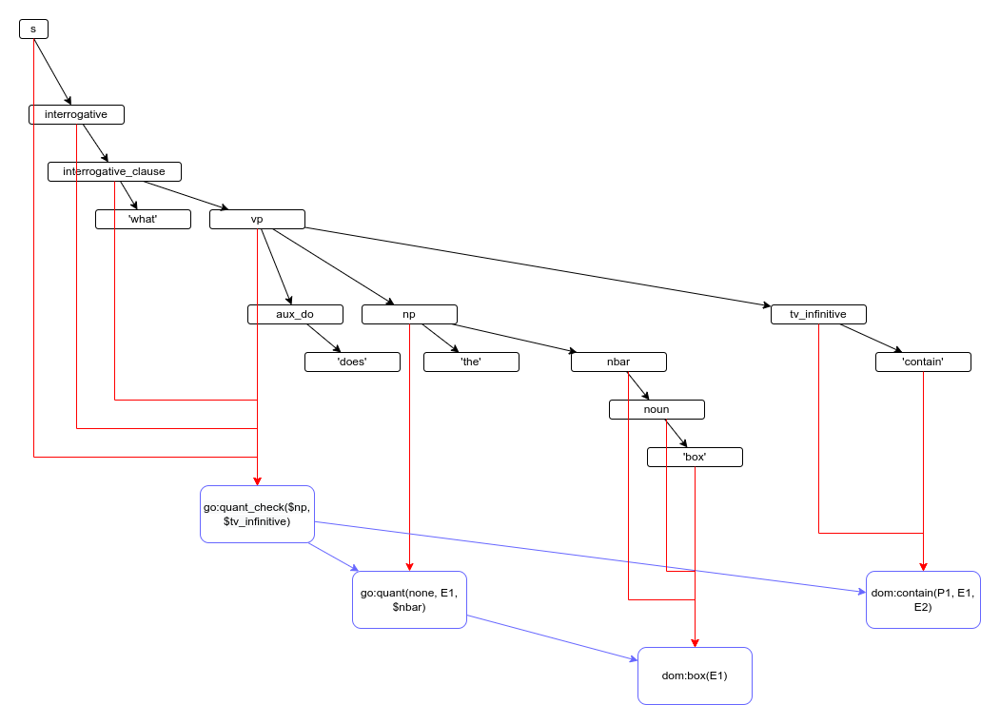

## 2022-10-26

Reading in "Generalized Phrase Structure Grammar" (Gazdar, Klein, Pullum, Sag).
Chapter 7 on unbounded dependencies.

"A constituent assigned to a category C[SLASH]C' (often written C/C' is an C-type constituent from which a C'-type constituent is missing"

I like this very much, because I now have a large number of vp clauses that do very different things.

Introducing: vp_missing_np

===

Does an imperative sentence need an `vp_imperative`, that contains commands? It is that useful? Are these the only vp's with commands?

## 2022-10-25

Blocks world has a number of similar predicates:

    go:type()
    go:isa()
    go:get_sort()
    dom:basic_type()
    dom:shape()
    dom:characteristic_shape()

I need to reduce them. The predicates are mainly added for two reasons:

The application introduces the "cube", a special type of block, with equal sides. A cubed block thus has two types: the block itself, and the cube type. Sometimes only a single type is needed for an object, and hence the predicate "basic_type" is introduced. It refers to the type of the object in the database. Is there good ground for making this predicate "basic"? Perhaps it should be called "db_type"?

The shapes follow the same pattern. An exception is made for block.

SHRDLU also has a predicate "shape", but it is not even used.
Generation uses a predicate "default_shape".

They don't give the same amount of results:

    go:type() : all
    go:isa() : all
    go:get_sort(): 1
    dom:basic_type() : 1
    dom:shape(): all
    dom:characteristic_shape() : 1

and even if they give 1 result, this result is not the same for `basic_type` (block) and `characteristic_shape` (cube).

And I think it may be useful to introduce

    go:subtype_of() - applied to types
    go:instance_of() - applied to instances

`go:isa()` would then be a combination of these.
Is it useful to distinguish between types and instances? The sentences look the same. "A red cube is a block" "A block is an object"

## 2022-10-24

I just solved a very long standing problem.

Sometimes DBPedia lists all children of a person individually. At other times, however, it just lists the number of children.

I used to have two different *intents* for these. One of them needed to *rewrite* the sentence in order to fit the database content (!)
Clearly wrong, but how to fix?

I now fixed this by *inventing* children. Given the number of children, I'm creating random identifiers for them. 

    have_child(A, B) :-     
        go:xor(
            have_1_child(A, B),

            have_n_children(A, N) 
            go:range_foreach(1, N, ChildIndex,
                go:uuid(ChildId, person)
                go:unify(B, ChildId)
            )
        )
    ;

The `range_foreach` generates uuids for each of the N children.

If dbpedia has both predicates, only the one naming them will be used.

## 2022-10-23

I am extracting the intent of a sentence into a special structure. It used to be part of the sense, but that was wrong because it was clearly a meta tag. It wan't a tag, as I first thought. Tags are about entities, not sentences. I found out the hard way when I tried the `why` sentence that followed the `when` sentence. Due to anaphora resolution of the sentence' main event, both sentences has the same main event. At the second sentence, this entity had both the `when` and the `why` tag. It's now a separate field: `intent`, and its not bound to an entity.

## 2022-10-19

I had a problem with start and end times of events. Time used to only increase with each physical movement. But this caused time to stand still even when larger level events took place. I now increase time with each new event.

===

I finished interaction 31!

## 2022-10-12

It's very natural in logic for an entity to have multiple types. An object can be both a block and a cube. So you may want to specify both. `cube` can be a calculated type, based on the equalness of the sides. But the one is not more essential than the other. Both are just labels, really, and it depends on the context which ones to use.

So if you want an entity to have just one type, you need to be clear what type exactly you mean. And it's better to use a special predicate, that has the special characteristic of being unique for an entity.

I want to use `go:type()` because it allows me to reason over sub-types.

## 2022-10-11

An entity should have one and only one type.

Rules that say: if E has type A, then E has type B, are illegal.

If you want to check if E belongs to a supertype, use `go:isa(E, T)`. `isa` applies both to types and instances.

    go:isa(E, block)
    go:isa(block, object)

which is implemented as

    go:isa(E, T) :- go:type(E, T)
    go:isa(E, T) :- go:type(E, U) go:isa(U, T)

for example:

    roo isa kangaroo
    kangaroo isa mammal
    mammal isa animal

    ? go:isa(roo, animal)
    go:isa(roo, animal) :- go:type(roo, U1) go:isa(U1, animal)
    go:isa(kangaroo, animal) :- go:type(kangaroo, mammal) go:isa(mammal, animal)
    go:isa(mammal, animal) :- go:type(mammal, animal)

===

The problem of multiple types still exists. And I'm not sure what to do with it.

I want an object to have a single type, so that if you ask for its type, you get one type. See the rendering of the scene, for example.

On the other hand, there's always the issue of multiple types:

    Tweety is a bird
    Tweety is a cartoon character

Is one type more essential? Maybe, maybe not. But in the context of a certain problem, the essential type may be clear. In the context of cartoons, all things are cartoon characters, so this doesn't add information. Only the fact that Tweety is a bird adds value.

So, for now I hold on to the assumption that an entity can only have a single type.

## 2022-10-09

    Had you touched any pyramid before you put the green one on the little cube?

While the syntactic class check is helpful, it's a fuzz. I like the check for type better. The referent must have a go:type(). "a red one" basically means "a red block", where "one" is replaced by the type. So you must be able to distinguish the type from other relations.

It's an interesting idea. But it fails as soon as someone adds `go:type(E1, person)` to "you".

No, "put" is the key. `dom:put()` requires the semantic object to the a `dom:object()`.

## 2022-10-04

In "the green one", "one" is an nbar; it can't be replaced by an np ("you").

    nbar(E1) -> noun(E1) -> 'one'
    
    np(E1) -> pronoun(E1) -> 'you'

    nbar(E1) -> noun(E1) -> 'pyramid'

Only parents with a single child can be taken into account.

So, "you" can't be the antecedent of "one" because the syntactic category of "you" (pronoun) can't replace it.

This would be an example of where keeping the syntax information present is useful.

## 2022-10-03

Only now it occurs to me that my one-anaphora resolver _just_ looks for the previous NP. This will not do. I need an anaphora-resolution algorithm.
Let's see what Gardiner says.

types of one-anaphora

- contrastive: I prefer a small dog to a large one
- member: fourteen trees ... the one at the bottom
- sense sharing: ... so Joe wore one too
- subtitude: a large hammer and a small one (syntactic replacement?)

tools

- _near_ noun phrases make more likely antecedents
- the antecedent needs a head, an actual noun, like "block" (so that excludes "you")
- in the contrastive case, it might actually be good to find a conflict
- the focus may be an indication

I haven't actually done anything with the concept of _head_. What is it?

https://en.wikipedia.org/wiki/Head_(linguistics)
In linguistics, the head or nucleus of a phrase is the word that determines the syntactic category of that phrase.

If an object is "big" and "block", NLI-GO treats these as the same, and this is not sufficient. 
Maybe I should model the heads explicitly like this

    "block",        sense: go:type(E1, block)

The article says there aren't any good heuristics for one-anaphora antecedent finding.

## 2022-10-02

    Had you touched any pyramid before you put the green one on the little cube?

Bug: 'one' is replaced by 'you' -> 'the green you'

## 2022-09-26

Compare 

    H: I own red blocks.
    C: OK
    H: Pick up a small one
    C: OK (picks up a small red block)
    *C: OK (picks up a small blue block)

with

    H: I own red blocks.
    C: OK
    H: Pick up a blue one
    C: OK (picks up a blue block)
    *C: I can't (pick up a blue red block)

I think the only way to solve this problem is to give the system knowledge of mutually exclusiveness: all colors are mutually exclusive, as are large and small.

How can we tell the system that large and small are mutually exclusive (mutex)? `dom:large(X)` and `dom:small(X)` are predicates. Saying something about predicates is called second order predication. Is this possible in NLI-GO?

Yes it's possible. But we need the application to tell us which properties are mutex. And this not need to be done directly (`mutex(large, small)`), because this would require a lot of relations for the mutexes between all colors. We can use the `is` relation. 

These relations have been in the database all along, but have not been used:

    is(red, color)
    is(blue, color)
    is(green, color)
    is(white, color)
    is(black, color)

They may become useful now. We can define mutual exclusiveness as follows:

`p1(X)` and `p2(X)` are mutex, if `is(p1, Z)` and `is(p2, Z)` and `p1` != `p2`.

This promotes `is` to a system predicate (`go:isa(X)`), and that's ok.

## 2022-09-25

Problem:

    H: Is there a large block behind a pyramid?
    C: Yes, three of them: a large red one, a large green cube and the blue one

    H: Put a small one onto the green cube which supports a pyramid
    C: I can't

Why "I can't"? Because NLI-GO now replaces "one" with "large block", in stead of "block". And this creates the impossible

    Put a small large block onto the green cube which supports a pyramid

## 2022-09-17

- ellipsis: adds syntax nodes their semantic attachments
- reference: replaces a variable with another variable (depends on anaphora queue)
- one-anaphora: adds semantic node to semantic structure (depends on anaphora queue)

---

As "one" no longer refers to some instance of a previously mentioned entity type, but rather to some instance of a complete entity definition, we now ran into the following problem:

    Find a block which is taller than the one you are holding and put it into the box

Here "the one" (which used to be "the block") will be replaced with "the block which is taller than the one you are holding". Thus yielding:

    Find a block which is taller than (the block which is taller than the one you are holding) you are holding and put it into the box

Does that mean that the definition of an entity should not hold relative clauses, or is the consequence even more dramatic, that the definition can only consist of the part of the sentence that has been parsed thus far? That it may only consist of words that appear before "one"?

Maybe this is a difference between "the one" and "one"?

---
Identifying and resolving one-anaphora - Mary Gardiner (2003)
https://files.puzzling.org/academic/gardiner03honours%20%28Identifying%20and%20resolving%20one-anaphora%29.pdf

---

Is it possible that "one" refers to a definition with a relative clause? Yes, and that's not a problem of course.

    How many blocks that support a pyramid are on the table? Pick one up.  

A definition may not contain a reference to itself. The following construction is allowed, of course, but the definition of the `block` should not contain one-anaphora.

    block which is taller than the one you are holding

So the one-anaphora should be removed from it

    block

This is a very edge-case restriction, but that's only because this sentence is an edge case. I wonder if Winograd picked it because of this. Anyway, the paper mentioned above, by Mary Gardiner, doesn't even mention relative clauses in one-anaphors. So it must be pretty special. 

## 2022-09-11

As lovely as this diagram is, I'm not going to use it. Changing the a relation structure is too problematic. For a part this has to do with the code I've written in Go, which should change quite a bit. But there's also the problem that changing a semantic structure might replace a part that's been pointed at by another syntactic node. This could lead to hard-to-detect bugs. In short, it doesn't feel very robust. I have been replacing structures the whole time, and it's not good to let that go.

---

Ellipsis changes the syntax tree. Anaphora changes the semantics tree.

But while before, I used the semantics tree to check anaphora, I will now use the syntax tree to check it. Each time a change is made to the semantics tree, the entire tree is replaced. 

## 2022-09-04 

I made a diagram of the syntax-to-semantics node mapping that I will make. Difference with old situation: the semantic tree will now contain pointers to semantic nodes (relation sets), where before this was not the case.

"What does the box contain?"

Before, the syntactic nodes also pointed at the semantic attachments, but these attachments had not been expanded. Now they will be.

## 2022-09-03

I was going to add the fully expanded semantic attachments at parse time. But I knew the shallow (unexpanded) attachements would be changed (when resolving one-anaphora). So I would need to rebuild the semantic structure again later. I didn't like this idea.

What I can also do is create the expanded attachment structure, while keeping it attached to the tree. And then allow this structure to be changed, by modifying it, in stead of making a copy.

Mutating a structure is not in agreement with functional programming, but what I can do is create a complete copy of the parse tree in each step that requires the tree to be changed. This way I can change the tree, and still adhere to functional requirements: copy-on-change.

---

This changes the way I've used the parse tree up to now. At the moment the semantic attachments remain "shallow" (unexpanded) until the relationize phase. I want to change that: I want to expand the relations right away, so that I can make changes to the semantics as well as the syntax tree, in the understanding process.

It's easier to modify a tree than to rebuild it in a slightly changed way. So I copy it first, and then make changes to the copy.

I can't oversee the consequences of this action, but I already know that this gives me more flexibility. It is interesting to keep the link of syntax node to semantic node. 

## 2022-08-23

There is yet another problem with replacing an event referent with its semantics.

If I replace "it" with its (event) meaning ("stack up both of the red blocks and either a green cube or a pyramid"), we get:

    How many objects did you touch while you were doing [stack up both of the red blocks and either a green cube or a pyramid]?    

Two things are wrong with this:

1) this new command is not the event we're referring to, it's a new instance of the same command
2) this command will actually be executed while performing the question

An action like this can be executed or described. Unlike with noun phrases, these are completely different things.

## 2022-08-22

"One-Anaphora is not Ellipsis" (which has remained a draft?) is an interesting article, but I'm not convinced by the author's arguments. And then there's this example

    *Who did Mary take a picture of, and who did John take one?

It is not grammatical, but not because of "one", it's because of the missing "of", compare:

    Who did Mary take a picture of, and who did John take one of?

Thus far I excluded one-anaphora as ellipsis because it's resolution requires an anaphora queue. But this only means that ellipsis and anaphora should be combined in a single step.

However, even if this is possible, it hard to use ellipsis for one-anaphora; mainly because the elided material may come from a _response_, and I don't have a syntactic tree for it available yet, let alone its semantic attachments.

## 2022-08-21

There's a single semantic node that represents an entity. Should there be a similar node to represent an event?
Do we need such a thing to fill in the slot represented by the word "one"?
It seems to be the case, if it is possible to refer to events that are not bound.

    He likes to look at birds.
    I like that as well.

Here "look at birds" is a predication/event that is not bound to a specific instance.
In this case "that" could not be understood without replacing "that" by the complete meaning of "look at birds".

The meaning node of an entity is its `quant`. The quant has a quantifier and a scope.
The meaning of a predication/event is a `quant_foreach` or a `quant_check`.

It's possible to keep track of the event definitions as well as entity definitions, as they are found in a sentence.
With these, it is possible to replace "that" with either an entity or an event definition.
But we should distinguish between them, because an event reference and an entity reference have different positions when nested into bigger relation structures.

---

Until now, the semantics of "Why did you do it?" basically looked like this: `why(event831)`. Note that "it" itself was not replaced by a relational structure. This only worked because the variable was bound. If this could be extended with the relational structure of the event, it would also work if the variable is not bound (i.e. `look_at(P1, X, birds) why(P1)`; "why does he do that?" => "why does he like to look at birds").

---

If I _were_ to treat "that" as ellipsis, it would look like this:

    { rule: event_ref(P1) -> 'that',                                       ellipsis: vp(P1),    sense: $vp,      tag: go:reference(P1) }
    { rule: event_ref(P1) -> 'it',                                         ellipsis: vp(P1),    sense: $vp,      tag: go:labeled_reference(P1, 'it') }

## 2022-08-20

One-anaphora can't be simply treated as ellipsis. It uses the anaphora queue to resolve the referent, and this queue is built into the anaphora process.

---

Later: 

Hahaha: I just came across this link: https://nlacara.github.io/papers/one_xe.pdf : "One-Anaphora is not Ellipsis" - Nicholas LaCara

---

One anaphora changes the raw attachments.
Regular anaphora uses the expanded attachments to find a referent.

So I need both the raw attachments and the expanded attachments. The expanded attachments should not be used to create the final relations (even though that is tempting!). Having both is an acceptable solution. But not ideal.

I could also work with semantic placeholders.

---

Currently I am not even treating one-anaphora well. I replace "one" by the main relation. So in this example 

    If you happen to own a book by Dan Brown, bring one for me.

I would replace "one" by "book", which is clearly insufficient.
Now:

    { rule: noun(E1) -> 'one',                                             tag: go:sortal_reference(E1) }

Maybe:

    { rule: noun(E1) -> 'one',                                             sense: go:quant(one, E1, none), tag: go:reference(E1, none) }

This would mean: resolve "one" by replacing the variable with the one referred to, but set the quantification to 1. "one" means then "one of the set of entities mentioned just previously".

Unfortunately, this syntax just works if the variable is already bound. If it is not, the variable will have no restictions whatsoever in the new relation set.

This could be resolved by keeping track of the quant-definition of the entity, as used in the previous text.

    { rule: noun(E1) -> 'one',                                             sense: go:quant(one, E1, $missing_nbar) }

Here `$missing_nbar` needs to be replaced by the relations of the referenced entity.

## 2022-08-18

I want to treat anaphora resolution as a syntactic process. But I need at least the semantic attachments of some nodes to do the resolution. And that's ok, really. The relationization can be done before AR, while keeping the relations with the nodes in the syntax tree, But I have a problem with one-anaphora: it changes these relations again.

A solution could be to treat one-anaphora as ellipsis in stead, for example:

    Pick one and put it on the red block.
    After ellipsis resolution:
    Pick a pyramid and put it on the red block.

## 2022-07-16

I just noticed another form of discourse-based labeling:

    Boris Johnson served as Prime Minister of the United Kingdom and Leader of the Conservative Party since 2019.
    Johnson gained a King's Scholarship to study at Eton College, a boarding school near Windsor in Berkshire.

Note "Johnson" in line 2. The name of the person is shortened, but we still know whom it refers to. "Johnson" can't be used as the first occurrance in the discourse, because there are many Johnson's and we would not know which one was meant.

"Johnson" is what I would call a label. I haven't found the proper term for this yet. The label's scope is just the discourse in which the full name was used before.

In the same piece on Boris Johnson, other Johnson's are mentioned as well: https://en.wikipedia.org/wiki/Boris_Johnson

    Alexander Boris de Pfeffel Johnson was born on 19 June 1964 on the Upper East Side of Manhattan, New York City, 23-year-old Stanley Johnson, then studying economics at Columbia University, and 22-year-old Charlotte Fawcett, an artist from a family of liberal intellectuals. 
    Johnson's parents had married in 1963 before moving to the US

Introducing other people that are also named Johnson doesn't revoke the original label.  

## 2022-07-09

Notes:

- EntityLabels have been disabled (activation is set to 0)
- The principle should be that the relations produced by relationize are not modified any more (the relation created for one-anaphora should be added to the syntax tree) / so preferably `relationize` is the last step before finding a solution.  

To do:

- extract tags - just after dialogize
- name resolution is actually a syntactic process and should be done before anaphora resolution (because it provides gender information, and this may be needed to check agreement in the anaphora resolution)
- create a syntactic AR step, use it, and disable the semantic AR step

=======

Notes

Like CLE, I was of the opinion that the syntax tree should be turned into a semantic form (Quasi Logical Form) as soon as possible. More and more, I am coming back from this: postpone the relationization process as long as possible. Why? Because the annotated syntax tree holds more information.

The book on CLE also notes that sortal restrictions, for example, has a syntactic and a pragmatic part. This can be a reason to split it into two processes, performed at different times in the process.

I have not given any attention yet to "bound variable anaphora" https://en.wikipedia.org/wiki/Bound_variable_pronoun
It's possible that the system is already able to handle this, because it treats anaphora on the variable level, not on the values that bind it.

## 2022-07-08

Is it better to do _syntactic_ anaphora resolution? I was undecided until now, but the labeled and unlabeled event references take me to the syntactic side. Syntactically, there's no difference between an event and an entity. Both are just nodes. While semantically, an entity has a scope, and that's where the resolution takes place. Also, the event may no longer have a representation, semantically, so it needs to be artificially created.

Syntactically, can I do these tags:

event
    go_reference (when did you do _that_)
    go_labeled_reference (why did you do _it_)
entity
    go_reference (put _the_ pyramid on the table)
    go_sortal_reference (pick _one_ up)
    go_reflective_reference (_himself_)
    go_labeled_reference (and pick _it_ up)

## 2022-07-02

Words like "it", "him" and "her", once introduced, form a temporary variable/placeholder for an entity, in a discourse. While this variable is still in scope, it keeps referring to the same entity.

The word "it" should not be reevaluated each time it is used. As long as it is still in scope, it automatically refers to the the same entity.

Words like "that" are different. They refer to different things each time.

This idea of pronouns as variables turn Winograds heuristics into a rule:

"The system has heuristics which leads it to use "it" to refer to an object in an event it is describing whenever
(1) the same object was called "it" in the question
(2) the object was called "it" in the question preceding the current one, and "it" was not used in the current one
..."

The rule would be: as long as a variable V (that hold entity E) is in scope (whatever that means), use that variable to name the entity.

Maybe "label" is a better word. "it", "she" and "he" label entities.

The first use of "it" refers to a previous entity. Following "it"s refer to the previous it.
The first use creates the label; following uses use the label. 
When a label is not used for a few sentences, it is removed.

See also "referential chain" (2021-09-19)

## 2022-06-30

I made the check that the generator didn't apply the same rule twice more specific; it now only applies within the same generation path.

===

Interaction #31

    H: How many objects did you touch while you were doing it?
    C: Four of them

Winograd: "Time references can refer to a time span, using words like "while"."

The previous time reference was "before", which involved only an upper limit. "while" provides both a lower and an upper limit.

## 2022-06-28

The heuristics are complicated and error prone. I want something simpler and easier to implement.

What about this: whenever the text for an entity is generated, it is marked as `already_generated` by the generator. The rules can query this flag by using the relation `go:already_generated()`. When this happens a rule may choose to change the determiner to "that".

    { rule: qp(E1) -> 'that',                                                   condition: go:already_generated(E1) }

The answer would then become

    By putting a large red block on the table ; then putting a large green cube on that large red block ; then putting the red cube on top of that large green cube

sounds reasonable, doesn't it?

## 2022-06-26

Where can I place the anaphora resolution phase?

Can it be between the answering phase and the generation phase? A problem is that at this point an entity, say E1, occurs twice, but it can't be annotated with relations (such as `that(E1)`) because such an annotation would be applied to both instances. Actually: it can, if the variable would be duplicated into E1a and E1b and those variables would get separate anotations.

What about this:

- find event relations (first argument is an event)
- if an entity occurs in the _previous_ event relation, and it is in subject position in the first relation
  - create a new variable for it
  - mark it as `reference()`

But marking it as `reference()` is not enough. It can't use "it" all the time, because "it" may already have been used for another entity.

Winograd comments on this in the final paragraphs of his book:

"The system has heuristics which leads it to use "it" to refer to an object in an event it is describing whenever
(1) the same object was called "it" in the question
(2) the object was called "it" in the question preceding the current one, and "it" was not used in the current one
(3) the object has already been named in the current answer, and was the first object in the answer, or
(4) no objects have yet been named in the current answer, and the object was the only one named in the previous answer

To refer to an object already named in the current answer, other than the first, the program applies the determiner "that" to the appropriate noun, to get a phrase like "by putting a green block on a red cube then putting that cube in the box"
"

From the "it" options, (3) applies.

So the rules I can implement are:

- mark a reference to the first event's subject with `first_reference()`; this will be generated as "it"
- mark a reference to a further event's subjects with `second_reference()`; this will be generated as "that" <common noun>. 

## 2022-06-22

The problem in this sentence is in the _generated_ intrasentential anaphoric references

    it
    that cube

NLI-GO has no means to do that yet. Why is the first reference "it" and the second "that cube"?

Anaphora generation is done in the preparation phase. NLI-GO already 

## 2022-06-19

Starting with interaction #30:

    H: How did you do it?
    C: By putting a large red block on the table; then letting go of it; then putting a large green cube on it; then letting go of that cube; then putting the red cube on top of that cube; then letting go of that cube

Winograd: "'It' refers to the action mentioned in the last question; rather than the answer"

So that's the first problem: currently "it" would refer to the "root event" (you asked me to).

Winograd: "This is a description of the top-level subgoals used to achieve the goal"

To me, it's odd that "letting go" is defined as a separate goal. A human would not do that, since it is implied. It looks like an accidental consequence of the way Winograd built the goals. I happened to do it differently. So I may leave it out.

The top-level subgoals (S) can be found by querying `parent_event(S, P)`, where P is the stacking event.

## 2022-06-18

Interaction #28

    H: Why did you do that?
    C: To stack up the red cube, a large red block and a large green cube

That was easy, as expected. It took me 10 minutes. I had to create a distinction between a time description and a cause description for the same event.

===

Interaction #29

    H: Why did you do that?
    C: Because you asked me to

That took me another half hour. I had to introduce an `event:root` event that is the parent of all events. And when this event is used as the root cause, SHRDLU answers: "Because you asked me to". This is just a canned response.

## 2022-06-17

Until now, I only stored ids in the response clause that were assigned to the explicitly mentioned `result` field of the response.

This #27 made me realize that a new question may refer to any entity in the previous answer.

This made me add all entities of the previous answer to the response clause. And this works just fine!
The `result` field is therefore not necessary any more. Except maybe when you are interested in the raw answer per se, and not its description. I will leave it in for now.

## 2022-06-16

The test for #27 passes, but "that" resolves to the red cube by accident.

todo ...

## 2022-06-15

"that cube" should be resolved before "clear of that (red) cube" is resolved.

## 2022-06-14

Starting #27:

    H: Why did you clear off that cube?
    C: To put it on a large green cube

Winograd: "'That' refers to the action mentioned in the answer".

"Clearing off" is not in the grammar yet; it has just been used internally. So we need to add it.

"that cube" refers to "the red cube" in the previous answer. So we should not only be able to refer to the answer entity, and an answer event, but also to the entities that occur in that event, the entities used to describe the event.

"clear off" does not refer to any event of clearing off (there have been multiple already), but more specific to the one in the previous answer. So where we used "that" to refer to an event before, we now use an expression to refer to it. 

Btw: is "clean off" in #26 a typo, meant to say "clear off"? Or are both the same thing?

## 2022-06-13

Renamed solution to intent.

## 2022-06-12

Interaction #26 passed! 

I had to allow the result of a solution to be specified per handler. This makes it a bit more flexible.

## 2022-06-07

I just found out that "When did you pick it up?" had been answered correctly by accident.

"it" (the green pyramid) had been picked up already, twice. But this sentence still presumes the time frame "before you put the green one on the little cube" that was initialized in the previous sentence.

## 2022-06-04

I need to tell the system that P1 is an event. But it is not represented with a sense in the syntax rule.

Options:

Make an explicit event-based reference tag

    { rule: action(P1) -> 'do' demonstrative(P1),   tag: go:event_reference(P1) }

or

Introduce a dummy go:do(event) sense

    { rule: action(P1) -> 'do' demonstrative(P1),   sense: go:do(P1),   tag: go:reference(P1) }
    in argument-sort.relation:
      go_do(event)

The latter is just ugly; the former cannot refer to an event in the same sentence.

"That" _could_ be  represented as ellipsis, but that doesn't seem natural, and it's a lot more work for the developer.

or

Turn the event into a quant

    { rule: action(P1) -> 'do' demonstrative(P1),   sense: go:quant_check(go:quant(some, P1, none), none),    tag: go:reference(P1) }
  
It will be treated like the other references, but P1 is still not an event. So, introduce explicit sorts?

    { rule: action(P1) -> 'do' demonstrative(P1),   sense: go:quant_check(go:quant(some, P1, none), none),    tag: go:reference(P1) go:sort(P1, event) }

===

By the way, events, since they are not part of a quant, are not added to the event queue. Except for the events that are part of an answer; these will be added.

===

I'm now going for

    { rule: action(P1) -> 'do' demonstrative(P1),   sense: go:event_reference(P1) }

problem: "To get rid of it" is not marked as an event.
Possible solution:

    go:set_sort(EventId, event)

or

If a relation is asserted:

    go:assert(get_rid_of(EventId, `:shrdlu`, E1))

then perform a sort analysis on the relation.

    in argument-sort.relation:
        get_rid_of(event, person, object)

No there's no use storing the sort of a temporary variable.

===

There's still a big problem of how to resolve sorts. 

At present I assing sorts to variables in the input sentence. This makes sense, because we need to know the sorts for various reasons, and there's no other way to find them out. We can't link the sorts to ids, because there are not always ids (unbound variables).

But I need something more. And I still have the option to link a sort to an id. If every id had a sort, I could use that.

The first technique wordt then be top-down, the second bottom-up.

## 2022-06-01

Time for the next interaction: #26!

    H: Why did you do that?
    C: To clean off the red cube.

This is another "why" question. New is that it contains a reference to an event ("that").

Expaning "that", the sentence can be rewritten as 

    Why did you get rid of it?

So "do that" can be replaced by "get rid of it".

The important thing in this series of "why" questions is that Winograd forces us to treat responses as information, not just as text. By referring to parts of the response, we are forced to create structure in the response.

First problem: an event variable is not an argument of a quant. I only check quants for references.

## 2022-05-26

I am going to use `gender` for agreement, not `sort`. `gender` may include the animate/inanimate distinction.

https://en.wikipedia.org/wiki/Grammatical_gender#Related_linguistic_concepts

This is a nice case:

  		Is Jacqueline de Boer married to a man?
        Yes

		Who is he?
        Mark van Dongen

The answer, without gender matching, is "Jacqueline de Boer", because it is the subject of the previous sentence / it is the first noun in the previous sentence.

To check for gender, I need not only establish that "he" has `go:agree(E1, gender, male)`, but also that "Jacqueline de Boer" has gender female. If so they don't match.

But how do you establish grammatical gender for a proper noun? 

Ask the database. Since the name is resolved in the `relationize` phase; this function should also resolve the gender.

## 2022-05-22

Is anaphora resolution a syntactic or a semantic process? It is about rewriting a parse tree or rewriting a set of relations?

I decided it's more of a semantic process. And even though treating it as syntactic is a little bit cleaner (needs no rewrites of the clauses), this is not enough to make this a syntactic process. But it's not a strong decision yet.

## 2022-05-15

Fixing the tests again. "Why?" now fails because ellipsis resolution copies part of the previous sentence that hadn't been subjected to anaphora resolution. 

## 2022-05-14

All discourse entities must have a sort. Even if it is only `entity`.

Discourse entities are created when a user sentence is read, or when an answer is created by the system. In both cases the entities and their sorts are added.

## 2022-05-13

I'm now storing discourse entity sorts in a separate store.

Problem is, entities from responses are stored as well. And these may be an array of entities. Therefore the sorts may be arrays as well.

## 2022-05-09

About sorts: I dont want a double declaration of sort relation `dom:person(E1)` and tag `go:agree(E1, sort, person)`.
In stead, I just want the relation. And when the relation is a sort, this can be specified in `sort-hierarchy.txt`. The sort and the relation are equal. No need to separate them.

## 2022-05-09

"the green one" is both a reference and one-anaphora. The one-anaphora should be resolved first.

It also means that the resolvings should be processed immediately, because they are used right after. And not collected to be processed later.

"Had you touched any pyramid before you put the green one on the little cube?"

"one" does not refer to "any pyramid" because the system does not know it's a pyramid (sort pyramid). It can only deduce that from the id at the moment.

Time to introduce sort tags.

## 2022-05-08

Since A is the simplest solution, I only need to specify which part of the sentence is the subject.
I can do this by annotating it with a tag.
But even without tags there's a way to make the earlier parts of the sentence more likely referents than latter ones: 
add the entities of the sentence from right to left to the anaphora queue, so that the first entity is at the end (and hence treated first).

... it turns out that is was already the way it is implemented. There was another problem. "the small red block" had no binding in the dialog, for some reason.

The reason: "Does the small red block support the green pyramid?" restult in no bindings (the answer is "no"), and it is these result bindings that are stored.

That was not the only problem: the system stores the entities in the anaphora queue before the variables have been replaced. So the queue may contain variables that are not actually used.

The next sentence to consider also has a problem with the anaphora queue as it currently stands:

    Had you touched any pyramid before you put the green one on the little cube?

"one" refers to an earlier entity in the same sentence (any pyramid).

It's probably best to extend the anaphora queue while it is being used to resolve references. If it is extended before this resolve process, it contains items that should not be there yet. If it is extended afer this resolve process, it doesn't contain the items that are needed.

The reason that I'm now building an explicit A Q again, is that I need to be able to add entities to it, one by one.

## 2022-05-07

In this interaction:

    What does the box contain?
    The blue pyramid and the blue block

the two objects are bound to the same variable.

But when only one of them is referenced

    What is the pyramid supported by?

the variable in the new sentence should not be replaced by the one holding the 2 objects.

This is an interesting issue. The two objects should be referencable together ("move them out of the box"). But in our case it seems as if a new referent is created out of the existing referent set:

    E18: [blue-block1, blue-pyramid]
    =>
    E23: blue-pyramid

Solution: if a reference refers to a single entity from a referent group, keep the reference variable unchanged, but bind it single referent's value.

===

I now have the following problem:

    Does the small red block support the green pyramid?
    Yes
    Put the littlest pyramid on top of it
    OK

... puts the littlest pyramid on top of the green pyramid (itself!)

Why does "it" not refer to "the green pyramid"?

- A the preferred referent is the subject
- B the object of "put_on" is a steady surface (which pyramids are not)
- C "put_on" should have a constraint that one cannot put something on top of itself

B is sufficient in this case but not in other cases

## 2022-05-06

Should the anaphora queue contain only bound entities?

You need to be able to refer to an unbound entity. However, how would you check that it an entity from the queue is the same as the one examined?

If the entity from the queue has an id, use this to check if they match.
If the entity from the queue does not have an id, use agreement to check if they match.

## 2022-04-23

The SHRDLU dialog does not have any definite anaphoric references (!) (where "the green block" refers to the block that was mentioned in the previous sentence)

References will be replaced by tags:

- `go:back_reference(E1, none)` "it" "them" - 
  - `tag: reference(E1) agree(E1, sort, object) agree(E1, number, singular)`  
  - `tag: reference(E1) agree(E1, sort, person) agree(E1, number, plural)`
- `go:definite_reference(E1, $nbar)` "the" 
  - no tag, but all quants are tried to be resolved 
- `go:sortal_back_reference(E1)` "one" 
  - `tag: sortal_reference(E1)`
  - searches for a sort, then tries to resolve 

## 2022-04-20

I'm going to use the `tag` property of a syntax rule for the features. And since I don't use "feature structures" it's better that I use a different name.

What about "agree"?

    tag: agree(E1, number, plural)
    tag: agree(E1, gender, male)
    tag: agree(E1, sort, person)

A tag that "agrees" should be checked for conflicts.

## 2022-04-17

This new diagram shows how I'm going to handle things:

I am only going to add a meta-level of Features. This level of information (or "second order") is not about the value of the entity; it is about the possible values of the entity, or the type of the value.

An important aspect of features is that they mustn't conflict. 

This way you can say `plural(e5)` (`e5` is an atom that represents the object hold by the variable `E5`) while variable `E5` is not bound yet, and may not be bound at all. "I saw a dog. It chased a cat." - which dog exactly is not known at this time. Still, we know the sort and the number of the entity. Important for references.

The anaphora resolution phase merges variables if one refers to the other. Their meta data is merged. If `E11` refers to `E5`, the occurrences of `E11` will be replaced by `E5`.

You can reason about meta data as like normal data, but remember that the entities are different. So if the system needs to check `animal(E1)`, it may deduce this from `dog(E1)`.

## 2022-04-16

It's still possible to do it (assign atoms to sentence variables). When a database is consulted, the associated db id will be used, and if there is none, a variable can be used to consult the db.

Using atoms for entities will make probably some things easier. But the full extent of it is hard to predict.

But one of the things that can be done is to place the features inside an actual dialog database. Which means these facts can be used from anywhere in the code.

## 2022-04-04

Assigning discourse elements to sentence variables may not be such a good idea. All variables will be bound from the start and can't be bound later.

Another idea would be to replace some sentence variables by ones from previous sentences, in an anaphora resolution step.

## 2022-04-03

Also:

    The evening star is planet Venus
    The evening star appears in the west
    The morning star is the evening star
    Is the morning star planet Venus?
    yes
    Does the moning star appear in the west?
    no (!)

and

    Ice is hard
    Steam is volatile
    *Ice is steam

===

I'm going to introduce the discourse entities level between sentence variables and shared ids:

Whereas the list of discourse entities now hold ids, they should hold actual shared entity objects. This discourse entity has attributes:

- attributes derived from productions (gender, number, etc)
- has 0..n ids (reference to zero, one, or multiple shared entities)

Every sentence variable should refer to a discourse entity (DE). The discourse entity can say "plural", while the database ids are not (yet) known.

When are sentence variables linked to discourse entities? As soon as the sentence is parsed. Each variable then links to a different DE.
At anaphora resolution time, the sentence entity may unlink from the original DE and link to the final DE.

In DRT "From discourse to logic" sentence variables are equated `x = y`. Simple to implement, but a hassle to compute. You need to check these assignments every time you do a lookup. 

DRT

    Jones ownes Ulysses. It fascinates him.
    x y u v
    Jones(x)
    Ulysses(y)
    x owns y
    u fascinates v
    u = y
    v = x

NLI-GO

    Jones ownes Ulysses. It fascinates him.
    x: DE1 y: DE2 u: DE3 v: DE4
    Jones(x)
    Ulysses(y)
    x owns y
    u fascinates v
    process "it" (reference)    u: DE2
    process "him" (reference)   v: DE1
    x: DE1 y: DE2 u: DE2 v: DE1

All entities in the sentence need to be resolved to discourse entities, not just anaphora. "The blue block" may well refer to an entity named before.

Is it possible to have a separate anaphora resolution phase?

## 2022-04-02

For the last days I tried to incorporate Frege's sentence into the system

    "the morning star is the evening star"

But I give up. With reason. For one, this type of sentence is very very rare. It only occurs when you find out that two things that you thought were different are actually the same. This is absolutely irrelevant to an nli system. To create a special layer of representation just for this case makes it unnecessarily complex. Second: there are three ways of dealing with it (that I could think of):

- whenever you bind a variable to morning-star, bind it to evening-star as well (and the other way around)
- collapse the different database representations of the two entities into one
- assert identity and extend all inferences with an extra check for identity `planet(E) :- identical(E, F) planet(F)`

Very very complicated, and for what?

## 2022-03-24

I am thinking about creating a replacement for tags: productions; relations that are added to the dialog context once a parse is complete.
A production like `sort(E1, person)` can then be used to restrict the name-lookup process. And a production like `gender(E1, male)` can restrict the anaphora resolution process.

I may need meta information about these productions:

- `type`: default: `entity`
- `number`: agreement (should not conflict) 
- `sort`: derivable agreement (man -> person)
- `determinate`: changable (false -> true, but not: true -> false) 

## 2022-03-21

I'll try to build a general approach to anaphora resolution.

## 2022-03-11

The server is complete.

## 2022-02-28

Another idea: both break and cancel immediately return with no bindings. This stops the flow for that binding. Other bindings continue. But the break will also add its latest binding as a child-frame-bindings to the loop-cursor. Return does the same to the scope cursor.

## 2022-02-27

Still rebuilding the server, and making the processes synchronous.

I stumbled on a problem that I nadn't realized before. What if the process currently had multiple bindings, and the program flow is different for these bindings: 

- one binding causes the execution of child procedures, while the other doesn't
- one binding breaks while the other doesn't

Before I hadn't thought about this problem, while it was there all along. Actually, by executing child procedures _inline_, as I am doing now, I solved the first problem. But I stumbled on it only because of the second problem.

At the moment, if one binding causes a break, all bindings break. 

Yesterday, for a few hours, I thought that this would collapse my entire process structure. But it doesn't have to be so catastrophic. What I need to do is to keep the state of the program flow, per binding. And treat bindings as program flows. Program flows that may have breaked, and they should store this. Once a flow has breaked, it should not execute more steps, until the root of the break (the loop or the procedure), is reached.  

## 2022-02-12

Rebuilding the server.

Each client can tell the process runner to start a process.
Processes can run in parallel, but processes consist of step and the step is executed in a mutexed area: no two steps are executed together.
A process can create new processes; they are managed by the process list.
Once a process is done, it is removed from the process list; the system is ready when there are no more processes.

Need more mutexes.

## 2022-01-31

Make sure the process keeps running so that the call-stack is not broken down; it can't be rebuilt.

todo:

- continue fixing all `CreateChildStackFrame` calls, until you run into a problem (then undo the last one)
- register with the process for `wait for` messages
- have `wait for` retry for 1 minute, make it notify the event listeners, and continue running the process
- when a `wait for` is caught, return the `wait for` message
- on `break`, `return`, etc, break down the call stack
- continue fixing all `CreateChildStackFrame` calls
- clean up the rubbish

## 2022-01-30

About "simply processing a relation set": it is not simply possible to execute it and disregard the process stack. The process stack serves functions like `break` and `return`. Functions that require the call stack.

I'm thinking of the following technique for calling child relation sets. When a function F needs to execute a child set, it:

- adds a callback function to the current function F in the current stack frame
- places the child set on the stack
- returns a binding constant that says: ignore me

When the child set is executed, the process runner returns to F, it notices the callback function, and calls this callback, in stead of the function (it resumes where it left off). Before calling the callback, it clears the callback.

When a `break` or `return` occurs, F will be deleted and the process runner will not execute the callback. 

===

One callback function would not have been so bad, but some functions have a large substructure of helper functions, each of which may call a child relation set (`quant_ordered_list` comes to mind). Basically you just want to call child sets; and there are only a few problems: `break`, `cancel`, `return`, `fail`. All of which break down some part of the stack. 

After the stack has been broken down, the functions that execute these stack frames need to stop, immediately. This can be done by try/catch, or in Go, with panic/recover. Each function is wrapped by a panic/recover, and this wrapper checks if more of the calling functions need to be stopped, and if so, panic again.

Each of the keywords that tear down part of the stack, calls "panic", with a special control flag. The recover that catches this panic then checks if the call-stack-depth matches the process stack depth; if not, it panics again. Until the call stack depth matches the process stack depth. 

## 2022-01-29

I also want to simplify the process runner. Processes are currently very robust, but also very hard to understand. I dread having to make changes to functions that process relation sets as part of their procedure.

I thought about it for a long time and found myself coming back to the idea that a process, once started, should just keep running until its done. This is by far conceptually easiest to understand. Of course there were reasons for processes to interrupt: a user needed to answer a clarification question, or the user interface should update its state (moving blocks).

I worked this out. When a process is started, it simply processes a relation set. When the relation set is processed, the process is finished. A relation itself may also start processing another relation set. In the new scheme it can do this inline and wait for the result.

What about the callbacks to the user? The `wait for` relation that before stopped the process, will now continue to execute, _for a short amount of time_. It will wait for a fact, check 10 times a second, for a period of, say a minute. When the minute is over withouyt success, the `wait for` fails. The `wait for` will notify the wait-for-listeners, so that they don't waste time polling for `wait for`s.

## 2022-01-28

I introduced the server. It's a service that listens on a port for incomming messages, and in the background keeps all systems alive. The system now stays alive for the entire dialog with the user.

## 2022-01-22

The interactive demo doesn't work anymore. I know what's wrong with it: the dialog context is being rebuild at times that it shouldn't and this disturbs the process. The reason is that the process is restarted many times during the ansering of a single sentence. And that's ok for the processes, but not for the dialog entities and the clause list.

This is the drop. The process was already too slow; it had to redo the same code multiple times; and the grammars had to be reloaded. I've had enought: I'm going to build a real service. I'll turn nli-go into a service that keeps running. Nice!

===

There will be an application that listens to a port for incoming JSON messages. 
A dispatcher listens for incoming messages. A message will have a dialog id.
When this id is new, a new dialog context is created, and started. Then the message is passed to the dialog context.

I found this example https://gist.github.com/miguelmota/301340db93de42b537df5588c1380863

send message to port:

    echo "Hello" | netcat localhost 3333

## 2022-01-16

Changed go:equals() and go:not_equals() to    

    [T1 == T2]
    [T1 != T2]

Changed numerical comparisons to

    [T1 > T2]
    [T1 >= T2]
    [T1 < T2]
    [T1 <= T2]

Changed assignment to

    [V1 := T1]

Changed operations (see below for explanation) to

    [T1 + T2]
    [T1 - T2]
    [T1 / T2]
    [T1 * T2]

=== 

I want to rewrite go:add(T1, T2, Result) and like procedures to 

    [T1 + T2]

a possibility:

    go:eval(Result, go:add(T1, T2, Result))

and have assignment recognize `go:eval()` as a special case

Other possibility

    go:add(T1, T2)

and have procedure calling recognize that the last argument is missing; let it create an internal variable; and work with its result. This way we can use procedures as functions with very little overhead.

I will make this because it's such an interesting idea. You can also use it with facts from the database, like this:

    age(pat, 51)
    age(sue, 49)

    older(A, B) :- [age(A) > age(B)];

It's hard to change the process runner to have it create a child frame for each of the arguments, so for the moment I will have it execute the arguments immediately.

===

I don't have access tp the number of arguments, so for the moment I will do it a bit different:

    older(A, B) :- [age(A, return) > age(B, rv)];

Where the atom `return` takes the place of the return value.

## 2022-01-15

I added some keywords to mentalese:

old:

    go:if_then_else(
        go:not(cleartop(E2)) do_find_free_space(E2, E1, X1, Y1),
        do_put_on_position(ParentEventId, E1, E2, X1, Y1),
        do_cleartop(ParentEventId, E2) do_put_on_center(ParentEventId, E1, E2)
    )

new:

    if go:not(cleartop(E2)) do_find_free_space(E2, E1, X1, Y1) then
        do_put_on_position(ParentEventId, E1, E2, X1, Y1)
    else
        do_cleartop(ParentEventId, E2) do_put_on_center(ParentEventId, E1, E2)
    end

I created the keywords `return`, `fail`, `break` and `cancel`.

I removed `let()` and introduced `[X = n]` for both `let()` and most forms of `unify()`. I kept `unify()` because there were some valid use cases for it.

===

The processes I created work well, but I don't want to impose them on any other developer, because he would go insane quite quickly. Also, they cause a lot of code to be run multiple times unnecessaily. So I'm thinking of using some sort of Promises (see javascript) or async/await.

One of the main points of the processes is that an application may be killed at any time, and the proces still knows its state. If can continue where it left off.

## 2022-01-14

This is what I did: update these discourse entity values while processing the sentence. For example in `addToQueue`? This would not _add to the queue_, but update the discourse entity variables.

This then finally allowed me to run all 25 interactions, and remove the anaphora queue. But it became very clear to me that anaphora resolution is far from solved. The list of open problems is large. There's a long way to go before this subject is solved to satisfaction. 

## 2022-01-12

Great article "The defeat of the Winograd Schema Challenge" https://arxiv.org/pdf/2201.02387v1.pdf

It refers to this article that may be interesting:

A. Kehler, L. Kertz, H. Rohde, J. L. Elman, Coherence and coreference revisited, Journal of semantics 25 (2008) 144.

from this, an example of subject preference

    a. Bush narrowly defeated Kerry, and special interests promptly began lobbying him. [Bush]
    b. Kerry was narrowly defeated by Bush, and special interests promptly began lobbying him. [Kerry]

    "The alternation found in examples (6a,b) can be used to argue for the existence of a grammatical subject preference."

also

    the grammatical role parallelism preference which favours referents that occupy the same grammatical role as the pronoun.

===

Maybe I can update these discourse entity values while processing the sentence? For example in `addToQueue`? This would not _add to the queue_, but update it.

The problem is that `back_reference()` needs access to non-local information.

Is it possible to do anaphora resolution as a separate step?

## 2022-01-11

Nested entities have less priority than root entities.

Discourse entity values are not present while creating the anaphora queue, since they are only added at the end...

## 2022-01-10

A discourse variable often contains multiple values. Up until now I used a simple binding for discourse variables, but they could not store multiple values per variable. I thought of creating a new structure, but then I thought: what if I create a new type of term type: entity ids? But then I saw I already had an array type: the list.

Combinding multiple bindings in a single binding with multiple lists is all fine. But what about extracting these lists into multiple bindings? This can lead very quickly to a large number of bindings in an ongoing dialog.

The discourse entities may contain lists, and that's ok. These lists are not actively used any more.

"Had you touched any pyramid before you put [the green one] on the little cube?" contains a within-clause reference. And it causes a problem with the new implementation.

## 2022-01-09

Whenever a definite reference is asked, the system creates a temporary anaphora queue. It is built like this:

    for each of the root clauses, from last to first
        add all entities in order of priority

## 2022-01-07

On 5 January I managed to run all 25 interactions without any errors (!)

I still have to replace the anaphora queue and the sentences list with the new clause list.

===

A single root clause can contain multiple clauses. They may have references within the root clause.

    John mended the vase that he broke.

Highlighting the centers in the last interactions of the dialog:

[] = new center
() = retain center

    H: Had [you] touched any pyramid before you put the green one on the little cube?     // subject has highest prio (syntax)
    S: Yes, [the green one]                                                               // the answer entity gets to be the center (auto)  
    H: When did you pick (it) up?                                                         // back_reference() is calculated and yields the entity (solve!)  
    S: While I was stacking up a large red block, a large green cube and the red cube     // has no answer entities, so keep (it) ! (auto)
    H: Why (did you pick (it) up)?                                                        // ellipsis resolution creates the same entity for 'it' (auto)  
    S: To get rid of (it)                                                                 // note: write grammar (lookup of center)

Problems to solve

- `back_reference` needs access to the active clause of current input
- `update center` needs the sentence to be solved because it needs the result of the `back_reference()`s   

Todo

- I need to do `go:dialog_add_root_clause(RootClauseTree, false)` before the `solve` phase so that `back_reference` can use the latest clause.
- Update the center at a later time (when?) create a new relation for it

## 2022-01-05

I must implement all entities with atoms. Currently they are variables, but it means that variables are used as values, and this is clumsy. Then there must be a mapping from these atoms to database ids.

## 2022-01-01

Perhaps there can be an extra processing step in `respond.rule` that locates the backward-looking center of the new sentence.
